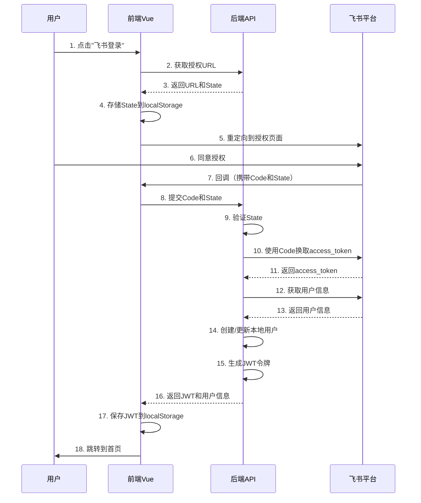

# 飞书OAuth登录演示 - 完整集成指南

本演示项目展示了如何使用 MudFeishu SDK 集成飞书第三方应用统一登录认证系统，包含完整的前后端实现。

## 项目结构

```
MudFeishu/
├── Demos/
│   ├── FeishuOAuthDemo/          # .NET 10 后端API
│   └── feishu-oauth-frontend/    # Vue 3 前端应用
```

## 技术栈

### 后端
- .NET 10.0 (ASP.NET Core Minimal API)
- Mud.Feishu SDK v1.2.1
- JWT Bearer 认证
- C# 13.0

### 前端
- Vue 3 (Composition API)
- TypeScript
- Vite 5.0
- Element Plus 2.4
- Pinia (状态管理)
- Vue Router 4
- Axios

## 快速开始

### 前置要求

1. **飞书开放平台应用**
   - 访问 [飞书开放平台](https://open.feishu.cn/app)
   - 创建企业自建应用
   - 获取 App ID 和 App Secret

2. **开发环境**
   - .NET 10 SDK
   - Node.js 18+
   - npm 或 yarn

### 步骤1：配置飞书开放平台应用

1. 创建企业自建应用后，进入应用详情页
2. 记录 `App ID` 和 `App Secret`
3. 配置重定向URL：
   - 开发环境：`http://localhost:5173/auth/feishu/callback`
   - 生产环境：`https://your-domain.com/auth/feishu/callback`
4. 添加权限：
   - `contact:user.base:readonly` - 获取用户基本信息
5. 启用"网页"能力
6. 发布应用版本（开发环境可使用未发布版本）

### 步骤2：配置后端

1. 复制配置文件：
```bash
cd Demos/FeishuOAuthDemo
```

2. 修改 `appsettings.json`：
```json
{
  "Feishu": {
    "AppId": "cli_xxxxxxxxxxxxxxxx",        // 替换为你的App ID
    "AppSecret": "your-app-secret-here",     // 替换为你的App Secret
    "BaseUrl": "https://open.feishu.cn",
    "TimeOut": 30,
    "RetryCount": 3,
    "EnableLogging": true
  },
  "OAuth": {
    "RedirectUri": "http://localhost:5173/auth/feishu/callback",  // 与飞书平台配置一致
    "Jwt": {
      "Secret": "your-256-bit-secret-key-for-jwt-token-generation-min-32-chars",  // 至少32字符
      "Issuer": "FeishuOAuthDemo",
      "Audience": "FeishuOAuthUsers",
      "ExpirationMinutes": 1440
    },
    "StateExpirationMinutes": 5
  }
}
```

3. 还原NuGet包并启动：
```bash
dotnet restore
dotnet run
```

后端将运行在 `http://localhost:5000`

4. 访问API文档：`http://localhost:5000/scalar`

### 步骤3：配置前端

1. 进入前端目录：
```bash
cd ../../feishu-oauth-frontend
```

2. 安装依赖：
```bash
npm install
```

3. 启动开发服务器：
```bash
npm run dev
```

前端将运行在 `http://localhost:5173`

## 核心功能说明

### OAuth 2.0 授权流程



### 后端API端点

#### 1. 获取飞书授权URL
```
GET /api/oauth/feishu/url
```

**响应**：
```json
{
  "success": true,
  "message": "生成授权URL成功",
  "url": "https://accounts.feishu.cn/open-apis/authen/v1/authorize?...",
  "state": "abc123..."
}
```

#### 2. 处理OAuth回调
```
POST /api/oauth/feishu/callback
Content-Type: application/json

{
  "code": "authorization_code",
  "state": "abc123..."
}
```

**响应**：
```json
{
  "success": true,
  "message": "登录成功",
  "token": "eyJhbGciOiJIUzI1NiIsInR5cCI6IkpXVCJ9...",
  "user": {
    "openId": "ou_xxxxxxxxxxxxxxxxxxxxxxxx",
    "unionId": "on_xxxxxxxxxxxxxxxxxxxxxxxx",
    "name": "张三",
    "avatar": "https://...",
    "email": "zhangsan@example.com"
  }
}
```

#### 3. 验证Token
```
POST /api/oauth/validate-token
Content-Type: application/json

"eyJhbGciOiJIUzI1NiIsInR5cCI6IkpXVCJ9..."
```

#### 4. 获取当前用户信息
```
GET /api/oauth/user/me
Authorization: Bearer {token}
```

#### 5. 登出
```
POST /api/oauth/logout
```

### 安全机制

#### 1. State参数（防CSRF）
- 后端生成随机state并存储
- 前端存储state到localStorage
- 回调时验证state一致性
- 验证后立即删除state

#### 2. JWT令牌认证
- 使用HS256算法签名
- 包含用户身份信息（openId, unionId, name）
- 支持令牌过期（默认24小时）
- 请求时通过Authorization头发送

#### 3. 错误处理
- State验证失败 → 拒绝登录
- Code无效 → 返回错误提示
- Token过期 → 自动跳转登录页
- 网络错误 → 友好错误提示

## 数据库集成

当前演示使用内存存储用户信息。生产环境建议：

### 使用Entity Framework Core

```csharp
// 1. 添加DbContext
public class ApplicationDbContext : DbContext
{
    public DbSet<User> Users { get; set; }

    protected override void OnConfiguring(DbContextOptionsBuilder optionsBuilder)
    {
        optionsBuilder.UseSqlServer(connectionString);
    }
}

// 2. 创建User实体
public class User
{
    public string UserId { get; set; }      // 主键
    public string OpenId { get; set; }     // 飞书OpenID
    public string UnionId { get; set; }    // 飞书UnionID
    public string Name { get; set; }
    public string? Avatar { get; set; }
    public string? Email { get; set; }
    public DateTime CreatedAt { get; set; }
    public DateTime? LastLoginAt { get; set; }
}

// 3. 修改UserService实现数据库操作
```

## 生产环境部署

### 后端部署

1. **构建发布**
```bash
dotnet publish -c Release -o ./publish
```

2. **配置HTTPS**
- 配置SSL证书
- 修改监听地址为HTTPS

3. **环境变量**
```bash
export Feishu__AppId="your-app-id"
export Feishu__AppSecret="your-app-secret"
export OAuth__Jwt__Secret="your-jwt-secret"
```

4. **反向代理** (Nginx示例)
```nginx
server {
    listen 80;
    server_name your-domain.com;

    location /api/ {
        proxy_pass http://localhost:5000/api/;
        proxy_set_header Host $host;
        proxy_set_header X-Real-IP $remote_addr;
    }
}
```

### 前端部署

1. **构建生产版本**
```bash
npm run build
```

2. **部署到Nginx**
```nginx
server {
    listen 80;
    server_name your-domain.com;

    root /var/www/feishu-oauth-frontend/dist;
    index index.html;

    location / {
        try_files $uri $uri/ /index.html;
    }

    location /api/ {
        proxy_pass http://backend-api:5000/api/;
    }
}
```

### Docker部署

#### 后端Dockerfile
```dockerfile
FROM mcr.microsoft.com/dotnet/aspnet:10.0 AS base
WORKDIR /app

FROM mcr.microsoft.com/dotnet/sdk:10.0 AS build
WORKDIR /src
COPY ["Demos/FeishuOAuthDemo/FeishuOAuthDemo.csproj", "FeishuOAuthDemo/"]
RUN dotnet restore "FeishuOAuthDemo/FeishuOAuthDemo.csproj"
COPY . .
WORKDIR "/src/FeishuOAuthDemo"
RUN dotnet build "FeishuOAuthDemo.csproj" -c Release -o /app/build

FROM build AS publish
RUN dotnet publish "FeishuOAuthDemo.csproj" -c Release -o /app/publish

FROM base AS final
WORKDIR /app
COPY --from=publish /app/publish .
ENTRYPOINT ["dotnet", "FeishuOAuthDemo.dll"]
```

#### 前端Dockerfile
```dockerfile
FROM node:18-alpine as build
WORKDIR /app
COPY package*.json ./
RUN npm install
COPY . .
RUN npm run build

FROM nginx:alpine
COPY --from=build /app/dist /usr/share/nginx/html
EXPOSE 80
```

#### docker-compose.yml
```yaml
version: '3.8'

services:
  backend:
    build:
      context: .
      dockerfile: Demos/FeishuOAuthDemo/Dockerfile
    ports:
      - "5000:80"
    environment:
      - Feishu__AppId=${FEISHU_APP_ID}
      - Feishu__AppSecret=${FEISHU_APP_SECRET}
      - OAuth__Jwt__Secret=${JWT_SECRET}

  frontend:
    build:
      context: .
      dockerfile: feishu-oauth-frontend/Dockerfile
    ports:
      - "80:80"
    depends_on:
      - backend
```

## 测试建议

### 单元测试
- OAuth流程各环节的单元测试
- State验证逻辑测试
- JWT生成和验证测试

### 集成测试
- 完整OAuth流程的端到端测试
- 错误场景测试（拒绝授权、网络错误等）
- Token过期和刷新测试

### 安全测试
- CSRF攻击防护测试
- XSS攻击防护测试
- Token窃取防护测试

## 常见问题

### Q1: 回调时提示"State验证失败"
**A**: 检查以下几点：
- 前端是否正确存储state到localStorage
- 回调URL中的state是否与生成时一致
- state是否已过期（默认5分钟）

### Q2: 提示"获取用户访问令牌失败"
**A**: 检查：
- App ID和App Secret是否正确
- RedirectUri是否与飞书平台配置一致
- Code是否有效（code只能使用一次）

### Q3: 前端无法调用后端API
**A**: 检查：
- 后端是否启动并监听在5000端口
- CORS配置是否正确
- Vite proxy配置是否正确

### Q4: Token验证失败
**A**: 检查：
- JWT Secret前后端是否一致
- Token是否已过期
- Token格式是否正确（Bearer前缀）

## 扩展功能

### 1. 支持多个OAuth提供商
- 微信企业号登录
- 钉钉登录
- 自定义OAuth 2.0提供商

### 2. 用户绑定
- 支持飞书用户绑定现有账户
- 支持多种登录方式绑定同一账户

### 3. 单点登录（SSO）
- 使用Redis存储Token黑名单
- 实现全局登出功能

### 4. 权限管理
- 基于角色的访问控制（RBAC）
- 与飞书权限系统集成

## 相关资源

- [飞书开放平台文档](https://open.feishu.cn/document/)
- [MudFeishu SDK文档](../../README.md)
- [ASP.NET Core认证文档](https://docs.microsoft.com/aspnet/core/security/)
- [Vue Router文档](https://router.vuejs.org/zh/)

## 许可证

MIT License

## 贡献

欢迎提交Issue和Pull Request！
