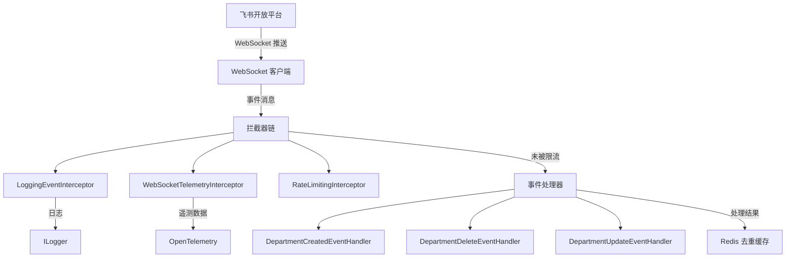
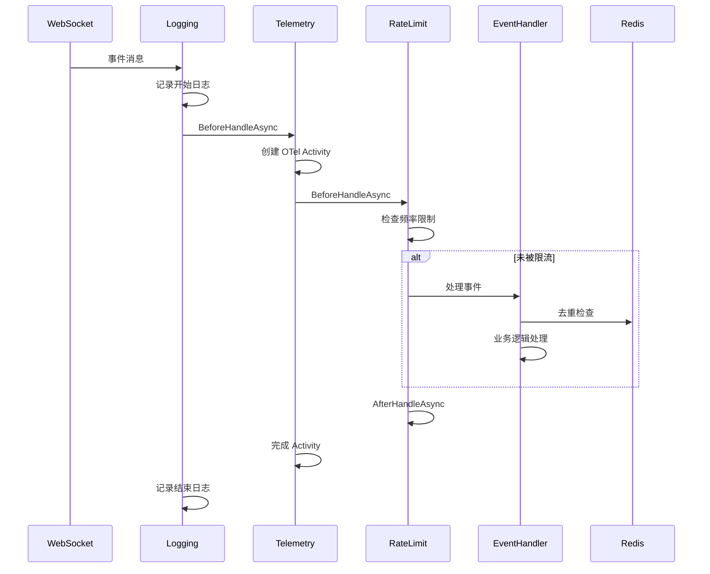
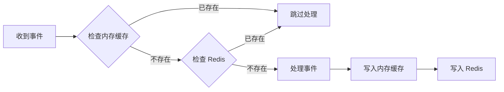

# Mud.Feishu.WebSocket.Demo

飞书 WebSocket 事件处理演示项目，展示如何使用 Mud.Feishu.WebSocket SDK 实现实时事件订阅、处理和拦截器链。

## 📋 目录

- [项目简介](#项目简介)
- [核心功能](#核心功能)
- [技术架构](#技术架构)
- [快速开始](#快速开始)
- [配置说明](#配置说明)
- [项目结构](#项目结构)
- [核心组件](#核心组件)
- [拦截器使用](#拦截器使用)
- [事件处理](#事件处理)
- [分布式去重](#分布式去重)
- [遥测与监控](#遥测与监控)
- [示例场景](#示例场景)
- [常见问题](#常见问题)

## 项目简介

本项目是一个完整的飞书 WebSocket 事件处理示例应用，演示了如何：

- ✅ 连接飞书 WebSocket 服务并接收实时事件推送
- ✅ 实现自定义事件处理器处理部门相关事件
- ✅ 使用拦截器链增强事件处理能力（日志、遥测、限流）
- ✅ 集成 Redis 实现分布式事件去重
- ✅ 使用 OpenTelemetry 收集遥测指标
- ✅ 后台服务模拟事件用于测试

### 适用场景

- 企业内部系统需要实时同步飞书组织架构变化
- 需要 webhook 替代方案（避免网络问题导致的丢包）
- 多实例部署需要分布式去重
- 需要监控和追踪事件处理性能

## 核心功能

| 功能 | 说明 |
|------|------|
| **WebSocket 连接管理** | 自动连接、重连、心跳保活 |
| **事件处理** | 支持部门创建、更新、删除等事件 |
| **拦截器链** | 日志记录、遥测收集、频率限制 |
| **分布式去重** | Redis 缓存防止重复处理 |
| **后台模拟** | 定时生成模拟事件用于测试 |
| **OpenTelemetry** | 分布式追踪和性能监控 |

## 技术架构



### 拦截器执行流程



## 快速开始

### 1. 环境要求

- .NET 8.0 或更高版本
- Redis 服务器（用于分布式去重）
- 飞书企业自建应用凭证

### 2. 安装依赖

```bash
cd Demos/Mud.Feishu.WebSocket.Demo
dotnet restore
```

### 3. 配置飞书应用

在 `appsettings.json` 中配置飞书凭证：

```json
{
  "Feishu": {
    "AppId": "cli_xxxxxxxxxxxxxxxx",
    "AppSecret": "your-app-secret-here"
  }
}
```

### 4. 配置 Redis

确保 Redis 服务运行并更新配置：

```json
{
  "Feishu": {
    "Redis": {
      "ServerAddress": "localhost:6379",
      "Password": "letmein"
    }
  }
}
```

启动 Redis（Docker 示例）：

```bash
docker run -d -p 6379:6379 redis --requirepass letmein
```

### 5. 运行项目

```bash
dotnet run
```

### 6. 验证运行

查看控制台输出，应该看到类似日志：

```
[信息] WebSocket 服务已启动
[信息] 正在连接到飞书 WebSocket...
[信息] WebSocket 连接成功
[信息] 开始监听事件推送
```

## 配置说明

### 完整配置示例

```json
{
  "Feishu": {
    "AppId": "",
    "AppSecret": "",
    "BaseUrl": "https://open.feishu.cn",
    "TimeOut": 30,
    "RetryCount": 3,
    "TokenRefreshThreshold": 300,
    "EnableLogging": true,
    "WebSocket": {
      "AutoReconnect": true,
      "MaxReconnectAttempts": 5,
      "ReconnectDelayMs": 5000,
      "HeartbeatIntervalMs": 30000,
      "ConnectionTimeoutMs": 10000,
      "ReceiveBufferSize": 4096,
      "EnableLogging": false,
      "EnableMessageQueue": true,
      "MessageQueueCapacity": 1000,
      "ParallelMultiHandlers": true,
      "EnableEventDeduplication": true,
      "EventDeduplicationCacheExpirationMs": 1800000,
      "EventDeduplicationCleanupIntervalMs": 300000,
      "EnableDistributedDeduplication": true
    },
    "Redis": {
      "ServerAddress": "localhost:6379",
      "Password": "letmein",
      "EventCacheExpiration": "1:00:00",
      "NonceTtl": "00:05:00",
      "SeqIdCacheExpiration": "1:00:00",
      "EventKeyPrefix": "feishu:event:",
      "NonceKeyPrefix": "feishu:nonce:",
      "SeqIdKeyPrefix": "feishu:seqid:",
      "ConnectTimeout": 5000,
      "SyncTimeout": 5000,
      "Ssl": false
    }
  },
  "DemoSettings": {
    "EnableMockEvents": true,
    "MockEventIntervalMs": 10000
  }
}
```

### WebSocket 配置项

| 配置项 | 类型 | 默认值 | 说明 |
|--------|------|--------|------|
| `AutoReconnect` | bool | true | 连接断开时是否自动重连 |
| `MaxReconnectAttempts` | int | 5 | 最大重连次数 |
| `ReconnectDelayMs` | int | 5000 | 重连延迟（毫秒） |
| `HeartbeatIntervalMs` | int | 30000 | 心跳间隔（毫秒） |
| `ConnectionTimeoutMs` | int | 10000 | 连接超时（毫秒） |
| `ReceiveBufferSize` | int | 4096 | 接收缓冲区大小 |
| `EnableMessageQueue` | bool | true | 是否启用消息队列 |
| `MessageQueueCapacity` | int | 1000 | 消息队列容量 |
| `ParallelMultiHandlers` | bool | true | 是否并行处理多个处理器 |
| `EnableEventDeduplication` | bool | true | 是否启用内存去重 |
| `EventDeduplicationCacheExpirationMs` | int | 1800000 | 去重缓存过期时间（毫秒） |
| `EnableDistributedDeduplication` | bool | true | 是否启用分布式去重 |

### Redis 配置项

| 配置项 | 类型 | 默认值 | 说明 |
|--------|------|--------|------|
| `ServerAddress` | string | localhost:6379 | Redis 服务器地址 |
| `Password` | string | - | Redis 密码 |
| `EventCacheExpiration` | TimeSpan | 1:00:00 | 事件缓存过期时间 |
| `NonceTtl` | TimeSpan | 00:05:00 | Nonce 缓存过期时间 |
| `SeqIdCacheExpiration` | TimeSpan | 1:00:00 | 序列号缓存过期时间 |
| `EventKeyPrefix` | string | feishu:event: | 事件缓存键前缀 |
| `ConnectTimeout` | int | 5000 | 连接超时（毫秒） |
| `Ssl` | bool | false | 是否使用 SSL |

### Demo 配置项

| 配置项 | 类型 | 默认值 | 说明 |
|--------|------|--------|------|
| `EnableMockEvents` | bool | true | 是否启用后台模拟事件 |
| `MockEventIntervalMs` | int | 10000 | 模拟事件间隔（毫秒） |

## 项目结构

```
Mud.Feishu.WebSocket.Demo/
├── Program.cs                                    # 程序入口
├── Mud.Feishu.WebSocket.Demo.csproj             # 项目文件
├── appsettings.json                              # 主配置文件
├── appsettings.Development.json                  # 开发环境配置
├── Properties/
│   └── launchSettings.json                      # 启动配置
├── Handlers/                                     # 事件处理器目录
│   ├── DemoDepartmentEventHandler.cs           # 部门创建事件处理器
│   ├── DemoDepartmentDeleteEventHandler.cs     # 部门删除事件处理器
│   └── DemoDepartmentUpdateEventHandler.cs     # 部门更新事件处理器
├── Interceptors/                                 # 拦截器目录
│   ├── RateLimitingInterceptor.cs              # 限流拦截器
│   └── WebSocketTelemetryInterceptor.cs        # 遥测拦截器
├── Services/                                     # 服务目录
│   ├── DemoEventService.cs                     # 事件统计服务
│   └── DemoEventBackgroundService.cs           # 后台模拟事件服务
└── README.md                                    # 本文档
```

## 核心组件

### 1. 程序入口 (Program.cs)

```csharp
var builder = WebApplication.CreateBuilder(args);

// 1. 配置 Redis 分布式去重服务
builder.Services.AddFeishuRedisDeduplicators(builder.Configuration);

// 2. 配置飞书 WebSocket 服务（添加拦截器）
builder.Services.CreateFeishuWebSocketServiceBuilder(builder.Configuration)
    .AddInterceptor<LoggingEventInterceptor>()                    // 日志拦截器（内置）
    .AddInterceptor<WebSocketTelemetryInterceptor>()               // 遥测拦截器（自定义）
    .AddInterceptor(sp => new RateLimitingInterceptor(
        sp.GetRequiredService<ILogger<RateLimitingInterceptor>>(),
        minIntervalMs: 50))                                      // 限流拦截器（自定义，50ms 间隔）
    .AddHandler<DemoDepartmentEventHandler>()
    .AddHandler<DemoDepartmentDeleteEventHandler>()
    .AddHandler<DemoDepartmentUpdateEventHandler>()
    .Build();

// 3. 配置演示服务
builder.Services.AddSingleton<DemoEventService>();
builder.Services.AddHostedService<DemoEventBackgroundService>();

var app = builder.Build();
app.Run();
```

### 2. 事件处理器

所有事件处理器继承自对应的基类：

| 处理器 | 基类 | 处理事件类型 |
|--------|------|-------------|
| `DemoDepartmentEventHandler` | `DepartmentCreatedEventHandler` | 部门创建 |
| `DemoDepartmentDeleteEventHandler` | `DepartmentDeleteEventHandler` | 部门删除 |
| `DemoDepartmentUpdateEventHandler` | `DepartmentUpdateEventHandler` | 部门更新 |

**示例：部门创建事件处理器**

```csharp
public class DemoDepartmentEventHandler : DepartmentCreatedEventHandler
{
    private readonly DemoEventService _eventService;

    public DemoDepartmentEventHandler(
        IFeishuEventDeduplicator businessDeduplicator,
        ILogger<DemoDepartmentEventHandler> logger,
        DemoEventService eventService)
        : base(businessDeduplicator, logger)
    {
        _eventService = eventService;
    }

    protected override async Task ProcessBusinessLogicAsync(
        EventData eventData,
        DepartmentCreatedResult? departmentData,
        CancellationToken cancellationToken = default)
    {
        // 记录事件到服务
        await _eventService.RecordDepartmentEventAsync(departmentData, cancellationToken);

        // 模拟业务处理
        await ProcessDepartmentEventAsync(departmentData, cancellationToken);

        _eventService.IncrementDepartmentCount();
    }

    private Task ProcessDepartmentEventAsync(DepartmentCreatedResult? departmentData, CancellationToken cancellationToken)
    {
        // 实现你的业务逻辑
        Console.WriteLine($"部门创建: {departmentData?.Department?.Name}");
        return Task.CompletedTask;
    }
}
```

### 3. 服务类

#### DemoEventService

事件统计和管理服务：

```csharp
public class DemoEventService
{
    private readonly ConcurrentBag<DepartmentEvent> _departmentEvents = new();
    private int _departmentCount;

    public void IncrementDepartmentCount() => Interlocked.Increment(ref _departmentCount);
    public int GetDepartmentCount() => _departmentCount;

    public Task RecordDepartmentEventAsync(DepartmentCreatedResult? departmentData, CancellationToken cancellationToken)
    {
        // 记录部门事件
        return Task.CompletedTask;
    }

    public IEnumerable<DepartmentEvent> GetDepartmentEvents() => _departmentEvents;
}
```

#### DemoEventBackgroundService

后台模拟事件服务：

```csharp
public class DemoEventBackgroundService : BackgroundService
{
    protected override async Task ExecuteAsync(CancellationToken stoppingToken)
    {
        while (!stoppingToken.IsCancellationRequested)
        {
            if (_demoSettings.EnableMockEvents)
            {
                // 生成模拟事件
                await GenerateMockEventAsync(stoppingToken);
            }

            await Task.Delay(_demoSettings.MockEventIntervalMs, stoppingToken);
        }
    }
}
```

## 拦截器使用

### 内置拦截器

#### LoggingEventInterceptor

自动记录事件处理日志：

```csharp
.AddInterceptor<LoggingEventInterceptor>()
```

无需额外配置，会自动记录：
- 事件开始处理
- 事件处理成功/失败
- 处理耗时

### 自定义拦截器

#### 1. 遥测拦截器 (WebSocketTelemetryInterceptor)

使用 OpenTelemetry 收集遥测数据：

```csharp
public class WebSocketTelemetryInterceptor : IFeishuEventInterceptor
{
    private readonly ActivitySource _activitySource;
    private readonly ConcurrentDictionary<string, Activity> _activities = new();
    private int _totalEvents;
    private int _failedEvents;

    public Task<bool> BeforeHandleAsync(string eventType, EventData eventData, CancellationToken cancellationToken = default)
    {
        var activity = _activitySource.StartActivity($"WebSocketEvent_{eventType}");
        if (activity != null)
        {
            activity.SetTag("component", "Mud.Feishu.WebSocket.Demo");
            activity.SetTag("event.type", eventType);
            activity.SetTag("event.id", eventData.EventId);
            activity.SetTag("event.tenant_key", eventData.TenantKey);
        }

        _activities.TryAdd(eventData.EventId, activity);
        Interlocked.Increment(ref _totalEvents);
        return Task.FromResult(true);
    }

    public Task AfterHandleAsync(string eventType, EventData eventData, Exception? exception, CancellationToken cancellationToken = default)
    {
        if (_activities.TryRemove(eventData.EventId, out var activity))
        {
            if (exception != null)
            {
                Interlocked.Increment(ref _failedEvents);
                activity.SetStatus(ActivityStatusCode.Error, exception.Message);
            }
            else
            {
                activity.SetStatus(ActivityStatusCode.Ok);
            }
            activity.Dispose();
        }
        return Task.CompletedTask;
    }

    public (int TotalEvents, int FailedEvents, double SuccessRate) GetStatistics()
    {
        var successRate = _totalEvents > 0
            ? Math.Round((double)(_totalEvents - _failedEvents) / _totalEvents * 100, 2)
            : 0;
        return (_totalEvents, _failedEvents, successRate);
    }
}
```

注册方式：

```csharp
.AddInterceptor<WebSocketTelemetryInterceptor>()
```

获取统计信息：

```csharp
var (totalEvents, failedEvents, successRate) = telemetryInterceptor.GetStatistics();
Console.WriteLine($"总事件: {totalEvents}, 失败: {failedEvents}, 成功率: {successRate}%");
```

#### 2. 限流拦截器 (RateLimitingInterceptor)

防止高频事件导致系统过载：

```csharp
public class RateLimitingInterceptor : IFeishuEventInterceptor
{
    private readonly ConcurrentDictionary<string, DateTime> _lastProcessedTimes = new();
    private readonly TimeSpan _minInterval;
    private readonly ILogger<RateLimitingInterceptor> _logger;

    public RateLimitingInterceptor(ILogger<RateLimitingInterceptor> logger, int minIntervalMs = 50)
    {
        _logger = logger;
        _minInterval = TimeSpan.FromMilliseconds(minIntervalMs);
    }

    public Task<bool> BeforeHandleAsync(string eventType, EventData eventData, CancellationToken cancellationToken = default)
    {
        var key = $"{eventData.TenantKey}:{eventType}";

        if (_lastProcessedTimes.TryGetValue(key, out var lastProcessed))
        {
            var elapsed = DateTime.UtcNow - lastProcessed;
            if (elapsed < _minInterval)
            {
                _logger.LogWarning("[限流] 事件 {EventType} 处理过快，已限流", eventType);
                return Task.FromResult(false); // 中断处理
            }
        }

        _lastProcessedTimes.AddOrUpdate(key, DateTime.UtcNow, (_, _) => DateTime.UtcNow);
        return Task.FromResult(true);
    }

    public Task AfterHandleAsync(string eventType, EventData eventData, Exception? exception, CancellationToken cancellationToken = default)
    {
        return Task.CompletedTask;
    }
}
```

注册方式：

```csharp
.AddInterceptor(sp => new RateLimitingInterceptor(
    sp.GetRequiredService<ILogger<RateLimitingInterceptor>>(),
    minIntervalMs: 50))
```

### 拦截器执行顺序

拦截器按照注册顺序执行：

```csharp
builder.Services.CreateFeishuWebSocketServiceBuilder(builder.Configuration)
    .AddInterceptor<LoggingEventInterceptor>()        // 1. 日志（最先执行）
    .AddInterceptor<WebSocketTelemetryInterceptor>()   // 2. 遥测
    .AddInterceptor<RateLimitingInterceptor>()        // 3. 限流
    .Build();
```

**执行顺序**：

1. `LoggingEventInterceptor.BeforeHandleAsync` → 记录开始
2. `WebSocketTelemetryInterceptor.BeforeHandleAsync` → 创建 Activity
3. `RateLimitingInterceptor.BeforeHandleAsync` → 检查限流
4. **事件处理器**（如果未被限流）
5. `RateLimitingInterceptor.AfterHandleAsync`
6. `WebSocketTelemetryInterceptor.AfterHandleAsync` → 完成 Activity
7. `LoggingEventInterceptor.AfterHandleAsync` → 记录结束

### 拦截器中断行为

**WebSocket 拦截器与 Webhook 拦截器的区别**：

| 行为 | BeforeHandleAsync 返回 false | AfterHandleAsync |
|------|---------------------------|-----------------|
| **后续拦截器** | 不执行 | **仍然执行**（按注册顺序） |
| **事件处理器** | 不执行 | - |

**重要**：即使某个拦截器的 `BeforeHandleAsync` 返回 `false`，所有拦截器的 `AfterHandleAsync` 仍然会执行！

## 事件处理

### 支持的事件类型

| 事件类型 | 处理器基类 | 示例 |
|---------|-----------|------|
| 部门创建 | `DepartmentCreatedEventHandler` | 处理新部门创建 |
| 部门删除 | `DepartmentDeleteEventHandler` | 处理部门删除 |
| 部门更新 | `DepartmentUpdateEventHandler` | 处理部门信息更新 |
| 用户创建 | `UserCreatedEventHandler` | 处理新用户创建 |
| 用户删除 | `UserDeleteEventHandler` | 处理用户删除 |
| 用户更新 | `UserUpdateEventHandler` | 处理用户信息更新 |

### 创建自定义事件处理器

1. **继承对应的事件处理器基类**

```csharp
public class MyCustomEventHandler : UserCreatedEventHandler
{
    public MyCustomEventHandler(
        IFeishuEventDeduplicator businessDeduplicator,
        ILogger<MyCustomEventHandler> logger)
        : base(businessDeduplicator, logger)
    {
    }

    protected override async Task ProcessBusinessLogicAsync(
        EventData eventData,
        UserCreatedResult? userData,
        CancellationToken cancellationToken = default)
    {
        // 实现你的业务逻辑
        var userId = userData?.User?.OpenId;
        var userName = userData?.User?.Name;

        // 记录到数据库
        await SaveToDatabase(userId, userName, cancellationToken);

        // 触发其他操作
        await NotifyOtherSystems(userId, cancellationToken);
    }
}
```

2. **注册事件处理器**

```csharp
builder.Services.CreateFeishuWebSocketServiceBuilder(builder.Configuration)
    .AddHandler<MyCustomEventHandler>()
    .Build();
```

3. **处理去重**

基类已经内置去重逻辑，使用 `IFeishuEventDeduplicator`：

```csharp
protected override async Task<bool> ShouldProcessAsync(EventData eventData, CancellationToken cancellationToken = default)
{
    // 基类已实现基于 eventId 的去重
    return await base.ShouldProcessAsync(eventData, cancellationToken);
}
```

## 分布式去重

### 为什么需要去重？

在以下场景中可能收到重复事件：

1. **网络重试**：飞书平台可能重试发送事件
2. **多实例部署**：多个实例连接到同一个 WebSocket
3. **应用重启**：重启后可能收到之前的事件

### 去重实现

本项目使用 **两层去重机制**：

#### 1. 内存去重（单机）

```json
{
  "Feishu": {
    "WebSocket": {
      "EnableEventDeduplication": true,
      "EventDeduplicationCacheExpirationMs": 1800000
    }
  }
}
```

- 基于 `EventId` 进行去重
- 缓存过期时间：30 分钟
- 自动清理过期缓存

#### 2. Redis 去重（分布式）

```json
{
  "Feishu": {
    "Redis": {
      "ServerAddress": "localhost:6379",
      "Password": "letmein",
      "EventCacheExpiration": "1:00:00",
      "EventKeyPrefix": "feishu:event:"
    }
  }
}
```

注册 Redis 去重服务：

```csharp
builder.Services.AddFeishuRedisDeduplicators(builder.Configuration);
```

### 去重工作原理



### 去重 Key 生成规则

```csharp
// 内存去重 Key
Key = EventId

// Redis 去重 Key
Key = "feishu:event:" + EventId
TTL = EventCacheExpiration (1小时)
```

## 遥测与监控

### OpenTelemetry 集成

使用 OpenTelemetry 收集事件处理指标：

```csharp
.AddInterceptor<WebSocketTelemetryInterceptor>()
```

### 收集的指标

| 指标 | 说明 |
|------|------|
| 总事件数 | 处理的总事件数量 |
| 失败事件数 | 处理失败的事件数量 |
| 成功率 | 成功处理的事件百分比 |
| 事件耗时 | 单个事件的处理时间 |
| 事件类型分布 | 各类事件的数量统计 |

### 查看遥测数据

```csharp
// 获取拦截器实例
var telemetryInterceptor = app.Services.GetRequiredService<WebSocketTelemetryInterceptor>();

// 获取统计信息
var (totalEvents, failedEvents, successRate) = telemetryInterceptor.GetStatistics();

Console.WriteLine($"总事件: {totalEvents}");
Console.WriteLine($"失败: {failedEvents}");
Console.WriteLine($"成功率: {successRate}%");
```

### 集成外部监控

可以集成 Jaeger、Zipkin 等 APM 工具：

```csharp
builder.Services.AddOpenTelemetry()
    .ConfigureResource(resource => resource.AddService("FeishuWebSocketDemo"))
    .AddSource("Mud.Feishu.WebSocket.Demo")
    .AddAspNetCoreInstrumentation()
    .AddOtlpExporter(opt =>
    {
        opt.Endpoint = new Uri("http://localhost:4317");
    });
```

## 示例场景

### 场景 1：实时同步组织架构

**需求**：当飞书组织架构变化时，实时同步到本地数据库。

**实现**：

```csharp
public class DepartmentSyncHandler : DepartmentCreatedEventHandler
{
    private readonly IDepartmentRepository _repository;

    protected override async Task ProcessBusinessLogicAsync(
        EventData eventData,
        DepartmentCreatedResult? departmentData,
        CancellationToken cancellationToken = default)
    {
        var department = new Department
        {
            Id = departmentData?.Department?.OpenDepartmentId,
            Name = departmentData?.Department?.Name,
            ParentId = departmentData?.Department?.ParentDepartmentId,
            LeaderUserId = departmentData?.Department?.LeaderUserId,
            CreatedAt = DateTime.UtcNow
        };

        await _repository.InsertAsync(department, cancellationToken);
    }
}
```

### 场景 2：用户离职自动禁用账号

**需求**：当飞书用户离职时，自动禁用本地系统账号。

**实现**：

```csharp
public class UserDeleteHandler : UserDeleteEventHandler
{
    private readonly IUserService _userService;

    protected override async Task ProcessBusinessLogicAsync(
        EventData eventData,
        UserDeletedResult? userData,
        CancellationToken cancellationToken = default)
    {
        var userId = userData?.User?.OpenId;
        await _userService.DisableUserAsync(userId, cancellationToken);
    }
}
```

### 场景 3：高频事件限流

**需求**：防止批量导入等操作产生的事件风暴导致系统过载。

**实现**：

```csharp
// 配置限流拦截器
.AddInterceptor(sp => new RateLimitingInterceptor(
    sp.GetRequiredService<ILogger<RateLimitingInterceptor>>(),
    minIntervalMs: 100)) // 100ms 最小间隔
```

### 场景 4：多实例分布式部署

**需求**：部署多个实例，确保事件不被重复处理。

**实现**：

1. 配置 Redis 去重：

```json
{
  "Feishu": {
    "Redis": {
      "ServerAddress": "redis-cluster:6379",
      "Password": "your-redis-password"
    },
    "WebSocket": {
      "EnableDistributedDeduplication": true
    }
  }
}
```

2. 注册 Redis 去重服务：

```csharp
builder.Services.AddFeishuRedisDeduplicators(builder.Configuration);
```

## 常见问题

### Q1: WebSocket 连接失败怎么办？

**A**: 检查以下几点：

1. 飞书应用凭证是否正确
2. 网络是否可以访问 `open.feishu.cn`
3. 是否在飞书开放平台启用了"网页"功能
4. 检查防火墙设置

查看日志中的错误信息：

```
[错误] WebSocket 连接失败: 连接超时
```

### Q2: 事件处理太慢怎么办？

**A**: 优化方案：

1. **启用并行处理**：

```json
{
  "WebSocket": {
    "ParallelMultiHandlers": true
  }
}
```

2. **启用消息队列**：

```json
{
  "WebSocket": {
    "EnableMessageQueue": true,
    "MessageQueueCapacity": 2000
  }
}
```

3. **添加限流拦截器**：防止事件风暴

```csharp
.AddInterceptor<RateLimitingInterceptor>()
```

4. **异步处理业务逻辑**：

```csharp
protected override async Task ProcessBusinessLogicAsync(...)
{
    // 快速返回，使用后台任务处理
    _ = Task.Run(() => ProcessAsync());
}
```

### Q3: 如何确认事件是否被去重？

**A**: 查看日志：

```
[信息] 事件已去重，跳过处理: eventId=xxx
```

或者检查 Redis：

```bash
redis-cli
KEYS feishu:event:*
```

### Q4: 如何测试事件处理？

**A**: 使用后台模拟服务：

```json
{
  "DemoSettings": {
    "EnableMockEvents": true,
    "MockEventIntervalMs": 5000
  }
}
```

每 5 秒生成一个模拟事件。

### Q5: 如何查看拦截器统计？

**A**: 通过遥测拦截器获取：

```csharp
var telemetryInterceptor = app.Services.GetRequiredService<WebSocketTelemetryInterceptor>();
var (total, failed, successRate) = telemetryInterceptor.GetStatistics();
Console.WriteLine($"总事件: {total}, 失败: {failed}, 成功率: {successRate}%");
```

### Q6: Redis 连接失败怎么办？

**A**: 检查：

1. Redis 服务是否运行
2. 连接地址和密码是否正确
3. 防火墙是否允许连接
4. SSL 配置是否正确

禁用分布式去重（仅用于测试）：

```json
{
  "WebSocket": {
    "EnableDistributedDeduplication": false
  }
}
```

### Q7: 如何添加自定义拦截器？

**A**: 创建类实现 `IFeishuEventInterceptor` 接口：

```csharp
public class MyCustomInterceptor : IFeishuEventInterceptor
{
    public Task<bool> BeforeHandleAsync(string eventType, EventData eventData, CancellationToken cancellationToken = default)
    {
        // 事件处理前执行
        // 返回 false 中断处理
        return Task.FromResult(true);
    }

    public Task AfterHandleAsync(string eventType, EventData eventData, Exception? exception, CancellationToken cancellationToken = default)
    {
        // 事件处理后执行
        return Task.CompletedTask;
    }
}
```

注册拦截器：

```csharp
.AddInterceptor<MyCustomInterceptor>()
```

### Q8: WebSocket 与 Webhook 如何选择？

| 特性 | WebSocket | Webhook |
|------|-----------|---------|
| 实时性 | ⭐⭐⭐⭐⭐ | ⭐⭐⭐ |
| 可靠性 | ⭐⭐⭐⭐ | ⭐⭐⭐ |
| 部署复杂度 | ⭐⭐⭐ | ⭐⭐⭐⭐ |
| 资源消耗 | ⭐⭐⭐⭐ | ⭐⭐⭐⭐⭐ |
| 适用场景 | 实时性要求高、内部系统 | 简单场景、外部系统 |

**推荐**：
- 实时性要求高 → WebSocket
- 需要离线重试 → Webhook
- 简单场景 → Webhook
- 多实例部署 → WebSocket + Redis 去重

## 相关文档

- [拦截器详细文档](./README-INTERCEPTORS.md) - 拦截器深度解析和使用示例
- [Mud.Feishu.WebSocket 文档](../../docs/websocket.md) - WebSocket SDK 官方文档
- [飞书开放平台文档](https://open.feishu.cn/document) - 飞书官方 API 文档

## 许可证

本项目遵循 [MIT 许可证](../../LICENSE)。

## 支持

如有问题，请：
- 提交 [Issue](https://gitee.com/mudtools/MudFeishu/issues)
- 查看 [文档](../../docs)
- 联系技术支持

---

**Mud.Feishu.WebSocket.Demo** - 飞书 WebSocket 事件处理的最佳实践演示
