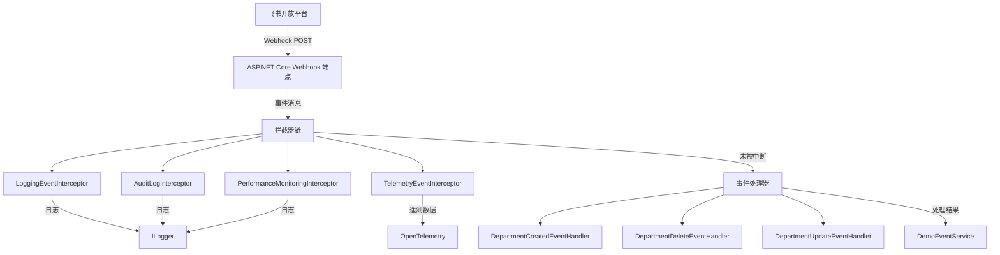
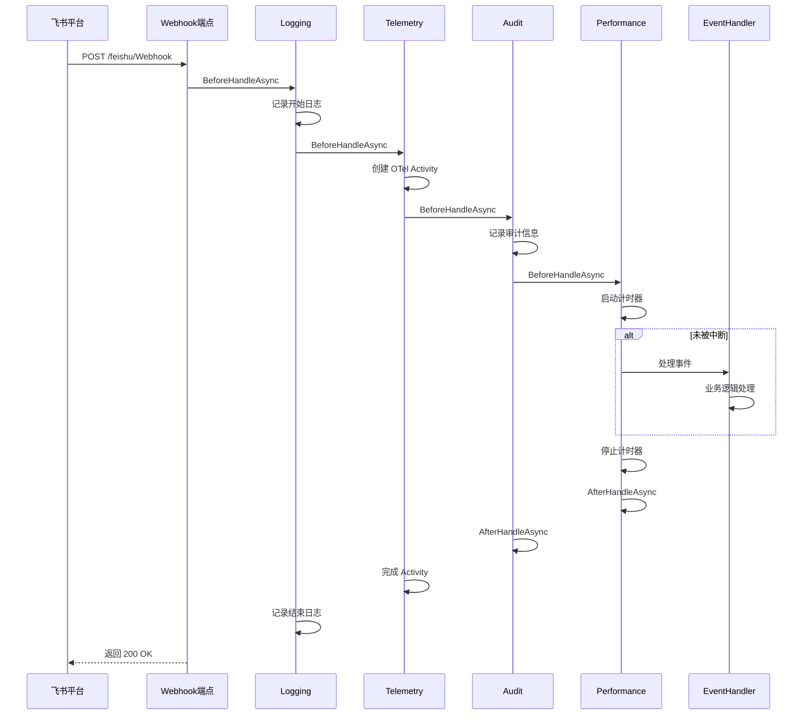

# Mud.Feishu.Webhook.Demo

飞书 Webhook 事件处理演示项目，展示如何使用 Mud.Feishu.Webhook SDK 接收、处理和监控飞书平台的各种事件回调。

## 📋 目录

- [项目简介](#项目简介)
- [核心功能](#核心功能)
- [技术架构](#技术架构)
- [快速开始](#快速开始)
- [配置说明](#配置说明)
- [项目结构](#项目结构)
- [核心组件](#核心组件)
- [事件处理器](#事件处理器)
- [拦截器使用](#拦截器使用)
- [诊断与测试](#诊断与测试)
- [示例场景](#示例场景)
- [常见问题](#常见问题)

## 项目简介

本项目是一个完整的飞书 Webhook 事件处理示例应用，演示了如何：

- ✅ 接收飞书平台推送的 Webhook 事件
- ✅ 实现自定义事件处理器处理部门相关事件
- ✅ 使用拦截器链增强事件处理能力（日志、遥测、审计、性能监控）
- ✅ 提供诊断端点检查处理器注册情况
- ✅ 提供测试端点模拟飞书事件
- ✅ 使用 OpenTelemetry 收集遥测指标

### 适用场景

- 需要实时同步飞书数据到本地系统
- 需要监控和分析 Webhook 事件处理性能
- 需要详细的审计日志记录
- 简单的 Webhook 集成场景（相比 WebSocket 更简单）

### Webhook vs WebSocket

| 特性 | Webhook | WebSocket |
|------|---------|-----------|
| **实时性** | ⭐⭐⭐ | ⭐⭐⭐⭐⭐ |
| **可靠性** | ⭐⭐⭐⭐ | ⭐⭐⭐⭐ |
| **部署复杂度** | ⭐⭐⭐⭐⭐ | ⭐⭐⭐ |
| **资源消耗** | ⭐⭐⭐⭐⭐ | ⭐⭐⭐⭐ |
| **网络要求** | 需要公网 IP | 无需公网 IP |
| **适用场景** | 简单场景、外部系统 | 实时性要求高、内部系统 |

**推荐选择**：
- 简单场景、低频事件 → **Webhook**（本项目）
- 实时性要求高、高频事件 → **WebSocket**

## 核心功能

| 功能 | 说明 |
|------|------|
| **Webhook 接收** | 接收飞书平台推送的事件回调 |
| **事件处理** | 支持部门创建、删除、更新等事件 |
| **拦截器链** | 日志、遥测、审计、性能监控（4个拦截器） |
| **诊断端点** | 检查处理器注册情况 |
| **测试端点** | 捕获请求、模拟事件 |
| **OpenTelemetry** | 分布式追踪和性能监控 |

## 技术架构



### 拦截器执行流程



## 快速开始

### 1. 环境要求

- .NET 8.0 或更高版本
- 飞书企业自建应用凭证
- 可公网访问的服务器（或使用 ngrok 等内网穿透工具）

### 2. 安装依赖

```bash
cd Demos/Mud.Feishu.Webhook.Demo
dotnet restore
```

### 3. 配置飞书应用

在 `appsettings.json` 中配置飞书凭证：

```json
{
  "FeishuWebhook": {
    "VerificationToken": "your-verification-token",
    "EncryptKey": "your-encrypt-key"
  }
}
```

**获取凭证**：
1. 登录 [飞书开放平台](https://open.feishu.cn/app)
2. 进入 **"凭证与基础信息"** 获取 App ID 和 App Secret
3. 进入 **"事件订阅"** 配置 Webhook 回调地址
4. 验证签名时生成或填写 `VerificationToken` 和 `EncryptKey`

### 4. 配置 Webhook 回调地址

在飞书开放平台配置回调地址：

```
http://your-server-domain/feishu/Webhook
```

**本地测试**：使用 ngrok 等工具创建公网隧道：

```bash
# 安装 ngrok
# 访问 https://ngrok.com/ 下载并安装

# 创建隧道
ngrok http 5015

# ngrok 会显示公网地址，例如：
# https://abc123.ngrok.io
```

然后配置飞书 Webhook 地址为：

```
https://abc123.ngrok.io/feishu/Webhook
```

### 5. 运行项目

```bash
dotnet run
```

服务启动后监听：
- HTTP: `http://localhost:5015`
- HTTPS: `https://localhost:7144`

### 6. 验证运行

查看控制台输出，应该看到类似日志：

```
[信息] Webhook 服务已启动
[信息] 监听地址: http://localhost:5015/feishu/Webhook
```

访问诊断端点：

```bash
curl http://localhost:5015/diagnostics/handlers
```

## 配置说明

### 完整配置示例

```json
{
  "Logging": {
    "LogLevel": {
      "Default": "Debug",
      "Microsoft.AspNetCore": "Warning",
      "Mud.Feishu.Webhook": "Debug",
      "Mud.Feishu.Abstractions": "Debug"
    }
  },
  "urls": "http://*:80",
  "AllowedHosts": "*",
  "FeishuWebhook": {
    "VerificationToken": "",
    "EncryptKey": "",
    "RoutePrefix": "feishu/Webhook",
    "AutoRegisterEndpoint": true,
    "EnableRequestLogging": true,
    "EnableExceptionHandling": true,
    "EnforceHeaderSignatureValidation": false,
    "EnableBodySignatureValidation": false,
    "EventHandlingTimeoutMs": 30000,
    "MaxConcurrentEvents": 10,
    "EnablePerformanceMonitoring": true,
    "AllowedHttpMethods": ["POST"],
    "MaxRequestBodySize": 10485760,
    "ValidateSourceIP": false,
    "AllowedSourceIPs": []
  }
}
```

### 配置项说明

| 配置项 | 类型 | 默认值 | 说明 |
|--------|------|--------|------|
| `VerificationToken` | string | - | 验证令牌，用于验证请求来源 |
| `EncryptKey` | string | - | 加密密钥，用于解密事件数据 |
| `RoutePrefix` | string | feishu/Webhook | Webhook 路由前缀 |
| `AutoRegisterEndpoint` | bool | true | 自动注册端点 |
| `EnableRequestLogging` | bool | true | 启用请求日志 |
| `EnableExceptionHandling` | bool | true | 启用异常处理 |
| `EnforceHeaderSignatureValidation` | bool | false | 是否验证请求头签名 |
| `EnableBodySignatureValidation` | bool | false | 是否验证请求体签名 |
| `EventHandlingTimeoutMs` | int | 30000 | 事件处理超时时间（毫秒） |
| `MaxConcurrentEvents` | int | 10 | 最大并发事件数 |
| `EnablePerformanceMonitoring` | bool | true | 启用性能监控 |
| `AllowedHttpMethods` | string[] | ["POST"] | 允许的 HTTP 方法 |
| `MaxRequestBodySize` | int | 10485760 | 最大请求体大小（10MB） |
| `ValidateSourceIP` | bool | false | 是否验证源 IP |
| `AllowedSourceIPs` | string[] | [] | 允许的源 IP 列表 |

### 安全配置建议

**生产环境**：

```json
{
  "FeishuWebhook": {
    "EnforceHeaderSignatureValidation": true,
    "EnableBodySignatureValidation": true,
    "ValidateSourceIP": true,
    "AllowedSourceIPs": ["58.200.0.0/16"], // 飞书服务器 IP 段
    "MaxRequestBodySize": 1048576 // 限制为 1MB
  }
}
```

**开发环境**：

```json
{
  "FeishuWebhook": {
    "EnforceHeaderSignatureValidation": false,
    "EnableBodySignatureValidation": false,
    "ValidateSourceIP": false,
    "EnableRequestLogging": true
  }
}
```

## 项目结构

```
Mud.Feishu.Webhook.Demo/
├── Program.cs                                    # 程序入口
├── Mud.Feishu.Webhook.Demo.csproj             # 项目文件
├── appsettings.json                              # 主配置文件
├── appsettings.Development.json                  # 开发环境配置
├── Properties/
│   └── launchSettings.json                      # 启动配置
├── Handlers/                                     # 事件处理器目录
│   ├── DemoDepartmentEventHandler.cs           # 部门创建事件处理器
│   ├── DemoDepartmentDeleteEventHandler.cs     # 部门删除事件处理器
│   └── DemoDepartmentUpdateEventHandler.cs     # 部门更新事件处理器
├── Interceptors/                                 # 拦截器目录
│   ├── README.md                               # 拦截器说明文档
│   ├── AuditLogInterceptor.cs                  # 审计日志拦截器
│   └── PerformanceMonitoringInterceptor.cs    # 性能监控拦截器
├── Services/                                     # 服务目录
│   └── DemoEventService.cs                     # 事件统计服务
├── Models/                                      # 数据模型
│   └── WebbookDemoModels.cs                    # Webhook 相关模型定义
├── DiagnosticsEndpoint.cs                       # 诊断端点
├── TestEndpoint.cs                              # 测试端点
└── README.md                                    # 本文档
```

## 核心组件

### 1. 程序入口 (Program.cs)

```csharp
var builder = WebApplication.CreateBuilder(args);

// 注册演示服务
builder.Services.AddSingleton<DemoEventService>();

// 注册飞书 Webhook 服务（添加拦截器）
builder.Services.CreateFeishuWebhookServiceBuilder(builder.Configuration, "FeishuWebhook")
    .AddInterceptor<LoggingEventInterceptor>()                          // 日志拦截器（内置）
    .AddInterceptor<TelemetryEventInterceptor>(sp =>
        new TelemetryEventInterceptor("Mud.Feishu.Webhook.Demo"))    // 遥测拦截器（内置）
    .AddInterceptor<AuditLogInterceptor>()                             // 审计日志拦截器（自定义）
    .AddInterceptor<PerformanceMonitoringInterceptor>()               // 性能监控拦截器（自定义）
    .AddHandler<DemoDepartmentEventHandler>()                        // 部门创建
    .AddHandler<DemoDepartmentDeleteEventHandler>()                   // 部门删除
    .AddHandler<DemoDepartmentUpdateEventHandler>()                   // 部门更新
    .Build();

var app = builder.Build();

// 注册端点
app.MapDiagnostics();        // 诊断端点
app.MapTestEndpoints();       // 测试端点

// 注册 Webhook 中间件
app.UseFeishuWebhook();

app.Run();
```

### 2. 事件统计服务 (DemoEventService)

管理事件统计和模拟数据：

```csharp
public class DemoEventService
{
    private readonly ConcurrentBag<DepartmentCreatedResult> _departmentEvents = new();
    private int _userCount = 0;
    private int _departmentCount = 0;
    private int _departmentDeleteCount = 0;

    public void IncrementUserCount() => Interlocked.Increment(ref _userCount);
    public void IncrementDepartmentCount() => Interlocked.Increment(ref _departmentCount);

    public EventStatistics GetStatistics()
    {
        return new EventStatistics
        {
            UserCount = _userCount,
            DepartmentCount = _departmentCount,
            DepartmentDeleteCount = _departmentDeleteCount,
            TotalEvents = _userCount + _departmentCount + _departmentDeleteCount
        };
    }

    // 生成模拟数据
    public EventData GenerateMockUserEvent() { }
    public EventData GenerateMockDepartmentEvent() { }
    public EventData GenerateMockApprovalEvent() { }
}
```

## 事件处理器

### 支持的事件类型

| 事件类型 | 处理器基类 | 示例 |
|---------|-----------|------|
| 部门创建 | `DepartmentCreatedEventHandler` | 处理新部门创建 |
| 部门删除 | `DepartmentDeleteEventHandler` | 处理部门删除 |
| 部门更新 | `DepartmentUpdateEventHandler` | 处理部门信息更新 |
| 用户创建 | `UserCreatedEventHandler` | 处理新用户创建 |
| 用户删除 | `UserDeleteEventHandler` | 处理用户删除 |
| 用户更新 | `UserUpdateEventHandler` | 处理用户信息更新 |
| 审批通过 | `ApprovalPassedEventHandler` | 处理审批通过 |
| 审批拒绝 | `ApprovalRejectedEventHandler` | 处理审批拒绝 |

### 部门创建事件处理器

```csharp
public class DemoDepartmentEventHandler : DepartmentCreatedEventHandler
{
    private readonly DemoEventService _eventService;

    public DemoDepartmentEventHandler(
        IFeishuEventDeduplicator businessDeduplicator,
        ILogger<DemoDepartmentEventHandler> logger,
        DemoEventService eventService)
        : base(businessDeduplicator, logger)
    {
        _eventService = eventService;
    }

    protected override async Task ProcessBusinessLogicAsync(
        EventData eventData,
        DepartmentCreatedResult? departmentData,
        CancellationToken cancellationToken = default)
    {
        _logger.LogInformation("开始处理部门创建事件: {EventId}", eventData.EventId);

        // 1. 记录事件到服务
        await _eventService.RecordDepartmentEventAsync(departmentData, cancellationToken);

        // 2. 模拟业务处理
        await ProcessDepartmentEventAsync(departmentData, cancellationToken);

        // 3. 记录完成日志
        _logger.LogInformation(
            "部门创建事件处理完成: 部门ID {DepartmentId}, 部门名 {DepartmentName}",
            departmentData?.Department?.OpenDepartmentId,
            departmentData?.Department?.Name);

        _eventService.IncrementDepartmentCount();
    }

    private Task ProcessDepartmentEventAsync(DepartmentCreatedResult? departmentData, CancellationToken cancellationToken)
    {
        // 实现你的业务逻辑
        Console.WriteLine($"部门创建: {departmentData?.Department?.Name}");
        return Task.CompletedTask;
    }
}
```

### 创建自定义事件处理器

1. **继承对应的事件处理器基类**

```csharp
public class MyCustomEventHandler : UserCreatedEventHandler
{
    private readonly IUserService _userService;

    public MyCustomEventHandler(
        IFeishuEventDeduplicator businessDeduplicator,
        ILogger<MyCustomEventHandler> logger,
        IUserService userService)
        : base(businessDeduplicator, logger)
    {
        _userService = userService;
    }

    protected override async Task ProcessBusinessLogicAsync(
        EventData eventData,
        UserCreatedResult? userData,
        CancellationToken cancellationToken = default)
    {
        // 实现你的业务逻辑
        var userId = userData?.User?.OpenId;
        var userName = userData?.User?.Name;

        // 记录到数据库
        await _userService.CreateUserAsync(userId, userName, cancellationToken);

        // 触发其他操作
        await NotifyOtherSystems(userId, cancellationToken);
    }
}
```

2. **注册事件处理器**

```csharp
builder.Services.CreateFeishuWebhookServiceBuilder(builder.Configuration, "FeishuWebhook")
    .AddHandler<MyCustomEventHandler>()
    .Build();
```

## 拦截器使用

本项目注册了 4 个拦截器，它们按顺序执行：

```csharp
builder.Services.CreateFeishuWebhookServiceBuilder(builder.Configuration, "FeishuWebhook")
    .AddInterceptor<LoggingEventInterceptor>()                          // 1. 日志拦截器（内置）
    .AddInterceptor<TelemetryEventInterceptor>(sp => 
        new TelemetryEventInterceptor("Mud.Feishu.Webhook.Demo"))     // 2. 遥测拦截器（内置）
    .AddInterceptor<AuditLogInterceptor>()                             // 3. 审计日志拦截器（自定义）
    .AddInterceptor<PerformanceMonitoringInterceptor>()               // 4. 性能监控拦截器（自定义）
    .AddHandler<...>()
    .Build();
```

### 拦截器执行顺序

```
收到 Webhook 请求
    ↓
LoggingEventInterceptor (BeforeHandleAsync) → 记录事件开始
    ↓
TelemetryEventInterceptor (BeforeHandleAsync) → 创建 OpenTelemetry Activity
    ↓
AuditLogInterceptor (BeforeHandleAsync) → 记录审计信息
    ↓
PerformanceMonitoringInterceptor (BeforeHandleAsync) → 启动计时
    ↓
[事件处理器处理事件]
    ↓
PerformanceMonitoringInterceptor (AfterHandleAsync) → 记录耗时
    ↓
AuditLogInterceptor (AfterHandleAsync) → 记录处理结果
    ↓
TelemetryEventInterceptor (AfterHandleAsync) → 完成 Activity
    ↓
LoggingEventInterceptor (AfterHandleAsync) → 记录事件结束
```

### 1. LoggingEventInterceptor（内置）

**位置**: `Mud.Feishu.Abstractions.Interceptors.LoggingEventInterceptor`

**功能**:
- 在事件处理前后记录基础日志信息
- 记录事件类型、事件 ID、租户密钥等基本信息

**日志示例**:
```
[INFO] 事件开始处理: EventType=department.user.created_v4, EventId=xxx, TenantKey=xxx
[INFO] 事件处理完成: EventType=department.user.created_v4, EventId=xxx
```

### 2. TelemetryEventInterceptor（内置）

**位置**: `Mud.Feishu.Abstractions.Interceptors.TelemetryEventInterceptor`

**功能**:
- 使用 OpenTelemetry API 收集遥测数据
- 创建 Activity 并设置标签（事件类型、事件 ID、租户密钥）
- 记录处理状态（成功/失败）和错误信息

**配置**:
```csharp
.AddInterceptor<TelemetryEventInterceptor>(sp =>
    new TelemetryEventInterceptor("Mud.Feishu.Webhook.Demo"))
```

### 3. AuditLogInterceptor（自定义）

**位置**: `Mud.Feishu.Webhook.Demo.Interceptors.AuditLogInterceptor`

**功能**:
- 记录详细的审计日志
- 记录事件创建时间、应用 ID 等扩展信息
- 区分成功和失败的处理结果

**日志示例**:
```
[INFO] [审计日志] 事件开始处理: EventType=department.user.created_v4, EventId=xxx, TenantKey=xxx, AppId=cli_xxx, CreateTime=2025-01-14 10:30:00
[INFO] [审计日志] 事件处理成功: EventType=department.user.created_v4, EventId=xxx
```

**实现**:
```csharp
public class AuditLogInterceptor : IFeishuEventInterceptor
{
    private readonly ILogger<AuditLogInterceptor> _logger;

    public AuditLogInterceptor(ILogger<AuditLogInterceptor> logger)
    {
        _logger = logger;
    }

    public Task<bool> BeforeHandleAsync(string eventType, EventData eventData, CancellationToken cancellationToken = default)
    {
        _logger.LogInformation(
            "[审计日志] 事件开始处理: EventType={EventType}, EventId={EventId}, TenantKey={TenantKey}, AppId={AppId}, CreateTime={CreateTime}",
            eventType,
            eventData.EventId,
            eventData.TenantKey,
            eventData.AppId,
            eventData.CreateTime);

        return Task.FromResult(true);
    }

    public Task AfterHandleAsync(string eventType, EventData eventData, Exception? exception, CancellationToken cancellationToken = default)
    {
        var status = exception == null ? "成功" : "失败";
        _logger.LogInformation("[审计日志] 事件处理{Status}: EventType={EventType}, EventId={EventId}", status, eventType, eventData.EventId);
        return Task.CompletedTask;
    }
}
```

### 4. PerformanceMonitoringInterceptor（自定义）

**位置**: `Mud.Feishu.Webhook.Demo.Interceptors.PerformanceMonitoringInterceptor`

**功能**:
- 使用 `Stopwatch` 精确记录事件处理耗时
- 根据耗时输出不同级别的日志（超过 1 秒警告，否则信息）
- 区分成功和失败的处理

**日志示例**:
```
[INFO] [性能监控] 事件处理完成: EventType=department.user.created_v4, EventId=xxx, ElapsedMs=45
[WARNING] [性能监控] 事件处理完成: EventType=department.user.created_v4, EventId=xxx, ElapsedMs=1234
```

**实现**:
```csharp
public class PerformanceMonitoringInterceptor : IFeishuEventInterceptor
{
    private readonly ConcurrentDictionary<string, Stopwatch> _stopwatches = new();
    private readonly ILogger<PerformanceMonitoringInterceptor> _logger;

    public PerformanceMonitoringInterceptor(ILogger<PerformanceMonitoringInterceptor> logger)
    {
        _logger = logger;
    }

    public Task<bool> BeforeHandleAsync(string eventType, EventData eventData, CancellationToken cancellationToken = default)
    {
        var eventId = eventData.EventId ?? Guid.NewGuid().ToString();
        var stopwatch = Stopwatch.StartNew();
        _stopwatches.TryAdd(eventId, stopwatch);

        return Task.FromResult(true);
    }

    public Task AfterHandleAsync(string eventType, EventData eventData, Exception? exception, CancellationToken cancellationToken = default)
    {
        var eventId = eventData.EventId ?? Guid.NewGuid().ToString();
        if (_stopwatches.TryRemove(eventId, out var stopwatch))
        {
            stopwatch.Stop();
            var elapsedMs = stopwatch.ElapsedMilliseconds;
            var logLevel = elapsedMs > 1000 ? LogLevel.Warning : LogLevel.Information;

            _logger.Log(logLevel,
                "[性能监控] 事件处理完成: EventType={EventType}, EventId={EventId}, ElapsedMs={ElapsedMs}",
                eventType,
                eventId,
                elapsedMs);
        }
        return Task.CompletedTask;
    }
}
```

### 如何添加自定义拦截器

#### 步骤 1: 实现接口

```csharp
using Mud.Feishu.Abstractions;
using Mud.Feishu.Abstractions.Interceptors;

public class MyCustomInterceptor : IFeishuEventInterceptor
{
    private readonly ILogger<MyCustomInterceptor> _logger;

    public MyCustomInterceptor(ILogger<MyCustomInterceptor> logger)
    {
        _logger = logger;
    }

    public Task<bool> BeforeHandleAsync(string eventType, EventData eventData, CancellationToken cancellationToken = default)
    {
        // 返回 true 继续处理，返回 false 中断处理
        _logger.LogInformation($"自定义拦截器: {eventType}");
        return Task.FromResult(true);
    }

    public Task AfterHandleAsync(string eventType, EventData eventData, Exception? exception, CancellationToken cancellationToken = default)
    {
        // 清理资源或记录处理结果
        return Task.CompletedTask;
    }
}
```

#### 步骤 2: 注册拦截器

```csharp
builder.Services.CreateFeishuWebhookServiceBuilder(builder.Configuration, "FeishuWebhook")
    .AddInterceptor<MyCustomInterceptor>()  // 注册自定义拦截器
    .AddHandler<...>()
    .Build();
```

#### 步骤 3: （可选）使用工厂方法注册

```csharp
.AddInterceptor<MyCustomInterceptor>(sp => new MyCustomInterceptor(
    sp.GetRequiredService<ILogger<MyCustomInterceptor>>(),
    // 其他依赖...
))
```

### 拦截器中断行为

如果需要在某些情况下中断事件处理：

```csharp
public class ConditionalInterceptor : IFeishuEventInterceptor
{
    public Task<bool> BeforeHandleAsync(string eventType, EventData eventData, CancellationToken cancellationToken = default)
    {
        // 条件判断
        if (eventType == "sensitive_event" && !IsAuthorized(eventData.TenantKey))
        {
            _logger.LogWarning("[条件拦截] 未授权，中断处理: {EventType}", eventType);
            return Task.FromResult(false); // 中断处理
        }
        return Task.FromResult(true); // 继续处理
    }

    public Task AfterHandleAsync(string eventType, EventData eventData, Exception? exception, CancellationToken cancellationToken = default)
    {
        // 即使中断，AfterHandleAsync 也会执行
        return Task.CompletedTask;
    }
}
```

**重要**：
- `BeforeHandleAsync` 返回 `false` → 中断后续拦截器和事件处理器
- 所有拦截器的 `AfterHandleAsync` **仍会执行**（按注册顺序）

## 诊断与测试

### 诊断端点

#### 查看已注册的处理器

```bash
curl http://localhost:5015/diagnostics/handlers
```

**响应示例**:
```json
{
  "RegisteredEventTypes": [
    "department.user.created_v4",
    "department.deleted_v3",
    "department.updated_v3"
  ],
  "HandlerInfo": [
    {
      "EventType": "department.user.created_v4",
      "HandlerType": "DemoDepartmentEventHandler",
      "IsRegistered": true
    },
    {
      "EventType": "department.deleted_v3",
      "HandlerType": "DemoDepartmentDeleteEventHandler",
      "IsRegistered": true
    },
    {
      "EventType": "department.updated_v3",
      "HandlerType": "DemoDepartmentUpdateEventHandler",
      "IsRegistered": true
    }
  ],
  "Summary": {
    "TotalEventTypes": 3,
    "TotalHandlers": 3,
    "Message": "✅ 成功注册 3 种事件类型"
  }
}
```

### 测试端点

#### 1. 捕获原始请求

```bash
curl -X POST http://localhost:5015/test/capture \
  -H "Content-Type: application/json" \
  -d '{"test": "data"}'
```

**响应**:
```json
{
  "success": true,
  "message": "请求已捕获",
  "index": 0
}
```

#### 2. 查看捕获的请求

```bash
curl http://localhost:5015/test/captured
```

**响应**:
```json
{
  "capturedRequests": [
    {
      "index": 0,
      "timestamp": "2025-01-17T10:30:00Z",
      "method": "POST",
      "path": "/test/capture",
      "headers": {
        "Content-Type": "application/json"
      },
      "body": "{\"test\":\"data\"}"
    }
  ],
  "totalCount": 1
}
```

#### 3. 查看特定请求详情

```bash
curl http://localhost:5015/test/captured/0
```

#### 4. 清空捕获的请求

```bash
curl -X DELETE http://localhost:5015/test/captured
```

#### 5. 模拟飞书事件

```bash
curl -X POST http://localhost:5015/test/mock-feishu-event \
  -H "Content-Type: application/json" \
  -d '{"eventType": "department"}'
```

### 日志输出示例

```
[INFO] [审计日志] 事件开始处理: EventType=department.user.created_v4, EventId=xxx, TenantKey=xxx, AppId=cli_xxx, CreateTime=2025-01-14 10:30:00
[DEBUG] [性能监控] 开始处理事件: EventType=department.user.created_v4, EventId=xxx
[INFO] >> [部门事件] 开始处理部门创建事件: {EventId}
[INFO] >> [部门事件] 部门创建事件处理完成: 部门ID {DepartmentId}, 部门名 {DepartmentName}
[INFO] [性能监控] 事件处理完成: EventType=department.user.created_v4, EventId=xxx, ElapsedMs=45
[INFO] [审计日志] 事件处理成功: EventType=department.user.created_v4, EventId=xxx
```

## 示例场景

### 场景 1：实时同步组织架构

**需求**：当飞书组织架构变化时，实时同步到本地数据库。

**实现**：

```csharp
public class DepartmentSyncHandler : DepartmentCreatedEventHandler
{
    private readonly IDepartmentRepository _repository;

    protected override async Task ProcessBusinessLogicAsync(
        EventData eventData,
        DepartmentCreatedResult? departmentData,
        CancellationToken cancellationToken = default)
    {
        var department = new Department
        {
            Id = departmentData?.Department?.OpenDepartmentId,
            Name = departmentData?.Department?.Name,
            ParentId = departmentData?.Department?.ParentDepartmentId,
            LeaderUserId = departmentData?.Department?.LeaderUserId,
            CreatedAt = DateTime.UtcNow
        };

        await _repository.InsertAsync(department, cancellationToken);
    }
}
```

### 场景 2：用户离职自动禁用账号

**需求**：当飞书用户离职时，自动禁用本地系统账号。

**实现**：

```csharp
public class UserDeleteHandler : UserDeleteEventHandler
{
    private readonly IUserService _userService;

    protected override async Task ProcessBusinessLogicAsync(
        EventData eventData,
        UserDeletedResult? userData,
        CancellationToken cancellationToken = default)
    {
        var userId = userData?.User?.OpenId;
        await _userService.DisableUserAsync(userId, cancellationToken);
    }
}
```

### 场景 3：性能监控告警

**需求**：当事件处理耗时超过阈值时，发送告警通知。

**实现**：

```csharp
public class AlertingInterceptor : IFeishuEventInterceptor
{
    private readonly ConcurrentDictionary<string, Stopwatch> _stopwatches = new();
    private readonly IAlertService _alertService;

    public Task<bool> BeforeHandleAsync(string eventType, EventData eventData, CancellationToken cancellationToken = default)
    {
        var stopwatch = Stopwatch.StartNew();
        _stopwatches.TryAdd(eventData.EventId, stopwatch);
        return Task.FromResult(true);
    }

    public async Task AfterHandleAsync(string eventType, EventData eventData, Exception? exception, CancellationToken cancellationToken = default)
    {
        if (_stopwatches.TryRemove(eventData.EventId, out var stopwatch))
        {
            stopwatch.Stop();
            if (stopwatch.ElapsedMilliseconds > 5000) // 超过 5 秒
            {
                await _alertService.SendAlertAsync(
                    $"事件处理超时: {eventType}, 耗时: {stopwatch.ElapsedMilliseconds}ms",
                    cancellationToken);
            }
        }
    }
}
```

### 场景 4：条件拦截

**需求**：只处理特定租户的事件。

**实现**：

```csharp
public class TenantFilterInterceptor : IFeishuEventInterceptor
{
    private readonly HashSet<string> _allowedTenants = new()
    {
        "tenant_1",
        "tenant_2"
    };

    public Task<bool> BeforeHandleAsync(string eventType, EventData eventData, CancellationToken cancellationToken = default)
    {
        if (!_allowedTenants.Contains(eventData.TenantKey))
        {
            _logger.LogWarning("[租户过滤] 忽略租户事件: {TenantKey}", eventData.TenantKey);
            return Task.FromResult(false); // 中断处理
        }
        return Task.FromResult(true);
    }

    public Task AfterHandleAsync(string eventType, EventData eventData, Exception? exception, CancellationToken cancellationToken = default)
    {
        return Task.CompletedTask;
    }
}
```

## 常见问题

### Q1: 飞书平台验证失败怎么办？

**A**: 检查以下几点：

1. `VerificationToken` 是否与飞书平台配置一致
2. Webhook 地址是否可公网访问
3. 防火墙是否允许访问

查看日志：

```
[错误] 验证失败: Token不匹配
```

### Q2: 如何查看处理器是否正确注册？

**A**: 访问诊断端点：

```bash
curl http://localhost:5015/diagnostics/handlers
```

检查 `RegisteredEventTypes` 和 `HandlerInfo` 字段。

### Q3: 事件处理超时怎么办？

**A**: 优化方案：

1. **增加超时时间**：

```json
{
  "FeishuWebhook": {
    "EventHandlingTimeoutMs": 60000
  }
}
```

2. **异步处理业务逻辑**：

```csharp
protected override async Task ProcessBusinessLogicAsync(...)
{
    // 快速返回，使用后台任务处理
    _ = Task.Run(() => ProcessAsync());
}
```

3. **增加并发数**：

```json
{
  "FeishuWebhook": {
    "MaxConcurrentEvents": 20
  }
}
```

### Q4: 如何测试 Webhook 事件？

**A**: 使用测试端点：

```bash
# 模拟部门事件
curl -X POST http://localhost:5015/test/mock-feishu-event \
  -H "Content-Type: application/json" \
  -d '{"eventType": "department"}'

# 模拟用户事件
curl -X POST http://localhost:5015/test/mock-feishu-event \
  -H "Content-Type: application/json" \
  -d '{"eventType": "user"}'
```

### Q5: 如何启用签名验证？

**A**: 配置安全选项：

```json
{
  "FeishuWebhook": {
    "EnforceHeaderSignatureValidation": true,
    "EnableBodySignatureValidation": true
  }
}
```

### Q6: 拦截器执行顺序如何控制？

**A**: 按注册顺序执行：

```csharp
builder.Services.CreateFeishuWebhookServiceBuilder(builder.Configuration, "FeishuWebhook")
    .AddInterceptor<FirstInterceptor>()     // 最先执行
    .AddInterceptor<SecondInterceptor>()    // 其次执行
    .AddInterceptor<ThirdInterceptor>()    // 最后执行
    .Build();
```

`BeforeHandleAsync` 按注册顺序执行，`AfterHandleAsync` 按相反顺序执行。

### Q7: 如何集成 OpenTelemetry？

**A**: 配置 OpenTelemetry：

```csharp
builder.Services.AddOpenTelemetry()
    .ConfigureResource(resource => resource.AddService("FeishuWebhookDemo"))
    .WithTracing(tracing => tracing
        .AddSource("Mud.Feishu.Webhook.Demo")
        .AddAspNetCoreInstrumentation()
        .AddConsoleExporter()
        .AddJaegerExporter(opt =>
        {
            opt.Endpoint = new Uri("http://localhost:4317");
        }));
```

### Q8: 如何记录详细日志？

**A**: 配置日志级别：

```json
{
  "Logging": {
    "LogLevel": {
      "Default": "Debug",
      "Mud.Feishu.Webhook": "Debug",
      "Mud.Feishu.Abstractions": "Debug"
    }
  }
}
```

### Q9: 拦截器中的异常如何处理？

**A**: 拦截器中的异常会影响整个处理流程，需要妥善处理：

```csharp
public Task<bool> BeforeHandleAsync(string eventType, EventData eventData, CancellationToken cancellationToken = default)
{
    try
    {
        // 你的逻辑
        return Task.FromResult(true);
    }
    catch (Exception ex)
    {
        _logger.LogError(ex, "拦截器执行失败");
        return Task.FromResult(true); // 根据业务决定是否中断
    }
}
```

### Q10: 如何持久化事件统计？

**A**: 扩展 `DemoEventService`：

```csharp
public class DemoEventService
{
    private readonly IDatabaseRepository _repository;

    public EventStatistics GetStatistics()
    {
        var stats = new EventStatistics { ... };

        // 从数据库加载
        var dbStats = _repository.GetEventStatistics();
        stats.UserCount += dbStats.UserCount;
        // ...

        return stats;
    }

    public async Task SaveStatisticsAsync()
    {
        await _repository.SaveEventStatisticsAsync(new EventStatistics
        {
            UserCount = _userCount,
            DepartmentCount = _departmentCount,
            // ...
        });
    }
}
```

## 相关文档

- [拦截器详细文档](./Interceptors/README.md) - 拦截器深度解析和使用示例
- [Mud.Feishu.Webhook 文档](../../docs/webhook.md) - Webhook SDK 官方文档
- [飞书开放平台文档](https://open.feishu.cn/document) - 飞书官方 API 文档

## 许可证

本项目遵循 [MIT 许可证](../../LICENSE)。

## 支持

如有问题，请：
- 提交 [Issue](https://github.com/your-repo/issues)
- 查看 [文档](../../docs)
- 联系技术支持

---

**Mud.Feishu.Webhook.Demo** - 飞书 Webhook 事件处理的最佳实践演示
