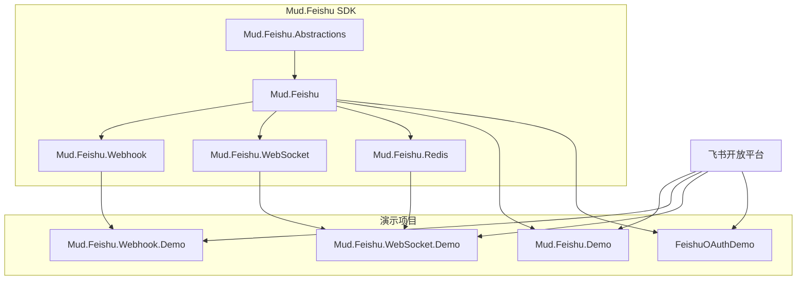
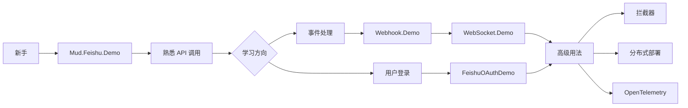

# Mud.Feishu 演示项目集

本目录包含 Mud.Feishu SDK 的完整示例项目，展示了如何在不同场景下集成和使用飞书开放平台的各种功能。

## 📋 目录

- [项目概览](#项目概览)
- [快速导航](#快速导航)
- [技术栈](#技术栈)
- [环境要求](#环境要求)
- [快速开始](#快速开始)
- [项目详解](#项目详解)
- [选择指南](#选择指南)
- [常见问题](#常见问题)

---

## 项目概览

| 项目名称 | 描述 | 技术栈 | 难度 |
|---------|------|--------|------|
| **[Mud.Feishu.Demo](./Mud.Feishu.Demo)** | REST API 完整功能示例 | .NET 8.0 + ASP.NET Core | ⭐⭐ |
| **[Mud.Feishu.Webhook.Demo](./Mud.Feishu.Webhook.Demo)** | Webhook 事件处理示例 | .NET 8.0 + ASP.NET Core | ⭐⭐⭐⭐ |
| **[Mud.Feishu.WebSocket.Demo](./Mud.Feishu.WebSocket.Demo)** | WebSocket 实时事件示例 | .NET 8.0 + ASP.NET Core | ⭐⭐⭐⭐ |
| **[FeishuOAuthDemo](./FeishuOAuthDemo)** | OAuth 2.0 统一登录示例 | .NET 10.0 + Vue 3 | ⭐⭐⭐ |

### 项目关系图



---

## 快速导航

### 根据场景选择

| 场景 | 推荐项目 | 说明 |
|------|---------|------|
| 🚀 **快速入门** | [Mud.Feishu.Demo](./Mud.Feishu.Demo) | 最简单的 API 调用示例，包含所有主要功能 |
| 🔔 **简单事件处理** | [Mud.Feishu.Webhook.Demo](./Mud.Feishu.Webhook.Demo) | Webhook 事件接收和处理，适合低频事件 |
| ⚡ **实时事件处理** | [Mud.Feishu.WebSocket.Demo](./Mud.Feishu.WebSocket.Demo) | WebSocket 实时事件推送，适合高频事件 |
| 🔐 **用户登录** | [FeishuOAuthDemo](./FeishuOAuthDemo) | OAuth 2.0 统一登录，包含前后端完整示例 |

### 根据技术栈选择

| 技术栈 | 推荐项目 |
|--------|---------|
| **ASP.NET Core Web API** | [Mud.Feishu.Demo](./Mud.Feishu.Demo) |
| **ASP.NET Core + Webhook** | [Mud.Feishu.Webhook.Demo](./Mud.Feishu.Webhook.Demo) |
| **ASP.NET Core + WebSocket** | [Mud.Feishu.WebSocket.Demo](./Mud.Feishu.WebSocket.Demo) |
| **.NET + Vue 3 前端** | [FeishuOAuthDemo](./FeishuOAuthDemo) |

---

## 技术栈

### 后端技术

| 技术 | 版本 | 用途 |
|------|------|------|
| .NET | 8.0, 9.0, 10.0 | 运行时框架 |
| ASP.NET Core | 8.0+ | Web 框架 |
| Mud.Feishu | 1.2.1 | 飞书 SDK |
| Swashbuckle.AspNetCore | 10.0.1 | API 文档生成 |
| Scalar.AspNetCore | 1.2.40 | API 文档生成（.NET 10） |
| Redis | - | 分布式去重 |
| OpenTelemetry | - | 遥测和追踪 |

### 前端技术

| 技术 | 版本 | 用途 |
|------|------|------|
| Vue | 3.x | 前端框架 |
| TypeScript | 5.x | 类型安全 |
| Vite | 5.x | 构建工具 |
| Element Plus | 2.x | UI 组件库 |
| Pinia | 2.x | 状态管理 |
| Vue Router | 4.x | 路由管理 |

---

## 环境要求

### 基础要求

- **.NET SDK**: 8.0 或更高版本
- **Node.js**: 18.x 或更高版本（仅前端项目需要）
- **飞书企业自建应用**: 需要在飞书开放平台创建应用
- **Redis**: 5.x 或更高版本（仅 WebSocket Demo 需要）

### 可选工具

- **ngrok**: 本地测试 Webhook 的公网隧道工具
- **Postman**: API 测试工具
- **Docker**: Redis 容器化部署

### 安装 .NET SDK

```bash
# Windows
# 下载安装程序: https://dotnet.microsoft.com/download

# 验证安装
dotnet --version
```

### 安装 Node.js

```bash
# Windows
# 下载安装程序: https://nodejs.org/

# 验证安装
node --version
npm --version
```

### 安装 Redis

**Docker 方式（推荐）**：

```bash
# Windows (需要 Docker Desktop)
docker run -d -p 6379:6379 redis --requirepass letmein

# 验证安装
docker ps
```

**Windows 方式**：

```bash
# 下载 Redis for Windows: https://github.com/microsoftarchive/redis/releases
# 解压并运行 redis-server.exe
```

---

## 快速开始

### 1. 克隆项目

```bash
git clone https://github.com/your-repo/MudFeishu.git
cd MudFeishu/Demos
```

### 2. 配置飞书应用

在飞书开放平台创建应用并获取凭证：

1. 访问 [飞书开放平台](https://open.feishu.cn/app)
2. 创建"企业自建应用"
3. 获取 `App ID` 和 `App Secret`
4. 根据项目需求配置权限和功能

### 3. 选择项目运行

#### 方式 A：运行 Mud.Feishu.Demo（推荐新手）

```bash
cd Mud.Feishu.Demo

# 编辑 appsettings.json，填入凭证
# {
#   "Feishu": {
#     "AppId": "cli_xxxxxxxxxxxxxxxx",
#     "AppSecret": "your-app-secret-here"
#   }
# }

# 运行项目
dotnet run

# 访问 API 文档
# https://localhost:60360/swagger
```

#### 方式 B：运行 Mud.Feishu.Webhook.Demo

```bash
cd Mud.Feishu.Webhook.Demo

# 编辑 appsettings.json，填入凭证
# {
#   "FeishuWebhook": {
#     "VerificationToken": "your-token",
#     "EncryptKey": "your-key"
#   }
# }

# 运行项目
dotnet run

# 访问诊断端点
# http://localhost:5015/diagnostics/handlers
```

#### 方式 C：运行 Mud.Feishu.WebSocket.Demo

```bash
cd Mud.Feishu.WebSocket.Demo

# 确保 Redis 正在运行
docker run -d -p 6379:6379 redis --requirepass letmein

# 编辑 appsettings.json，填入凭证
# {
#   "Feishu": {
#     "AppId": "cli_xxxxxxxxxxxxxxxx",
#     "AppSecret": "your-app-secret-here"
#   },
#   "Redis": {
#     "ServerAddress": "localhost:6379",
#     "Password": "letmein"
#   }
# }

# 运行项目
dotnet run

# 查看日志输出
```

#### 方式 D：运行 FeishuOAuthDemo

```bash
cd FeishuOAuthDemo/backend

# 编辑 appsettings.local.json，填入凭证
# {
#   "Feishu": {
#     "AppId": "cli_xxxxxxxxxxxxxxxx",
#     "AppSecret": "your-app-secret-here"
#   }
# }

# 运行后端
dotnet run

# 在另一个终端运行前端
cd ../frontend
npm install
npm run dev

# 访问前端
# http://localhost:5173
```

---

## 项目详解

### 1. Mud.Feishu.Demo

**描述**：ASP.NET Core Web API 完整功能示例

**功能模块**：
- ✅ 身份认证与令牌管理
- ✅ 消息发送与管理
- ✅ 卡片创建与交互
- ✅ 群组管理
- ✅ 组织架构管理（用户、部门、角色等）
- ✅ 任务管理

**特点**：
- 最全面的 API 覆盖
- Swagger 自动生成文档
- RESTful 设计规范
- 适合作为 API 调用参考

**快速开始**：

```bash
cd Mud.Feishu.Demo
dotnet run
# 访问 https://localhost:60360/swagger
```

**详细文档**：[查看 Mud.Feishu.Demo/README.md](./Mud.Feishu.Demo/README.md)

---

### 2. Mud.Feishu.Webhook.Demo

**描述**：Webhook 事件处理示例

**功能模块**：
- ✅ Webhook 事件接收
- ✅ 事件处理器（部门创建、删除、更新）
- ✅ 拦截器链（日志、遥测、审计、性能监控）
- ✅ 诊断端点
- ✅ 测试端点

**特点**：
- 4 个拦截器演示（2 个内置 + 2 个自定义）
- 详细的审计日志
- 性能监控和告警
- 适合学习拦截器机制

**快速开始**：

```bash
cd Mud.Feishu.Webhook.Demo
dotnet run
# 访问 http://localhost:5015/diagnostics/handlers
```

**详细文档**：[查看 Mud.Feishu.Webhook.Demo/README.md](./Mud.Feishu.Webhook.Demo/README.md)

---

### 3. Mud.Feishu.WebSocket.Demo

**描述**：WebSocket 实时事件示例

**功能模块**：
- ✅ WebSocket 连接管理
- ✅ 实时事件接收
- ✅ 事件处理器
- ✅ 拦截器链（日志、遥测、限流）
- ✅ Redis 分布式去重
- ✅ OpenTelemetry 集成

**特点**：
- 实时性高
- 支持分布式部署
- 完整的遥测和监控
- 适合高并发场景

**快速开始**：

```bash
# 启动 Redis
docker run -d -p 6379:6379 redis --requirepass letmein

cd Mud.Feishu.WebSocket.Demo
dotnet run
```

**详细文档**：[查看 Mud.Feishu.WebSocket.Demo/README.md](./Mud.Feishu.WebSocket.Demo/README.md)

---

### 4. FeishuOAuthDemo

**描述**：OAuth 2.0 统一登录示例

**功能模块**：
- ✅ OAuth 2.0 授权流程
- ✅ JWT 令牌生成和验证
- ✅ 飞书用户信息获取
- ✅ 前后端完整集成
- ✅ Vue 3 + Element Plus UI

**特点**：
- 完整的前后端分离架构
- 精美的 UI 界面
- State 参数防 CSRF
- 适合集成用户登录

**快速开始**：

```bash
# 后端
cd FeishuOAuthDemo/backend
dotnet run

# 前端（另一个终端）
cd FeishuOAuthDemo/frontend
npm install
npm run dev

# 访问 http://localhost:5173
```

**详细文档**：[查看 FeishuOAuthDemo/README.md](./FeishuOAuthDemo/README.md)

---

## 选择指南

### Webhook vs WebSocket

| 特性 | Webhook | WebSocket |
|------|---------|-----------|
| **实时性** | ⭐⭐⭐ | ⭐⭐⭐⭐⭐ |
| **可靠性** | ⭐⭐⭐⭐ | ⭐⭐⭐⭐ |
| **部署复杂度** | ⭐⭐⭐⭐⭐ | ⭐⭐⭐ |
| **资源消耗** | ⭐⭐⭐⭐⭐ | ⭐⭐⭐⭐ |
| **网络要求** | 需要公网 IP | 无需公网 IP |
| **适用场景** | 简单场景、低频事件 | 实时性要求高、高频事件 |
| **示例项目** | [Webhook.Demo](./Mud.Feishu.Webhook.Demo) | [WebSocket.Demo](./Mud.Feishu.WebSocket.Demo) |

**选择建议**：
- **Webhook**：适合简单场景、低频事件（如审批流程、数据同步）
- **WebSocket**：适合实时性要求高、高频事件（如即时通讯、实时监控）

### API 调用 vs 事件处理

| 场景 | 推荐项目 |
|------|---------|
| 主动调用飞书 API（发送消息、创建卡片等） | [Mud.Feishu.Demo](./Mud.Feishu.Demo) |
| 接收飞书事件推送 | [Webhook.Demo](./Mud.Feishu.Webhook.Demo) 或 [WebSocket.Demo](./Mud.Feishu.WebSocket.Demo) |
| 用户登录认证 | [FeishuOAuthDemo](./FeishuOAuthDemo) |

### 学习路径建议



**推荐学习顺序**：
1. **Mud.Feishu.Demo** → 了解基础 API 调用
2. **Mud.Feishu.Webhook.Demo** → 学习事件处理和拦截器
3. **Mud.Feishu.WebSocket.Demo** → 进阶实时事件和分布式
4. **FeishuOAuthDemo** → 完整的前后端集成

---

## 常见问题

### Q1: 我应该从哪个项目开始？

**A**: 如果你刚刚接触 Mud.Feishu SDK，推荐从 **[Mud.Feishu.Demo](./Mud.Feishu.Demo)** 开始，它包含最全面的 API 示例，并且有 Swagger 文档，非常适合学习基础 API 调用。

### Q2: Webhook 和 WebSocket 如何选择？

**A**: 参考 [Webhook vs WebSocket](#webhook-vs-websocket) 对比表：

- **选择 Webhook**：如果需要简单的事件接收、低频事件（如审批、数据同步）
- **选择 WebSocket**：如果需要实时性、高频事件（如即时通讯、实时监控）

### Q3: 如何测试 Webhook？

**A**: 有几种方式测试 Webhook：

1. **使用 ngrok 创建公网隧道**（推荐）：

```bash
# 安装 ngrok
# 访问 https://ngrok.com/

# 创建隧道
ngrok http 5015

# 在飞书平台配置回调地址为 ngrok 提供的公网地址
```

2. **使用内网穿透工具**：
   - Ngrok
   - LocalTunnel
   - Frp

3. **部署到云服务器**：
   - 购买云服务器（阿里云、腾讯云等）
   - 部署项目
   - 配置公网域名

### Q4: 如何获取飞书应用凭证？

**A**: 步骤如下：

1. 访问 [飞书开放平台](https://open.feishu.cn/app)
2. 点击"创建企业自建应用"
3. 填写应用信息并创建
4. 进入应用详情页
5. 在"凭证与基础信息"中获取：
   - **App ID**：类似 `cli_xxxxxxxxxxxxxxxx`
   - **App Secret**：点击"查看"或"重置"获取

### Q5: Redis 连接失败怎么办？

**A**: 检查以下几点：

1. **确认 Redis 是否运行**：

```bash
# Windows
redis-cli ping

# Docker
docker ps
docker exec <container-id> redis-cli ping
```

2. **检查连接配置**：

```json
{
  "Redis": {
    "ServerAddress": "localhost:6379",
    "Password": "letmein",
    "ConnectTimeout": 5000
  }
}
```

3. **防火墙设置**：确保 6379 端口未被防火墙阻止

### Q6: 如何添加自定义拦截器？

**A**: 参考 [Mud.Feishu.Webhook.Demo](./Mud.Feishu.Webhook.Demo) 中的拦截器示例：

1. **实现 `IFeishuEventInterceptor` 接口**：

```csharp
public class MyCustomInterceptor : IFeishuEventInterceptor
{
    public Task<bool> BeforeHandleAsync(string eventType, EventData eventData, CancellationToken cancellationToken = default)
    {
        // 返回 true 继续处理，返回 false 中断处理
        return Task.FromResult(true);
    }

    public Task AfterHandleAsync(string eventType, EventData eventData, Exception? exception, CancellationToken cancellationToken = default)
    {
        // 清理资源或记录处理结果
        return Task.CompletedTask;
    }
}
```

2. **注册拦截器**：

```csharp
builder.Services.CreateFeishuWebhookServiceBuilder(builder.Configuration, "FeishuWebhook")
    .AddInterceptor<MyCustomInterceptor>()
    .Build();
```

详细文档：[查看拦截器使用指南](./Mud.Feishu.Webhook.Demo/README.md#拦截器使用)

### Q7: 如何调试项目？

**A**: 使用以下方法：

1. **Visual Studio / VS Code**：
   - 设置断点
   - 启动调试模式（F5）
   - 查看变量和调用栈

2. **日志输出**：

```json
{
  "Logging": {
    "LogLevel": {
      "Default": "Debug",
      "Mud.Feishu": "Debug"
    }
  }
}
```

3. **使用 Postman**：
   - 导入 Swagger 生成的 OpenAPI 文档
   - 手动发送请求
   - 查看响应

4. **使用诊断端点**：
   - Webhook Demo: `http://localhost:5015/diagnostics/handlers`
   - 查看已注册的处理器和拦截器

### Q8: 项目可以用于生产环境吗？

**A**: 演示项目主要用于学习和参考，如果用于生产环境，建议：

1. **安全加固**：
   - 启用签名验证
   - 配置 IP 白名单
   - 使用 HTTPS

2. **性能优化**：
   - 增加并发处理数
   - 配置 Redis 集群
   - 添加负载均衡

3. **监控告警**：
   - 集成 OpenTelemetry
   - 配置日志收集
   - 设置性能监控

4. **错误处理**：
   - 完善异常处理
   - 添加重试机制
   - 配置熔断降级

### Q9: 如何升级 Mud.Feishu SDK 版本？

**A**: 更新 NuGet 包：

```bash
# 更新到最新版本
dotnet add package Mud.Feishu

# 更新到指定版本
dotnet add package Mud.Feishu --version 1.3.0

# 更新所有 Mud.Feishu 包
dotnet add package Mud.Feishu.Abstractions
dotnet add package Mud.Feishu.Webhook
dotnet add package Mud.Feishu.WebSocket
dotnet add package Mud.Feishu.Redis
```

### Q10: 如何贡献代码？

**A**: 欢迎贡献！步骤如下：

1. Fork 项目仓库
2. 创建特性分支：`git checkout -b feature/my-feature`
3. 提交更改：`git commit -am 'Add some feature'`
4. 推送分支：`git push origin feature/my-feature`
5. 创建 Pull Request

---

## 相关资源

### 官方文档

- [飞书开放平台文档](https://open.feishu.cn/document) - 飞书 API 官方文档
- [Mud.Feishu SDK 文档](../docs) - SDK 详细文档

### 示例文档

- [Mud.Feishu.Demo README](./Mud.Feishu.Demo/README.md)
- [Mud.Feishu.Webhook.Demo README](./Mud.Feishu.Webhook.Demo/README.md)
- [Mud.Feishu.WebSocket.Demo README](./Mud.Feishu.WebSocket.Demo/README.md)
- [FeishuOAuthDemo README](./FeishuOAuthDemo/README.md)

### 技术博客

- [Mud.Feishu 使用指南](../docs/guide.md)
- [最佳实践](../docs/best-practices.md)

### 社区支持

- [GitHub Issues](https://github.com/your-repo/issues) - 问题反馈
- [GitHub Discussions](https://github.com/your-repo/discussions) - 技术讨论
- [官方论坛](https://open.feishu.cn/community) - 飞书开发者社区

---

## 许可证

本项目遵循 [MIT 许可证](../LICENSE)。

---

## 支持

如有问题或建议，请：

- 提交 [Issue](https://github.com/your-repo/issues)
- 查看 [文档](../docs)
- 联系技术支持

---

**Mud.Feishu 演示项目集** - 学习和探索飞书开放平台集成的最佳实践
