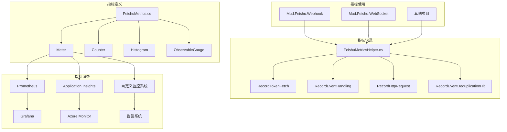

# 飞书指标系统 (FeishuMetrics) 文档

## 📊 概述

飞书指标系统是 Mud.Feishu 库的核心组件之一，基于 .NET 标准的 `System.Diagnostics.Metrics` 实现，提供了全面的指标收集和暴露能力。通过使用该系统，开发者可以实时监控飞书服务的运行状态、性能表现和错误情况，为系统运维和优化提供数据支持。

## 🏗️ 指标架构



## 📈 支持的指标

### 1. 令牌相关指标

| 指标名称 | 类型 | 单位 | 标签 | 说明 |
|---------|------|------|------|------|
| `feishu_token_fetch_total` | Counter | 次 | `token_type` | 令牌获取总次数 |
| `feishu_token_cache_hit_total` | Counter | 次 | `token_type` | 令牌缓存命中次数 |
| `feishu_token_cache_miss_total` | Counter | 次 | `token_type` | 令牌缓存未命中次数 |
| `feishu_token_refresh_total` | Counter | 次 | `token_type` | 令牌刷新次数 |
| `feishu_token_fetch_duration_ms` | Histogram | 毫秒 | `token_type` | 令牌获取持续时间 |
| `feishu_cached_tokens` | ObservableGauge | 个 | - | 当前缓存的令牌数 |

### 2. 事件处理指标

| 指标名称 | 类型 | 单位 | 标签 | 说明 |
|---------|------|------|------|------|
| `feishu_event_handling_total` | Counter | 次 | `event_type`, `handler_type` | 事件处理总次数 |
| `feishu_event_handling_success_total` | Counter | 次 | `event_type` | 事件处理成功次数 |
| `feishu_event_handling_failure_total` | Counter | 次 | `event_type`, `error_type` | 事件处理失败次数 |
| `feishu_event_handling_duration_ms` | Histogram | 毫秒 | `event_type`, `handler_type` | 事件处理持续时间 |
| `feishu_event_deduplication_hit_total` | Counter | 次 | `dedup_type` | 事件去重命中次数 |

### 3. HTTP 请求指标

| 指标名称 | 类型 | 单位 | 标签 | 说明 |
|---------|------|------|------|------|
| `feishu_http_request_total` | Counter | 次 | `method`, `url` | HTTP 请求总次数 |
| `feishu_http_request_success_total` | Counter | 次 | `method`, `status_code` | HTTP 请求成功次数 |
| `feishu_http_request_failure_total` | Counter | 次 | `method`, `status_code`, `error_type` | HTTP 请求失败次数 |
| `feishu_http_request_duration_ms` | Histogram | 毫秒 | `method`, `url` | HTTP 请求持续时间 |

### 4. WebSocket 相关指标

| 指标名称 | 类型 | 单位 | 标签 | 说明 |
|---------|------|------|------|------|
| `feishu_websocket_connections` | ObservableGauge | 个 | - | WebSocket 连接数 |

## 🛠️ 指标使用指南

### 1. 基本使用

#### 记录令牌获取

```csharp
using Mud.Feishu.Abstractions.Metrics;

// 记录令牌获取，支持缓存命中/未命中标记
using var metrics = FeishuMetricsHelper.RecordTokenFetch("app", fromCache: false);

// 记录令牌刷新
FeishuMetricsHelper.RecordTokenRefresh("app");
```

#### 记录事件处理

```csharp
using Mud.Feishu.Abstractions.Metrics;

// 记录事件处理
using var metrics = FeishuMetricsHelper.RecordEventHandling("im.message.receive_v1", "webhook");

// 记录事件处理成功
FeishuMetricsHelper.RecordEventHandlingSuccess("im.message.receive_v1");

// 记录事件处理失败
FeishuMetricsHelper.RecordEventHandlingFailure("im.message.receive_v1", "json_parse_error");

// 记录事件去重命中
FeishuMetricsHelper.RecordEventDeduplicationHit("event_id");
```

#### 记录 HTTP 请求

```csharp
using Mud.Feishu.Abstractions.Metrics;

// 记录 HTTP 请求
using var metrics = FeishuMetricsHelper.RecordHttpRequest("GET", "https://open.feishu.cn/open-apis/auth/v3/tenant_access_token/internal");

// 记录 HTTP 请求成功
FeishuMetricsHelper.RecordHttpRequestSuccess("GET", 200);

// 记录 HTTP 请求失败
FeishuMetricsHelper.RecordHttpRequestFailure("GET", 401, "unauthorized");
```

### 2. 标签命名规范

为了确保指标的一致性和可观测性，建议遵循以下标签命名规范：

- **使用小写字母和下划线**：例如 `token_type`、`event_type`、`error_type` 等
- **保持标签值简洁**：避免使用过长的标签值，建议不超过 50 个字符
- **使用标准化的标签值**：例如对于错误类型，使用 `timeout`、`unauthorized`、`json_parse_error` 等标准化的标签值
- **避免使用动态标签值**：例如用户 ID、事件 ID 等动态值不应该作为标签值，因为这会导致指标数量爆炸

### 3. 指标聚合建议

为了减少指标数量和提高性能，建议遵循以下指标聚合建议：

- **对相似的操作使用相同的指标名称**：通过标签区分不同的操作类型，而不是为每个操作创建单独的指标
- **合理设置指标的采集频率**：对于高频操作，建议使用较低的采集频率，或者使用指标聚合来减少指标数据量
- **避免使用过多的标签**：每个指标的标签数量建议不超过 5 个，否则会导致指标数量急剧增加
- **使用直方图（Histogram）记录持续时间**：直方图可以自动计算分位数，避免为每个时间范围创建单独的指标

## 🔍 监控建议

### 1. 关键指标监控

| 指标 | 监控原因 | 告警阈值 |
|------|---------|----------|
| `feishu_token_fetch_total` | 监控令牌获取频率，异常增加可能表示缓存失效 | 5 分钟内增加超过 100 次 |
| `feishu_token_cache_miss_total` | 监控缓存未命中率，过高表示缓存策略有问题 | 5 分钟内未命中率超过 50% |
| `feishu_event_handling_failure_total` | 监控事件处理失败率，过高表示系统有问题 | 5 分钟内失败率超过 10% |
| `feishu_event_handling_duration_ms` | 监控事件处理延迟，过高表示系统性能有问题 | P95 超过 1000ms |
| `feishu_http_request_failure_total` | 监控 HTTP 请求失败率，过高表示网络或服务有问题 | 5 分钟内失败率超过 5% |
| `feishu_http_request_duration_ms` | 监控 HTTP 请求延迟，过高表示网络或服务性能有问题 | P95 超过 2000ms |
| `feishu_websocket_connections` | 监控 WebSocket 连接数，异常变化表示连接状态有问题 | 1 分钟内变化超过 50% |

### 2. 仪表板示例

#### Grafana 仪表板

```json
{
  "title": "飞书服务监控",
  "panels": [
    {
      "title": "令牌获取统计",
      "type": "graph",
      "targets": [
        { "expr": "rate(feishu_token_fetch_total[5m])", "legendFormat": "总获取" },
        { "expr": "rate(feishu_token_cache_hit_total[5m])", "legendFormat": "缓存命中" },
        { "expr": "rate(feishu_token_cache_miss_total[5m])", "legendFormat": "缓存未命中" }
      ]
    },
    {
      "title": "事件处理统计",
      "type": "graph",
      "targets": [
        { "expr": "rate(feishu_event_handling_total[5m])", "legendFormat": "总处理" },
        { "expr": "rate(feishu_event_handling_success_total[5m])", "legendFormat": "成功" },
        { "expr": "rate(feishu_event_handling_failure_total[5m])", "legendFormat": "失败" }
      ]
    },
    {
      "title": "HTTP 请求统计",
      "type": "graph",
      "targets": [
        { "expr": "rate(feishu_http_request_total[5m])", "legendFormat": "总请求" },
        { "expr": "rate(feishu_http_request_success_total[5m])", "legendFormat": "成功" },
        { "expr": "rate(feishu_http_request_failure_total[5m])", "legendFormat": "失败" }
      ]
    },
    {
      "title": "WebSocket 连接数",
      "type": "gauge",
      "targets": [
        { "expr": "feishu_websocket_connections", "legendFormat": "连接数" }
      ]
    },
    {
      "title": "事件处理延迟",
      "type": "graph",
      "targets": [
        { "expr": "histogram_quantile(0.5, rate(feishu_event_handling_duration_ms_bucket[5m]))", "legendFormat": "P50" },
        { "expr": "histogram_quantile(0.9, rate(feishu_event_handling_duration_ms_bucket[5m]))", "legendFormat": "P90" },
        { "expr": "histogram_quantile(0.95, rate(feishu_event_handling_duration_ms_bucket[5m]))", "legendFormat": "P95" }
      ]
    }
  ]
}
```

## 📝 最佳实践

### 1. 代码层面

- **在关键流程中使用指标**：在令牌获取、事件处理、HTTP 请求等关键流程中使用指标记录
- **使用 `using` 语句**：对于需要记录持续时间的操作，使用 `using` 语句确保指标记录器被正确释放
- **记录详细的标签**：为指标添加详细的标签，便于后续的分析和定位问题
- **处理异常情况**：在异常情况下也要记录指标，确保监控的完整性

### 2. 运维层面

- **设置合理的告警阈值**：根据系统的实际情况，设置合理的告警阈值
- **定期分析指标数据**：定期分析指标数据，发现系统的性能瓶颈和潜在问题
- **优化缓存策略**：根据令牌缓存命中率，优化缓存策略，提高系统性能
- **监控服务健康状态**：通过指标监控服务的健康状态，及时发现和处理问题

## 🔄 版本兼容性

| .NET 版本 | 支持状态 | 备注 |
|----------|---------|------|
| .NET Standard 2.0 | ✅ 支持 | 需要使用兼容的 `System.Diagnostics.Metrics` 实现 |
| .NET 6.0 | ✅ 支持 | 原生支持 `System.Diagnostics.Metrics` |
| .NET 7.0 | ✅ 支持 | 原生支持 `System.Diagnostics.Metrics` |
| .NET 8.0 | ✅ 支持 | 原生支持 `System.Diagnostics.Metrics` |
| .NET 10.0 | ✅ 支持 | 原生支持 `System.Diagnostics.Metrics` |

## 🤝 贡献指南

如果您发现指标系统存在问题，或者有新的指标需求，欢迎提交 Issue 或 Pull Request。我们非常感谢社区的贡献！

### 贡献步骤

1. Fork 仓库
2. 创建功能分支
3. 实现您的改动
4. 运行测试确保代码质量
5. 提交 Pull Request

## 📄 许可证

飞书指标系统采用 MIT 许可证，详细信息请参考项目根目录下的 LICENSE-MIT 文件。

---

**注意**：本文档仅供参考，具体的指标使用方式可能会随着版本的更新而变化。请参考最新的代码和文档进行使用。