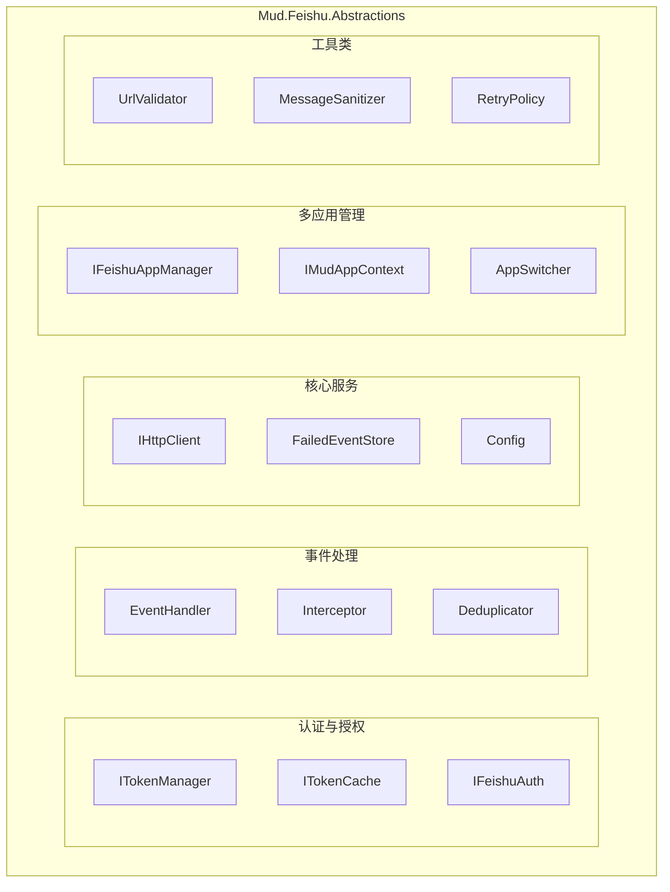
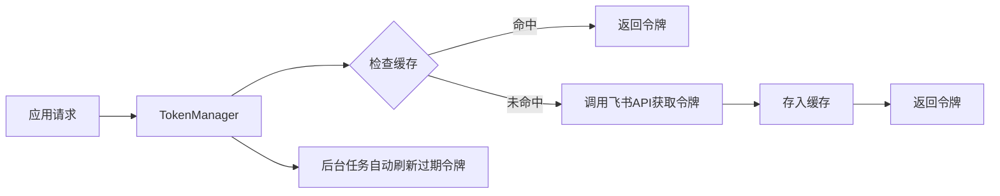
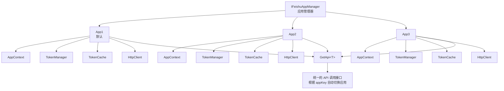
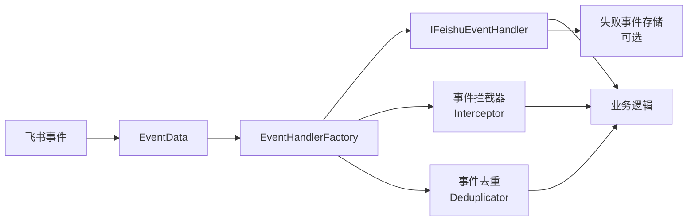

# Mud.Feishu.Abstractions

[](https://www.nuget.org/packages/Mud.Feishu.Abstractions/)
[](LICENSE-MIT)

Mud.Feishu.Abstractions 是 MudFeishu 库的抽象层，提供了完整的飞书 API 访问能力，包括认证授权、令牌管理、多应用支持、事件订阅处理等核心功能。它支持 WebSocket 事件订阅和 HTTP 事件订阅两种模式，提供基于策略模式的事件处理机制，使开发人员能够轻松地在 .NET 应用程序中集成飞书服务。

## 🚀 特性

### 核心功能
- **🔐 完整的认证授权** - 支持应用令牌、租户令牌、用户令牌三种认证方式
- **🔑 智能令牌管理** - 带缓存的令牌管理器，自动刷新、过期检测、重试机制
- **🏢 多应用支持** - 统一管理多个飞书应用，每个应用拥有独立的配置和资源
- **🎭 令牌缓存抽象** - 支持内存缓存、Redis 等多种缓存实现
- **🛡️ 安全防护** - URL 白名单验证、私有 IP 检测、敏感信息脱敏

### 事件处理
- **📡 事件订阅抽象** - 提供完整的事件订阅和处理抽象层
- **🔧 策略模式** - 基于策略模式的事件处理器，支持多种事件类型
- **🏭 工厂模式** - 内置事件处理器工厂，支持动态注册和发现
- **⚡ 异步处理** - 完全异步的事件处理，支持并行处理
- **🔄 事件去重** - 支持事件 ID 去重和 SeqID 去重，保证幂等性
- **🎯 类型安全** - 强类型事件数据模型，避免运行时错误
- **🛠️ 拦截器机制** - 支持事件处理前后的自定义逻辑

### 开发体验
- **📋 丰富事件类型** - 支持飞书 40+ 种事件类型
- **🔄 可扩展** - 易于扩展新的事件类型和处理器
- **🛡️ 内置基类** - 提供默认事件处理器基类，简化开发
- **📦 多框架支持** - 支持 netstandard2.0、.NET 6.0 - .NET 10.0
- **🌐 HTTP 客户端** - 增强的 HTTP 客户端，支持重试、日志、文件下载

## 📦 安装

```bash
dotnet add package Mud.Feishu.Abstractions
```

## 🏛️ 核心架构

### 系统架构



### 令牌管理流程



### 多应用架构



### 事件处理流程



### 核心组件

#### 认证与令牌管理
- **`ITokenManager`** - 令牌管理器基础接口
- **`IAppTokenManager`** - 应用令牌管理器
- **`ITenantTokenManager`** - 租户令牌管理器
- **`IUserTokenManager`** - 用户令牌管理器（支持多用户）
- **`ITokenCache`** - 令牌缓存抽象接口
- **`IFeishuAuthentication`** - 飞书认证 API 客户端
- **`TokenManagerWithCache`** - 带缓存的令牌管理器基类
- **`MemoryTokenCache`** - 内存缓存实现

#### 多应用管理
- **`IFeishuAppManager`** - 应用管理器接口
- **`IMudAppContext`** - 应用上下文接口
- **`IFeishuAppContextSwitcher`** - 应用上下文切换接口
- **`FeishuAppManager`** - 应用管理器实现
- **`FeishuAppContext`** - 应用上下文实现
- **`FeishuAppConfig`** - 应用配置类
- **`FeishuAppConfigBuilder`** - 应用配置构建器

#### 事件处理
- **`EventData`** - 事件数据模型
- **`IFeishuEventHandler`** - 事件处理器接口
- **`DefaultFeishuEventHandler<T>`** - 抽象事件处理器基类
- **`IdempotentFeishuEventHandler<T>`** - 幂等性事件处理器
- **`IFeishuEventHandlerFactory`** - 事件处理器工厂
- **`IFeishuEventInterceptor`** - 事件拦截器接口
- **`IFeishuEventDeduplicator`** - 事件去重服务接口
- **`IFeishuSeqIDDeduplicator`** - SeqID 去重服务接口

#### 核心服务
- **`IEnhancedHttpClient`** - 增强型 HTTP 客户端接口
- **`IFailedEventStore`** - 失败事件存储接口
- **`IEventResult`** - 事件结果接口
- **`ObjectEventResult<T>`** - 对象事件结果类

#### 数据模型
- **`FeishuApiResult<T>`** - API 响应结果模型
- **`AppCredentials`** - 应用凭证模型
- **`FeishuEventTypes`** - 事件类型常量
- 组织事件模型、IM 事件模型、审批事件模型等

## 🔑 令牌管理

### 令牌类型

Mud.Feishu.Abstractions 支持三种飞书令牌类型：

| 令牌类型 | 接口 | 用途 | 有效期 |
|---------|------|------|--------|
| **应用令牌** | `IAppTokenManager` | 应用级别的权限验证 | 2 小时 |
| **租户令牌** | `ITenantTokenManager` | 租户级别的权限验证 | 2 小时 |
| **用户令牌** | `IUserTokenManager` | 用户级别的权限验证 | 根据授权类型而定 |

### 令牌管理器特性

- **自动缓存** - 自动缓存令牌，减少 API 调用
- **智能刷新** - 令牌即将过期时自动刷新
- **并发控制** - 使用 Lazy 加载防止并发请求导致的缓存击穿
- **重试机制** - 获取令牌失败时自动重试（最多 2 次，指数退避）
- **线程安全** - 所有操作都是线程安全的
- **统计信息** - 提供缓存统计信息（总数、过期数）

### 使用示例

#### 1. 基本使用

```csharp
// 注入应用令牌管理器
public class MyService
{
    private readonly IAppTokenManager _appTokenManager;

    public MyService(IAppTokenManager appTokenManager)
    {
        _appTokenManager = appTokenManager;
    }

    public async Task CallFeishuApiAsync()
    {
        // 获取令牌（自动处理缓存、刷新等）
        var token = await _appTokenManager.GetTokenAsync();

        // 使用令牌调用飞书 API
        var client = new HttpClient();
        client.DefaultRequestHeaders.Authorization =
            new AuthenticationHeaderValue("Bearer", token);

        // ...
    }
}
```

#### 2. 多用户令牌管理

```csharp
public class UserService
{
    private readonly IUserTokenManager _userTokenManager;

    public UserService(IUserTokenManager userTokenManager)
    {
        _userTokenManager = userTokenManager;
    }

    // 获取特定用户的令牌
    public async Task<string> GetUserTokenAsync(string userId)
    {
        return await _userTokenManager.GetTokenAsync(userId);
    }

    // 使用授权码获取用户令牌
    public async Task<string> GetUserTokenWithCodeAsync(string code, string redirectUri)
    {
        return await _userTokenManager.GetUserTokenWithCodeAsync(code, redirectUri);
    }

    // 刷新用户令牌
    public async Task<string> RefreshUserTokenAsync(string userId, string refreshToken)
    {
        return await _userTokenManager.RefreshUserTokenAsync(userId, refreshToken);
    }
}
```

#### 3. 自定义令牌缓存

```csharp
// 实现 ITokenCache 接口
public class RedisTokenCache : ITokenCache
{
    private readonly IConnectionMultiplexer _redis;
    private readonly IDatabase _db;

    public RedisTokenCache(IConnectionMultiplexer redis)
    {
        _redis = redis;
        _db = _redis.GetDatabase();
    }

    public async Task<string?> GetAsync(string key, CancellationToken cancellationToken = default)
    {
        return await _db.StringGetAsync(key);
    }

    public async Task SetAsync(string key, string value, TimeSpan expiration, CancellationToken cancellationToken = default)
    {
        await _db.StringSetAsync(key, value, expiration);
    }

    public async Task<bool> RemoveAsync(string key, CancellationToken cancellationToken = default)
    {
        return await _db.KeyDeleteAsync(key);
    }

    // 实现其他方法...
}

// 注册自定义缓存
builder.Services.AddTokenCache<RedisTokenCache>();
```

#### 4. 获取缓存统计

```csharp
public class TokenStatisticsService
{
    private readonly ITokenManager _tokenManager;

    public async Task PrintStatisticsAsync()
    {
        var (total, expired) = await _tokenManager.GetCacheStatisticsAsync();
        Console.WriteLine($"缓存统计: 总数={total}, 过期={expired}");
    }
}
```

### 令牌缓存策略

令牌管理器使用以下策略来优化性能：

1. **首次访问** - 调用飞书 API 获取令牌
2. **后续访问** - 从缓存返回令牌（如果未过期）
3. **即将过期** - 令牌过期前 5 分钟（默认）自动刷新
4. **并发请求** - 使用 Lazy 加载，多个并发请求只触发一次刷新
5. **失败重试** - 获取令牌失败时自动重试 2 次，使用指数退避策略

## 🏢 多应用支持

### 核心概念

Mud.Feishu.Abstractions 提供完整的多应用管理能力，允许在同一个系统中管理多个飞书应用：

- **独立配置** - 每个应用拥有独立的 AppId、AppSecret、BaseUrl 等配置
- **独立资源** - 每个应用拥有独立的令牌管理器、缓存、HTTP 客户端
- **统一管理** - 通过 IFeishuAppManager 统一管理所有应用
- **动态切换** - 支持运行时动态添加、移除、切换应用
- **缓存隔离** - 使用 PrefixedTokenCache 确保不同应用的令牌缓存互不干扰

### 应用配置

```csharp
// 方式 1: 使用配置文件
{
  "Feishu": {
    "Apps": [
      {
        "AppKey": "default",
        "AppId": "cli_xxxxxx",
        "AppSecret": "xxxxxx",
        "BaseUrl": "https://open.feishu.cn",
        "IsDefault": true
      },
      {
        "AppKey": "approval",
        "AppId": "cli_yyyyyy",
        "AppSecret": "yyyyyy",
        "BaseUrl": "https://open.feishu.cn"
      }
    ]
  }
}

// 方式 2: 使用代码配置
builder.Services.AddFeishuApp(configs =>
{
    configs.AddDefaultApp("default", "cli_xxxxxx", "xxxxxx")
            .SetBaseUrl("https://open.feishu.cn")
            .SetTimeout(30)
            .SetRetryCount(3);

    configs.AddApp("approval", "cli_yyyyyy", "yyyyyy")
            .SetTimeout(60)
            .SetRetryCount(5);
});

// 方式 3: 使用构建器
builder.Services.AddFeishuApp(builder =>
{
    builder.AddDefaultApp("default", "cli_xxxxxx", "xxxxxx")
           .AddApp("approval", "cli_yyyyyy", "yyyyyy")
           .AddApp("im", "cli_zzzzzz", "zzzzzz");
});
```

### 使用多应用

#### 1. 获取指定应用的 API

```csharp
public class MultiAppService
{
    private readonly IFeishuAppManager _appManager;

    public MultiAppService(IFeishuAppManager appManager)
    {
        _appManager = appManager;
    }

    public async Task UseDefaultAppAsync()
    {
        // 获取默认应用的 API
        var api = _appManager.GetFeishuApi<IMyApi>();
        await api.DoSomethingAsync();
    }

    public async Task UseSpecificAppAsync(string appKey)
    {
        // 获取指定应用的 API
        var api = _appManager.GetFeishuApi<IMyApi>(appKey);
        await api.DoSomethingAsync();
    }
}
```

#### 2. 应用上下文切换

```csharp
public class AppSwitchingService
{
    private readonly IFeishuAppContextSwitcher _switcher;

    public async Task WorkWithAppsAsync()
    {
        // 切换到默认应用
        var defaultContext = _switcher.UseDefaultApp();
        var defaultToken = await defaultContext
            .GetTokenManager(TokenType.App)
            .GetTokenAsync();

        // 切换到审批应用
        var approvalContext = _switcher.UseApp("approval");
        var approvalToken = await approvalContext
            .GetTokenManager(TokenType.App)
            .GetTokenAsync();

        // 使用应用上下文访问资源
        var httpClient = approvalContext.HttpClient;
        var auth = approvalContext.Authentication;
    }
}
```

#### 3. 多应用最佳实践

```csharp
public class MessageService
{
    private readonly IServiceProvider _serviceProvider;

    /// <summary>
    /// ❌ 错误做法 - 没有显式切换应用上下文
    /// </summary>
    /// <remarks>
    /// 直接从 DI 容器获取的服务可能使用默认应用，无法保证使用正确的应用凭证。
    /// </remarks>
    public async Task SendMessageAsync_Wrong(string message)
    {
        var userApi = _serviceProvider.GetRequiredService<IFeishuTenantV3User>();
        // 此时使用的可能是错误的应用凭证！
        await userApi.SendMessageAsync(message);
    }

    /// <summary>
    /// ✅ 正确做法 - 显式切换应用上下文
    /// </summary>
    /// <remarks>
    /// 使用 IFeishuAppManager 获取指定应用的 API，确保使用正确的应用凭证。
    /// </remarks>
    public async Task SendMessageAsync_Correct(string message)
    {
        var appManager = _serviceProvider.GetRequiredService<IFeishuAppManager>();

        // 方法1: 直接使用 IFeishuAppManager 获取指定应用的 API（推荐）
        var approvalUserApi = appManager.GetFeishuApi<IFeishuTenantV3User>("approval-app");

        // 方法2: 使用 UseApp 切换（注意：有线程安全问题）
        // var userApi = _serviceProvider.GetRequiredService<IFeishuTenantV3User>();
        // var appContext = userApi.UseApp("approval-app");

        await approvalUserApi.SendMessageAsync(message);
    }
}
```

**重要提示**：

- ⚠️ **线程安全警告**：直接使用 `UseApp()` 方法会改变服务实例的状态，在多线程环境下可能导致应用上下文混乱。**推荐使用 `IFeishuAppManager.GetFeishuApi<T>(appKey)` 方法获取独立的服务实例。**

- ✅ **推荐做法**：始终通过 `IFeishuAppManager` 获取指定应用的 API 实例，这样可以确保每次都使用正确的应用凭证，并避免线程安全问题。

- 📝 **后台任务**：在后台任务中，必须明确指定应用，不能依赖默认应用，否则可能导致应用上下文错误。

#### 4. 动态管理应用

```csharp
public class DynamicAppManager
{
    private readonly IFeishuAppManager _appManager;

    // 运行时添加新应用
    public void AddNewApp()
    {
        var newConfig = new FeishuAppConfig
        {
            AppKey = "newApp",
            AppId = "cli_newxxx",
            AppSecret = "newsecret",
            IsDefault = false
        };

        _appManager.AddApp(newConfig);
    }

    // 检查应用是否存在
    public bool CheckAppExists(string appKey)
    {
        return _appManager.HasApp(appKey);
    }

    // 获取所有应用
    public IEnumerable<IMudAppContext> GetAllApps()
    {
        return _appManager.GetAllApps();
    }

    // 移除应用
    public bool RemoveApp(string appKey)
    {
        return _appManager.RemoveApp(appKey);
    }
}
```

### 应用配置选项

| 配置项 | 类型 | 默认值 | 说明 |
|--------|------|--------|------|
| `AppKey` | string | - | 应用唯一标识（必需） |
| `AppId` | string | - | 飞书应用 ID（必需） |
| `AppSecret` | string | - | 飞书应用密钥（必需） |
| `BaseUrl` | string | https://open.feishu.cn | API 基础地址 |
| `TimeOut` | int | 30 | HTTP 请求超时时间（秒） |
| `RetryCount` | int | 3 | 失败重试次数 |
| `RetryDelayMs` | int | 1000 | 重试延迟时间（毫秒） |
| `TokenRefreshThreshold` | int | 300 | 令牌刷新阈值（秒） |
| `EnableLogging` | bool | true | 是否启用日志记录 |
| `IsDefault` | bool | false | 是否为默认应用 |

### 配置热更新机制

Mud.Feishu 使用 `IOptionsMonitor<T>` 模式支持配置热更新，无需重启应用即可动态更新配置。

**支持热更新的配置**：

| 配置项 | 是否支持热更新 | 说明 |
|--------|----------------|------|
| `FeishuWebhookOptions` | ✅ 支持 | Webhook 相关配置 |
| `FeishuWebSocketOptions` | ✅ 支持 | WebSocket 相关配置 |
| `FeishuAppConfig` | ⚠️ 部分支持 | 部分配置热更新，部分需要重启 |

**热更新示例**：

```csharp
public class ConfigurationWatcherService
{
    private readonly IOptionsMonitor<FeishuWebhookOptions> _webhookOptions;
    private readonly IOptionsMonitor<FeishuWebSocketOptions> _webSocketOptions;

    public ConfigurationWatcherService(
        IOptionsMonitor<FeishuWebhookOptions> webhookOptions,
        IOptionsMonitor<FeishuWebSocketOptions> webSocketOptions)
    {
        _webhookOptions = webhookOptions;
        _webSocketOptions = webSocketOptions;

        // 监听 Webhook 配置变更
        _webhookOptions.OnChange(options =>
        {
            Console.WriteLine($"Webhook 配置已更新: MaxConcurrentEvents={options.MaxConcurrentEvents}");
        });

        // 监听 WebSocket 配置变更
        _webSocketOptions.OnChange(options =>
        {
            Console.WriteLine($"WebSocket 配置已更新: HeartbeatInterval={options.HeartbeatInterval}");
        });
    }
}
```

**配置更新方式**：

1. **通过配置文件更新**（支持热重载）：
   ```json
   {
     "FeishuWebhook": {
       "MaxConcurrentEvents": 100,
       "EventHandlingTimeoutMs": 30000
     }
   }
   ```

2. **通过环境变量更新**（需要重启）：
   ```bash
   export FeishuWebhook__MaxConcurrentEvents=100
   ```

3. **通过命令行参数更新**（需要重启）：
   ```bash
   dotnet run --FeishuWebhook:MaxConcurrentEvents=100
   ```

**注意事项**：

- ⚠️ `FeishuAppConfig` 的 `AppId`、`AppSecret`、`EncryptKey` 等敏感配置修改后需要重启应用才能生效
- ✅ `FeishuWebhookOptions` 和 `FeishuWebSocketOptions` 的非敏感配置支持热更新
- 🔄 热更新后，已创建的实例会使用旧配置，新实例会使用新配置
- 📊 使用 `IOptionsSnapshot<T>` 可以获取当前请求周期的配置快照

**配置快照示例**：

```csharp
public class MyService
{
    private readonly IOptionsSnapshot<FeishuWebhookOptions> _webhookOptions;

    public MyService(IOptionsSnapshot<FeishuWebhookOptions> webhookOptions)
    {
        // 每次请求都会获取最新的配置
        _webhookOptions = webhookOptions;
    }

    public void DoSomething()
    {
        var options = _webhookOptions.Value;
        Console.WriteLine($"当前 MaxConcurrentEvents: {options.MaxConcurrentEvents}");
    }
}
```

## 🎯 支持的事件类型

### 组织管理事件
- `contact.user.created_v3` - 员工入职事件
- `contact.user.updated_v3` - 用户更新事件  
- `contact.user.deleted_v3` - 用户删除事件
- `contact.custom_attr_event.updated_v3` - 成员字段变更事件
- `contact.department.created_v3` - 部门创建事件
- `contact.department.updated_v3` - 部门更新事件
- `contact.department.deleted_v3` - 部门删除事件
- `contact.employee_type_enum.created_v3` - 人员类型创建事件
- `contact.employee_type_enum.updated_v3` - 人员类型更新事件
- `contact.employee_type_enum.deleted_v3` - 人员类型删除事件
- `contact.employee_type_enum.actived_v3` - 人员类型启用事件
- `contact.employee_type_enum.deactivated_v3` - 人员类型禁用事件

### 消息事件
- `im.message.receive_v1` - 接收消息事件
- `im.message.recalled_v1` - 消息撤回事件
- `im.message.message_read_v1` - 消息已读事件
- `im.message.reaction.created_v1` - 新增消息表情回复事件
- `im.message.reaction.deleted_v1` - 删除消息表情回复事件

### 群聊事件
- `im.chat.disbanded_v1` - 群解散事件
- `im.chat.updated_v1` - 群配置修改事件
- `im.chat.member.user.added_v1` - 用户进群事件
- `im.chat.member.user.deleted_v1` - 用户出群事件
- `im.chat.member.user.withdrawn_v1` - 撤销拉用户进群事件
- `im.chat.member.bot.added_v1` - 机器人进群事件
- `im.chat.member.bot.deleted_v1` - 机器人被移出群事件

### 审批事件
- `approval.approval.approved_v1` - 审批通过事件
- `approval.approval.rejected_v1` - 审批拒绝事件
- `approval.approval.updated_v1` - 审批更新事件
- `approval.cc_v1` - 审批抄送事件
- `approval.instance_v1` - 审批实例事件
- `approval.instance.remedy_group.updated_v1` - 审批实例补丁分组更新事件
- `approval.instance.trip_group.updated_v1` - 审批实例行程分组更新事件
- `approval.task_v1` - 审批任务事件
- `approval.leave_v1` - 请假审批事件
- `approval.out_v1` - 外出审批事件
- `approval.shift_v1` - 排班审批事件
- `approval.work_v1` - 工作审批事件

### 任务事件
- `task.update_tenant_v1` - 任务信息变更-租户维度事件
- `task.updated_v1` - 任务信息变更事件
- `task.comment.updated_v1` - 任务评论信息变更事件

### 日程和会议事件
- `calendar.event.updated_v4` - 日程事件
- `meeting.meeting.started_v1` - 会议开始事件
- `meeting.meeting.ended_v1` - 会议结束事件

## 📖 使用示例

### 1. 创建基础事件处理器（实现 IFeishuEventHandler 接口）

```csharp
using Mud.Feishu.Abstractions;
using System.Text.Json;

namespace YourProject.Handlers;

/// <summary>
/// 演示用户事件处理器
/// </summary>
public class DemoUserEventHandler : IFeishuEventHandler
{
    private readonly ILogger<DemoUserEventHandler> _logger;
    private readonly YourEventService _eventService;

    public DemoUserEventHandler(ILogger<DemoUserEventHandler> logger, YourEventService eventService)
    {
        _logger = logger ?? throw new ArgumentNullException(nameof(logger));
        _eventService = eventService ?? throw new ArgumentNullException(nameof(eventService));
    }

    public string SupportedEventType => FeishuEventTypes.UserCreated;

    public async Task HandleAsync(EventData eventData, CancellationToken cancellationToken = default)
    {
        if (eventData == null)
            throw new ArgumentNullException(nameof(eventData));

        _logger.LogInformation("👤 [用户事件] 开始处理用户创建事件: {EventId}", eventData.EventId);

        try
        {
            // 解析用户数据
            var userData = ParseUserData(eventData);

            // 记录事件到服务
            await _eventService.RecordUserEventAsync(userData, cancellationToken);

            // 模拟业务处理
            await ProcessUserEventAsync(userData, cancellationToken);

            _logger.LogInformation("✅ [用户事件] 用户创建事件处理完成: 用户ID {UserId}, 用户名 {UserName}",
                userData.UserId, userData.UserName);
        }
        catch (Exception ex)
        {
            _logger.LogError(ex, "❌ [用户事件] 处理用户创建事件失败: {EventId}", eventData.EventId);
            throw;
        }
    }

    private UserData ParseUserData(EventData eventData)
    {
        try
        {
            var jsonElement = JsonSerializer.Deserialize<JsonElement>(eventData.Event?.ToString() ?? "{}");
            var userElement = jsonElement.GetProperty("user");

            return new UserData
            {
                UserId = userElement.GetProperty("user_id").GetString() ?? "",
                UserName = userElement.GetProperty("name").GetString() ?? "",
                Email = TryGetProperty(userElement, "email") ?? "",
                Department = TryGetProperty(userElement, "department") ?? "",
                CreatedAt = DateTime.UtcNow
            };
        }
        catch (Exception ex)
        {
            _logger.LogError(ex, "解析用户数据失败");
            throw new InvalidOperationException("无法解析用户数据", ex);
        }
    }

    private async Task ProcessUserEventAsync(UserData userData, CancellationToken cancellationToken)
    {
        // 模拟异步业务操作
        await Task.Delay(100, cancellationToken);

        // 验证必要字段
        if (string.IsNullOrWhiteSpace(userData.UserId))
        {
            throw new ArgumentException("用户ID不能为空");
        }

        // 模拟发送欢迎通知
        _logger.LogInformation("📧 [用户事件] 发送欢迎通知给用户: {UserName} ({Email})",
            userData.UserName, userData.Email);

        await Task.CompletedTask;
    }

    private static string? TryGetProperty(JsonElement element, string propertyName)
    {
        return element.TryGetProperty(propertyName, out var value) ? value.GetString() : null;
    }
}
```

### 2. 继承预定义事件处理器（推荐方式）

```csharp
using Mud.Feishu.Abstractions;
using Mud.Feishu.Abstractions.DataModels.Organization;
using Mud.Feishu.Abstractions.EventHandlers;

namespace YourProject.Handlers;

/// <summary>
/// 演示部门事件处理器 - 继承预定义的部门创建事件处理器
/// </summary>
public class DemoDepartmentEventHandler : DepartmentCreatedEventHandler
{
    private readonly YourEventService _eventService;

    public DemoDepartmentEventHandler(ILogger<DemoDepartmentEventHandler> logger, YourEventService eventService) : base(logger)
    {
        _eventService = eventService ?? throw new ArgumentNullException(nameof(eventService));
    }

    protected override async Task ProcessBusinessLogicAsync(
        EventData eventData, 
        ObjectEventResult<DepartmentCreatedResult>? departmentData, 
        CancellationToken cancellationToken = default)
    {
        if (eventData == null)
            throw new ArgumentNullException(nameof(eventData));

        _logger.LogInformation("[部门事件] 开始处理部门创建事件: {EventId}", eventData.EventId);

        try
        {
            // 记录事件到服务
            await _eventService.RecordDepartmentEventAsync(departmentData.Object, cancellationToken);

            // 模拟业务处理
            await ProcessDepartmentEventAsync(departmentData.Object, cancellationToken);

            _logger.LogInformation("[部门事件] 部门创建事件处理完成: 部门ID {DepartmentId}, 部门名 {DepartmentName}",
                departmentData.Object.DepartmentId, departmentData.Object.Name);
        }
        catch (Exception ex)
        {
            _logger.LogError(ex, "[部门事件] 处理部门创建事件失败: {EventId}", eventData.EventId);
            throw;
        }
    }

    private async Task ProcessDepartmentEventAsync(DepartmentCreatedResult departmentData, CancellationToken cancellationToken)
    {
        // 模拟异步业务操作
        await Task.Delay(100, cancellationToken);

        // 验证逻辑
        if (string.IsNullOrWhiteSpace(departmentData.DepartmentId))
        {
            throw new ArgumentException("部门ID不能为空");
        }

        // 模拟权限初始化
        _logger.LogInformation("[部门事件] 初始化部门权限: {DepartmentName}", departmentData.Name);

        // 通知部门主管
        if (!string.IsNullOrWhiteSpace(departmentData.LeaderUserId))
        {
            _logger.LogInformation("[部门事件] 通知部门主管: {LeaderUserId}", departmentData.LeaderUserId);
        }

        // 处理层级关系
        if (!string.IsNullOrWhiteSpace(departmentData.ParentDepartmentId))
        {
            _logger.LogInformation("[部门事件] 建立层级关系: {DepartmentId} -> {ParentDepartmentId}",
                departmentData.DepartmentId, departmentData.ParentDepartmentId);
        }

        await Task.CompletedTask;
    }
}
```

### 3. 在 Program.cs 中配置服务和事件处理器

```csharp
using Mud.Feishu.WebSocket;
using Mud.Feishu.WebSocket.Demo.Handlers;
using Mud.Feishu.WebSocket.Demo.Services;
using Mud.Feishu.WebSocket.Services;

var builder = WebApplication.CreateBuilder(args);

// 配置基础服务
builder.Services.AddControllers();
builder.Services.AddEndpointsApiExplorer();
builder.Services.AddSwaggerGen(c =>
{
    c.SwaggerDoc("v1", new Microsoft.OpenApi.OpenApiInfo
    {
        Title = "飞书WebSocket测试API",
        Version = "v1",
        Description = "用于测试飞书WebSocket长连接功能的演示API"
    });
});

// 配置飞书服务
builder.Services.CreateFeishuServicesBuilder(builder.Configuration)
                .AddAuthenticationApi()
                .AddTokenManagers()
                .Build();

// 配置飞书WebSocket服务（推荐方式）
builder.Services.AddFeishuWebSocketBuilder()
    .ConfigureFrom(builder.Configuration)
    .UseMultiHandler()  // 使用多处理器模式
    .AddHandler<DemoDepartmentEventHandler>()      // 添加部门创建事件处理器
    .AddHandler<DemoDepartmentDeleteEventHandler>() // 添加部门删除事件处理器
    .Build();

// 配置自定义服务
builder.Services.AddSingleton<DemoEventService>();
builder.Services.AddHostedService<DemoEventBackgroundService>();

// 配置CORS
builder.Services.AddCors(options =>
{
    options.AddPolicy("AllowAll", policy =>
    {
        policy.AllowAnyOrigin()
              .AllowAnyMethod()
              .AllowAnyHeader();
    });
});

var app = builder.Build();

// 配置中间件
if (app.Environment.IsDevelopment())
{
    app.UseSwagger();
    app.UseSwaggerUI();
}

app.UseHttpsRedirection();
app.UseCors("AllowAll");
app.UseStaticFiles();
app.UseRouting();
app.MapControllers();

app.Run();
```

### 4. 创建自定义事件服务来处理事件数据

```csharp
namespace YourProject.Services;

/// <summary>
/// 演示事件服务 - 用于记录和管理事件处理结果
/// </summary>
public class DemoEventService
{
    private readonly ILogger<DemoEventService> _logger;
    private readonly ConcurrentBag<UserData> _userEvents = new();
    private readonly ConcurrentBag<DepartmentData> _departmentEvents = new();
    private int _userCount = 0;
    private int _departmentCount = 0;

    public DemoEventService(ILogger<DemoEventService> logger)
    {
        _logger = logger;
    }

    public async Task RecordUserEventAsync(UserData userData, CancellationToken cancellationToken = default)
    {
        _logger.LogDebug("记录用户事件: {UserId}", userData.UserId);
        _userEvents.Add(userData);
        await Task.CompletedTask;
    }

    public async Task RecordDepartmentEventAsync(DepartmentData departmentData, CancellationToken cancellationToken = default)
    {
        _logger.LogDebug("记录部门事件: {DepartmentId}", departmentData.DepartmentId);
        _departmentEvents.Add(departmentData);
        await Task.CompletedTask;
    }

    public void IncrementUserCount()
    {
        Interlocked.Increment(ref _userCount);
        _logger.LogInformation("用户计数更新: {Count}", _userCount);
    }

    public void IncrementDepartmentCount()
    {
        Interlocked.Increment(ref _departmentCount);
        _logger.LogInformation("部门计数更新: {Count}", _departmentCount);
    }

    public IEnumerable<UserData> GetUserEvents() => _userEvents.ToList();
    public IEnumerable<DepartmentData> GetDepartmentEvents() => _departmentEvents.ToList();
    public int GetUserCount() => _userCount;
    public int GetDepartmentCount() => _departmentCount;
}
```

## 🛠️ 核心服务

### 增强型 HTTP 客户端 (IEnhancedHttpClient)

提供飞书 API 调用的统一 HTTP 客户端，支持自动重试、日志记录、文件下载等功能。

```csharp
public class ApiClient
{
    private readonly IEnhancedHttpClient _httpClient;

    public ApiClient(IEnhancedHttpClient httpClient)
    {
        _httpClient = httpClient;
    }

    // 发送请求并反序列化响应
    public async Task<FeishuApiResult<UserInfo>> GetUserInfoAsync(string userId)
    {
        var request = new HttpRequestMessage(HttpMethod.Get,
            $"https://open.feishu.cn/open-apis/user/v4/info/{userId}");

        return await _httpClient.SendAsync<FeishuApiResult<UserInfo>>(request);
    }

    // 下载小文件
    public async Task<byte[]?> DownloadImageAsync(string mediaId)
    {
        var request = new HttpRequestMessage(HttpMethod.Get,
            $"https://open.feishu.cn/open-apis/drive/v1/medias/{mediaId}/download");

        return await _httpClient.DownloadAsync(request);
    }

    // 下载大文件（流式下载）
    public async Task<FileInfo> DownloadLargeFileAsync(string mediaId, string filePath)
    {
        var request = new HttpRequestMessage(HttpMethod.Get,
            $"https://open.feishu.cn/open-apis/drive/v1/medias/{mediaId}/download");

        return await _httpClient.DownloadLargeAsync(request, filePath, overwrite: true);
    }
}
```

### 事件去重服务 (IFeishuEventDeduplicator)

防止重复事件的处理，保证事件处理的幂等性。

```csharp
public class DeduplicatedEventHandler : IFeishuEventHandler
{
    private readonly IFeishuEventDeduplicator _deduplicator;

    public async Task HandleAsync(EventData eventData, CancellationToken cancellationToken = default)
    {
        // 检查事件是否已处理
        if (_deduplicator.IsProcessed(eventData.EventId))
        {
            _logger.LogInformation("事件 {EventId} 已处理，跳过", eventData.EventId);
            return;
        }

        // 标记事件为处理中
        if (!_deduplicator.TryMarkAsProcessing(eventData.EventId))
        {
            _logger.LogInformation("事件 {EventId} 正在处理中，跳过", eventData.EventId);
            return;
        }

        try
        {
            // 处理业务逻辑
            await ProcessEventAsync(eventData, cancellationToken);

            // 标记事件为已完成
            _deduplicator.MarkAsCompleted(eventData.EventId);
        }
        catch
        {
            // 处理失败，回滚状态以便重试
            _deduplicator.RollbackProcessing(eventData.EventId);
            throw;
        }
    }
}
```

### 失败事件存储 (IFailedEventStore)

持久化后台处理失败的事件，支持重试。

```csharp
public class FailedEventRetryService
{
    private readonly IFailedEventStore _failedEventStore;
    private readonly IFeishuEventHandlerFactory _factory;

    // 存储失败事件
    public async Task StoreFailedEventAsync(EventData eventData, Exception exception)
    {
        await _failedEventStore.StoreFailedEventAsync(
            eventData,
            exception,
            retryCount: 0,
            nextRetryTime: DateTimeOffset.Now.AddMinutes(5)
        );
    }

    // 获取待重试的事件
    public async Task<List<FailedEventInfo>> GetPendingRetryEventsAsync()
    {
        return await _failedEventStore.GetPendingRetryEventsAsync(
            beforeTime: DateTimeOffset.Now,
            maxCount: 10
        );
    }

    // 重试失败事件
    public async Task RetryFailedEventAsync(FailedEventInfo eventInfo)
    {
        var handler = _factory.GetHandler(eventInfo.EventData.EventType);

        try
        {
            await handler.HandleAsync(eventInfo.EventData);

            // 重试成功，移除失败记录
            await _failedEventStore.RemoveFailedEventAsync(eventInfo.EventId);
        }
        catch
        {
            // 重试失败，增加重试次数并更新下次重试时间
            await _failedEventStore.UpdateRetryCountAsync(
                eventInfo.EventId,
                eventInfo.RetryCount + 1,
                DateTimeOffset.Now.AddMinutes(5 * (eventInfo.RetryCount + 1))
            );
        }
    }
}
```

### 事件拦截器 (IFeishuEventInterceptor)

在事件处理前后执行自定义逻辑。

```csharp
public class CustomEventInterceptor : IFeishuEventInterceptor
{
    private readonly ILogger<CustomEventInterceptor> _logger;

    public async Task<bool> BeforeHandleAsync(
        string eventType,
        EventData eventData,
        CancellationToken cancellationToken)
    {
        // 事件处理前执行
        _logger.LogInformation("准备处理事件: {EventType}, EventId: {EventId}",
            eventType, eventData.EventId);

        // 返回 false 可以中断事件处理
        return true;
    }

    public async Task AfterHandleAsync(
        string eventType,
        EventData eventData,
        Exception? exception,
        CancellationToken cancellationToken)
    {
        // 事件处理后执行
        if (exception == null)
        {
            _logger.LogInformation("事件处理成功: {EventId}", eventData.EventId);
        }
        else
        {
            _logger.LogError(exception, "事件处理失败: {EventId}", eventData.EventId);
        }
    }
}

// 注册拦截器
builder.Services.AddSingleton<IFeishuEventInterceptor, CustomEventInterceptor>();
```

### URL 验证器 (UrlValidator)

防止 SSRF（服务端请求伪造）攻击。

```csharp
public class SafeUrlDownloader
{
    private readonly UrlValidator _urlValidator;
    private readonly IHttpClientFactory _httpClientFactory;

    public async Task<byte[]> DownloadFromUrlAsync(string url)
    {
        // 验证 URL 是否安全
        if (!_urlValidator.Validate(url))
        {
            throw new InvalidOperationException($"URL 不被允许: {url}");
        }

        var client = _httpClientFactory.CreateClient();
        return await client.GetByteArrayAsync(url);
    }
}

// 默认配置：仅允许飞书官方域名
// 可以自定义添加信任域名
urlValidator.AddTrustedDomain("https://api.yourcompany.com");
```

### 性能指标 (FeishuMetrics)

使用 System.Diagnostics.Metrics 收集和暴露性能指标。

```csharp
using Mud.Feishu.Abstractions.Metrics;

public class MetricsAwareEventHandler : IFeishuEventHandler
{
    public string SupportedEventType => FeishuEventTypes.UserCreated;

    public async Task HandleAsync(EventData eventData, CancellationToken cancellationToken = default)
    {
        // 记录事件处理指标
        using var _ = FeishuMetricsHelper.RecordEventHandling(eventData.EventType, nameof(MetricsAwareEventHandler));

        try
        {
            // 处理业务逻辑
            await ProcessEventAsync(eventData, cancellationToken);

            // 记录成功
            FeishuMetricsHelper.RecordEventHandlingSuccess(eventData.EventType);
        }
        catch (Exception ex)
        {
            // 记录失败
            FeishuMetricsHelper.RecordEventHandlingFailure(eventData.EventType, ex.GetType().Name);
            throw;
        }
    }
}
```

**支持的指标类型**：

- `feishu_token_fetch_total` - 令牌获取总次数
- `feishu_token_cache_hit_total` - 令牌缓存命中次数
- `feishu_token_cache_miss_total` - 令牌缓存未命中次数
- `feishu_token_refresh_total` - 令牌刷新次数
- `feishu_event_handling_total` - 事件处理总次数
- `feishu_event_handling_success_total` - 事件处理成功次数
- `feishu_event_handling_failure_total` - 事件处理失败次数
- `feishu_event_handling_duration_ms` - 事件处理持续时间（毫秒）
- `feishu_http_request_total` - HTTP 请求总次数
- `feishu_http_request_duration_ms` - HTTP 请求持续时间（毫秒）
- `feishu_websocket_connections` - WebSocket 连接数
- `feishu_cached_tokens` - 当前缓存的令牌数

### 消息脱敏 (MessageSanitizer)

对敏感信息进行脱敏处理。

```csharp
public class LoggingService
{
    private readonly MessageSanitizer _sanitizer;

    public void LogSensitiveData(string message)
    {
        // 自动脱敏敏感信息
        var sanitized = _sanitizer.Sanitize(message);

        _logger.LogInformation("处理后的消息: {SanitizedMessage}", sanitized);
    }

    // 支持的脱敏字段：
    // - Token: access_token, refresh_token, app_secret, api_key, private_key
    // - 个人信息: phone, mobile, email, name, id_card, address
    // - 金融信息: card_no, card_number, bank_card
}

// 示例：
// 原始: "access_token=abcdef1234567890, phone=13812345678"
// 脱敏: "access_token=abcd****7890, phone=138****5678"
```

## 🏗️ 高级用法

### 多处理器策略

```csharp
public class MultiHandlerService
{
    private readonly IFeishuEventHandlerFactory _factory;

    public MultiHandlerService(IFeishuEventHandlerFactory factory)
    {
        _factory = factory;
    }

    public async Task HandleEventWithMultipleStrategies(EventData eventData)
    {
        // 获取所有匹配的处理器
        var handlers = _factory.GetHandlers(eventData.EventType);

        // 按优先级处理
        foreach (var handler in handlers.OrderBy(h => h.GetType().Name))
        {
            try
            {
                await handler.HandleAsync(eventData);
            }
            catch (Exception ex)
            {
                // 记录错误但继续处理其他处理器
                Console.WriteLine($"处理器 {handler.GetType().Name} 失败: {ex.Message}");
            }
        }
    }
}
```

### 幂等性事件处理器

```csharp
public class IdempotentUserEventHandler : IdempotentFeishuEventHandler<UserCreateEvent>
{
    private readonly IFeishuEventDeduplicator _deduplicator;

    public IdempotentUserEventHandler(
        ILogger<IdempotentUserEventHandler> logger,
        IFeishuEventDeduplicator deduplicator) : base(logger, deduplicator)
    {
    }

    public override string SupportedEventType => FeishuEventTypes.UserCreated;

    protected override async Task ProcessBusinessLogicAsync(
        EventData eventData,
        UserCreateEvent? eventEntity,
        CancellationToken cancellationToken = default)
    {
        // 处理业务逻辑，基类已自动保证幂等性
        if (eventEntity != null)
        {
            await CreateUserAsync(eventEntity.User, cancellationToken);
        }
    }
}
```

### 条件事件处理

```csharp
public class ConditionalEventHandler : IFeishuEventHandler
{
    public string SupportedEventType => FeishuEventTypes.ReceiveMessage;

    public async Task HandleAsync(EventData eventData, CancellationToken cancellationToken = default)
    {
        // 只处理特定类型的消息
        if (eventData.Event is MessageReceiveEvent msgEvent)
        {
            if (msgEvent.Message.MessageType == "text")
            {
                await HandleTextMessage(msgEvent);
            }
            else if (msgEvent.Message.MessageType == "image")
            {
                await HandleImageMessage(msgEvent);
            }
        }
    }

    private async Task HandleTextMessage(MessageReceiveEvent msgEvent)
    {
        // 处理文本消息逻辑
    }

    private async Task HandleImageMessage(MessageReceiveEvent msgEvent)
    {
        // 处理图片消息逻辑
    }
}
```

## 🔧 扩展新事件类型

### 1. 定义事件类型常量

```csharp
public static class CustomEventTypes
{
    public const string MyCustomEvent = "custom.my_event.v1";
}
```

### 2. 创建事件数据模型

```csharp
public class MyCustomEvent : IEventResult
{
    [JsonPropertyName("custom_data")]
    public string CustomData { get; set; } = string.Empty;
}
```

### 3. 实现事件处理器

```csharp
// 基础实现方式
public class MyCustomEventHandler : IFeishuEventHandler
{
    public string SupportedEventType => CustomEventTypes.MyCustomEvent;

    public async Task HandleAsync(EventData eventData, CancellationToken cancellationToken = default)
    {
        if (eventData.Event is MyCustomEvent customEvent)
        {
            // 处理自定义事件
        }
    }
}

// 推荐使用基类
public class MyCustomEventHandler : DefaultFeishuEventHandler<MyCustomEvent>
{
    public override string SupportedEventType => CustomEventTypes.MyCustomEvent;

    public MyCustomEventHandler(ILogger<MyCustomEventHandler> logger) : base(logger)
    {
    }

    protected override async Task ProcessBusinessLogicAsync(
        EventData eventData, 
        MyCustomEvent? eventEntity, 
        CancellationToken cancellationToken = default)
    {
        if (eventEntity != null)
        {
            // 处理自定义事件，基类已自动反序列化
            Console.WriteLine($"自定义数据: {eventEntity.CustomData}");
        }
        
        await Task.CompletedTask;
    }
}
```

## 📊 选择对比

### 处理器选择策略

| 策略 | 优点 | 缺点 | 适用场景 |
|------|------|------|----------|
| `IEventHandler` 直接实现 | 最大灵活性 | 需要手动反序列化 | 简单事件或特殊需求 |
| `DefaultFeishuEventHandler<T>` | 自动反序列化、错误处理 | 继承层次增加 | 大多数标准事件 |
| `DefaultFeishuObjectEventHandler<T>` | 专为对象结果优化 | 功能相对固定 | 返回对象的事件 |
| `IdempotentFeishuEventHandler<T>` | 自动去重、幂等保证 | 需要配置去重服务 | 需要幂等性保证的事件 |

### 令牌缓存选择策略

| 缓存类型 | 优点 | 缺点 | 适用场景 |
|---------|------|------|----------|
| `MemoryTokenCache` | 简单、无需外部依赖 | 重启丢失、不支持分布式 | 单实例部署 |
| 自定义 `ITokenCache` | 灵活、支持 Redis 等多种实现 | 需要自己实现 | 分布式部署、需要持久化 |

### 性能建议

- ✅ **推荐** 使用 `DefaultFeishuEventHandler<T>` 基类
- ⚡ **优化** 对高频事件使用 `ValueTask`
- 🔄 **并发** 使用 `HandleEventParallelAsync` 处理复杂事件
- 🛡️ **安全** 基类内置了异常处理和日志记录
- 🔐 **令牌** 使用带缓存的令牌管理器，减少 API 调用
- 🏢 **多应用** 合理规划应用配置，避免过多应用导致资源浪费
- 🔄 **去重** 使用 `IdempotentFeishuEventHandler<T>` 保证幂等性
- 📝 **日志** 使用事件拦截器统一记录日志
- 🔒 **安全** 对敏感信息进行脱敏处理


## 🛠️ 开发和构建

### 要求

- .NET 6.0 或更高版本
- Visual Studio 2022 或 Visual Studio Code

### 依赖项

- **Microsoft.Extensions.Http** - HTTP 客户端支持
- **Microsoft.Extensions.Http.Polly** - HTTP 重试策略支持
- **Mud.HttpUtils** - HTTP 工具类及HttpClient代码生成器

### 构建项目

```bash
# 克隆仓库
git clone https://gitee.com/mudtools/MudFeishu.git
cd MudFeishu/Mud.Feishu.Abstractions

# 还原依赖
dotnet restore

# 构建项目
dotnet build

# 运行测试
dotnet test
```

## 📚 相关项目

- [Mud.Feishu](../Mud.Feishu) - 主要的飞书 SDK 实现
- [Mud.Feishu.WebSocket](../Mud.Feishu.WebSocket) - WebSocket 事件订阅实现
- [Mud.Feishu.Webhook](../Mud.Feishu.Webhook) - HTTP Webhook 事件订阅实现
- [Mud.Feishu.Redis](../Mud.Feishu.Redis) - Redis 缓存实现
- [Mud.Feishu.Test](../Tests) - 测试项目和使用示例

## 🤝 贡献

欢迎贡献！请查看 [贡献指南](../../CONTRIBUTING.md) 了解详情。

### 贡献流程

1. Fork 项目
2. 创建特性分支 (`git checkout -b feature/AmazingFeature`)
3. 提交更改 (`git commit -m 'Add some AmazingFeature'`)
4. 推送到分支 (`git push origin feature/AmazingFeature`)
5. 开启 Pull Request

## 📄 许可证

本项目采用 MIT 许可证 - 详见 [LICENSE](../../LICENSE) 文件

## 🌟 Star History

如果这个项目对你有帮助，请给我们一个 Star ⭐️

---

**Mud.Feishu.Abstractions** - 让飞书集成变得简单而强大！ 🚀

提供完整的飞书 API 访问能力，包括认证授权、令牌管理、多应用支持、事件订阅处理等核心功能，助力开发者快速构建飞书应用。