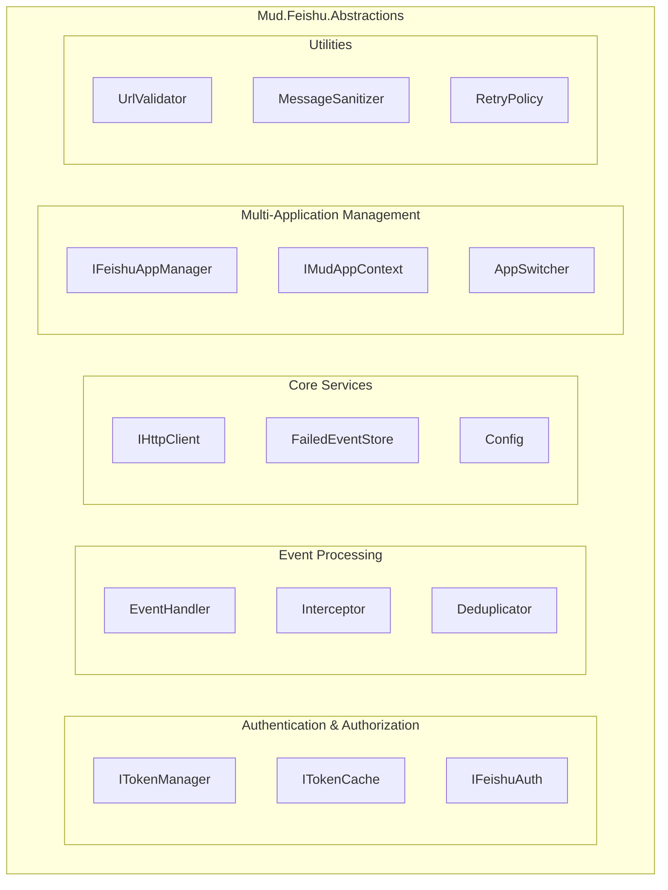
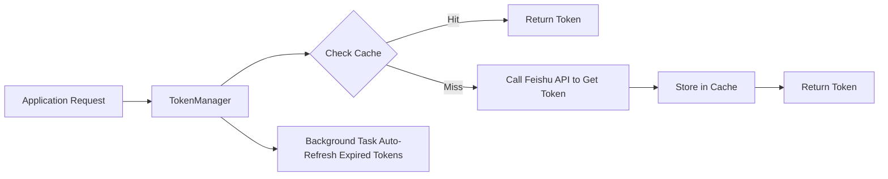
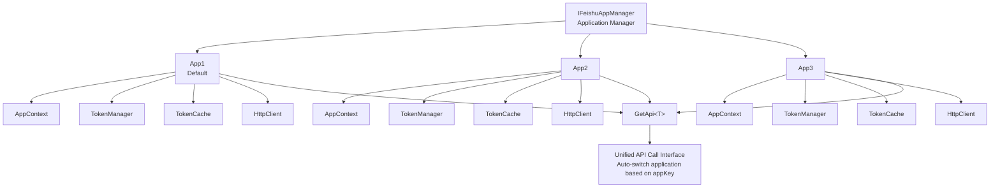
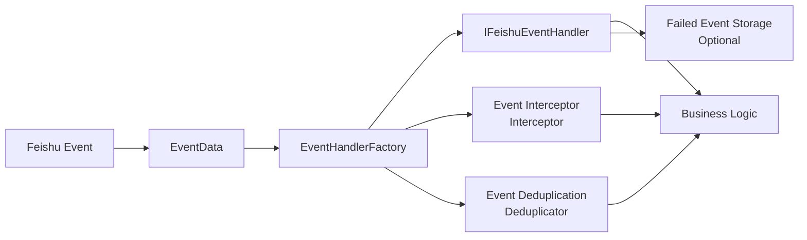

# Mud.Feishu.Abstractions

[](https://www.nuget.org/packages/Mud.Feishu.Abstractions/)
[](LICENSE-MIT)

Mud.Feishu.Abstractions is the abstraction layer of the MudFeishu library, providing complete Feishu API access capabilities, including authentication and authorization, token management, multi-application support, event subscription processing, and other core features. It supports both WebSocket event subscription and HTTP event subscription modes, providing a strategy pattern-based event processing mechanism that enables developers to easily integrate Feishu services into .NET applications.

## 🚀 Features

### Core Features
- **🔐 Complete Authentication & Authorization** - Supports application tokens, tenant tokens, and user tokens
- **🔑 Smart Token Management** - Token manager with caching, automatic refresh, expiration detection, and retry mechanism
- **🏢 Multi-Application Support** - Unified management of multiple Feishu applications, each with independent configuration and resources
- **🎭 Token Cache Abstraction** - Supports multiple cache implementations including memory cache and Redis
- **🛡️ Security Protection** - URL whitelist validation, private IP detection, sensitive information masking

### Event Processing
- **📡 Event Subscription Abstraction** - Provides complete event subscription and processing abstraction layer
- **🔧 Strategy Pattern** - Event handlers based on strategy pattern, supporting multiple event types
- **🏭 Factory Pattern** - Built-in event handler factory, supporting dynamic registration and discovery
- **⚡ Async Processing** - Fully asynchronous event processing with parallel processing support
- **🔄 Event Deduplication** - Supports event ID deduplication and SeqID deduplication, ensuring idempotency
- **🎯 Type Safety** - Strongly-typed event data models, avoiding runtime errors
- **🛠️ Interceptor Mechanism** - Supports custom logic before and after event processing

### Developer Experience
- **📋 Rich Event Types** - Supports 40+ Feishu event types
- **🔄 Extensible** - Easy to extend with new event types and handlers
- **🛡️ Built-in Base Classes** - Provides default event handler base classes to simplify development
- **📦 Multi-Framework Support** - Supports netstandard2.0, .NET 6.0 - .NET 10.0
- **🌐 HTTP Client** - Enhanced HTTP client with retry, logging, and file download support

## 📦 Installation

```bash
dotnet add package Mud.Feishu.Abstractions
```

## 🏛️ Core Architecture

### System Architecture



### Token Management Flow



### Multi-Application Architecture



### Event Processing Flow



### Core Components

#### Authentication & Token Management
- **`ITokenManager`** - Token manager base interface
- **`IAppTokenManager`** - Application token manager
- **`ITenantTokenManager`** - Tenant token manager
- **`IUserTokenManager`** - User token manager (supports multiple users)
- **`ITokenCache`** - Token cache abstraction interface
- **`IFeishuAuthentication`** - Feishu authentication API client
- **`TokenManagerWithCache`** - Token manager base class with caching
- **`MemoryTokenCache`** - Memory cache implementation

#### Multi-Application Management
- **`IFeishuAppManager`** - Application manager interface
- **`IMudAppContext`** - Application context interface
- **`IFeishuAppContextSwitcher`** - Application context switcher interface
- **`FeishuAppManager`** - Application manager implementation
- **`FeishuAppContext`** - Application context implementation
- **`FeishuAppConfig`** - Application configuration class
- **`FeishuAppConfigBuilder`** - Application configuration builder

#### Event Processing
- **`EventData`** - Event data model
- **`IFeishuEventHandler`** - Event handler interface
- **`DefaultFeishuEventHandler<T>`** - Abstract event handler base class
- **`IdempotentFeishuEventHandler<T>`** - Idempotent event handler
- **`IFeishuEventHandlerFactory`** - Event handler factory
- **`IFeishuEventInterceptor`** - Event interceptor interface
- **`IFeishuEventDeduplicator`** - Event deduplication service interface
- **`IFeishuSeqIDDeduplicator`** - SeqID deduplication service interface

#### Core Services
- **`IEnhancedHttpClient`** - Enhanced HTTP client interface
- **`IFailedEventStore`** - Failed event storage interface
- **`IEventResult`** - Event result interface
- **`ObjectEventResult<T>`** - Object event result class

#### Data Models
- **`FeishuApiResult<T>`** - API response result model
- **`AppCredentials`** - Application credential model
- **`FeishuEventTypes`** - Event type constants
- Organization event models, IM event models, approval event models, etc.

## 🔑 Token Management

### Token Types

Mud.Feishu.Abstractions supports three Feishu token types:

| Token Type | Interface | Purpose | Validity Period |
|------------|-----------|---------|-----------------|
| **Application Token** | `IAppTokenManager` | Application-level permission validation | 2 hours |
| **Tenant Token** | `ITenantTokenManager` | Tenant-level permission validation | 2 hours |
| **User Token** | `IUserTokenManager` | User-level permission validation | Depends on authorization type |

### Token Manager Features

- **Automatic Caching** - Automatically caches tokens to reduce API calls
- **Smart Refresh** - Automatically refreshes tokens before expiration
- **Concurrency Control** - Uses Lazy loading to prevent cache penetration from concurrent requests
- **Retry Mechanism** - Automatically retries (up to 2 times with exponential backoff) when token acquisition fails
- **Thread Safety** - All operations are thread-safe
- **Statistics** - Provides cache statistics (total count, expired count)

### Usage Examples

#### 1. Basic Usage

```csharp
// Inject application token manager
public class MyService
{
    private readonly IAppTokenManager _appTokenManager;

    public MyService(IAppTokenManager appTokenManager)
    {
        _appTokenManager = appTokenManager;
    }

    public async Task CallFeishuApiAsync()
    {
        // Get token (automatically handles caching, refresh, etc.)
        var token = await _appTokenManager.GetTokenAsync();

        // Use token to call Feishu API
        var client = new HttpClient();
        client.DefaultRequestHeaders.Authorization =
            new AuthenticationHeaderValue("Bearer", token);

        // ...
    }
}
```

#### 2. Multi-User Token Management

```csharp
public class UserService
{
    private readonly IUserTokenManager _userTokenManager;

    public UserService(IUserTokenManager userTokenManager)
    {
        _userTokenManager = userTokenManager;
    }

    // Get token for specific user
    public async Task<string> GetUserTokenAsync(string userId)
    {
        return await _userTokenManager.GetTokenAsync(userId);
    }

    // Get user token using authorization code
    public async Task<string> GetUserTokenWithCodeAsync(string code, string redirectUri)
    {
        return await _userTokenManager.GetUserTokenWithCodeAsync(code, redirectUri);
    }

    // Refresh user token
    public async Task<string> RefreshUserTokenAsync(string userId, string refreshToken)
    {
        return await _userTokenManager.RefreshUserTokenAsync(userId, refreshToken);
    }
}
```

#### 3. Custom Token Cache

```csharp
// Implement ITokenCache interface
public class RedisTokenCache : ITokenCache
{
    private readonly IConnectionMultiplexer _redis;
    private readonly IDatabase _db;

    public RedisTokenCache(IConnectionMultiplexer redis)
    {
        _redis = redis;
        _db = _redis.GetDatabase();
    }

    public async Task<string?> GetAsync(string key, CancellationToken cancellationToken = default)
    {
        return await _db.StringGetAsync(key);
    }

    public async Task SetAsync(string key, string value, TimeSpan expiration, CancellationToken cancellationToken = default)
    {
        await _db.StringSetAsync(key, value, expiration);
    }

    public async Task<bool> RemoveAsync(string key, CancellationToken cancellationToken = default)
    {
        return await _db.KeyDeleteAsync(key);
    }

    // Implement other methods...
}

// Register custom cache
builder.Services.AddTokenCache<RedisTokenCache>();
```

#### 4. Get Cache Statistics

```csharp
public class TokenStatisticsService
{
    private readonly ITokenManager _tokenManager;

    public async Task PrintStatisticsAsync()
    {
        var (total, expired) = await _tokenManager.GetCacheStatisticsAsync();
        Console.WriteLine($"Cache Statistics: Total={total}, Expired={expired}");
    }
}
```

### Token Cache Strategy

The token manager uses the following strategies to optimize performance:

1. **First Access** - Call Feishu API to get token
2. **Subsequent Access** - Return token from cache (if not expired)
3. **About to Expire** - Automatically refresh 5 minutes (default) before token expiration
4. **Concurrent Requests** - Use Lazy loading, multiple concurrent requests trigger only one refresh
5. **Failure Retry** - Automatically retry 2 times with exponential backoff when token acquisition fails

## 🏢 Multi-Application Support

### Core Concepts

Mud.Feishu.Abstractions provides complete multi-application management capabilities, allowing you to manage multiple Feishu applications in the same system:

- **Independent Configuration** - Each application has independent AppId, AppSecret, BaseUrl, and other configurations
- **Independent Resources** - Each application has independent token manager, cache, and HTTP client
- **Unified Management** - Unified management of all applications through IFeishuAppManager
- **Dynamic Switching** - Supports runtime dynamic addition, removal, and switching of applications
- **Cache Isolation** - Uses PrefixedTokenCache to ensure token caches of different applications do not interfere

### Application Configuration

```csharp
// Method 1: Use configuration file
{
  "Feishu": {
    "Apps": [
      {
        "AppKey": "default",
        "AppId": "cli_xxxxxx",
        "AppSecret": "xxxxxx",
        "BaseUrl": "https://open.feishu.cn",
        "IsDefault": true
      },
      {
        "AppKey": "approval",
        "AppId": "cli_yyyyyy",
        "AppSecret": "yyyyyy",
        "BaseUrl": "https://open.feishu.cn"
      }
    ]
  }
}

// Method 2: Use code configuration
builder.Services.AddFeishuApp(configs =>
{
    configs.AddDefaultApp("default", "cli_xxxxxx", "xxxxxx")
            .SetBaseUrl("https://open.feishu.cn")
            .SetTimeout(30)
            .SetRetryCount(3);

    configs.AddApp("approval", "cli_yyyyyy", "yyyyyy")
            .SetTimeout(60)
            .SetRetryCount(5);
});

// Method 3: Use builder
builder.Services.AddFeishuApp(builder =>
{
    builder.AddDefaultApp("default", "cli_xxxxxx", "xxxxxx")
           .AddApp("approval", "cli_yyyyyy", "yyyyyy")
           .AddApp("im", "cli_zzzzzz", "zzzzzz");
});
```

### Using Multiple Applications

#### 1. Get API for Specific Application

```csharp
public class MultiAppService
{
    private readonly IFeishuAppManager _appManager;

    public MultiAppService(IFeishuAppManager appManager)
    {
        _appManager = appManager;
    }

    public async Task UseDefaultAppAsync()
    {
        // Get API for default application
        var api = _appManager.GetFeishuApi<IMyApi>();
        await api.DoSomethingAsync();
    }

    public async Task UseSpecificAppAsync(string appKey)
    {
        // Get API for specific application
        var api = _appManager.GetFeishuApi<IMyApi>(appKey);
        await api.DoSomethingAsync();
    }
}
```

#### 2. Application Context Switching

```csharp
public class AppSwitchingService
{
    private readonly IFeishuAppContextSwitcher _switcher;

    public async Task WorkWithAppsAsync()
    {
        // Switch to default application
        var defaultContext = _switcher.UseDefaultApp();
        var defaultToken = await defaultContext
            .GetTokenManager(TokenType.App)
            .GetTokenAsync();

        // Switch to approval application
        var approvalContext = _switcher.UseApp("approval");
        var approvalToken = await approvalContext
            .GetTokenManager(TokenType.App)
            .GetTokenAsync();

        // Use application context to access resources
        var httpClient = approvalContext.HttpClient;
        var auth = approvalContext.Authentication;
    }
}
```

#### 3. Dynamic Application Management

```csharp
public class DynamicAppManager
{
    private readonly IFeishuAppManager _appManager;

    // Add new application at runtime
    public void AddNewApp()
    {
        var newConfig = new FeishuAppConfig
        {
            AppKey = "newApp",
            AppId = "cli_newxxx",
            AppSecret = "newsecret",
            IsDefault = false
        };

        _appManager.AddApp(newConfig);
    }

    // Check if application exists
    public bool CheckAppExists(string appKey)
    {
        return _appManager.HasApp(appKey);
    }

    // Get all applications
    public IEnumerable<IMudAppContext> GetAllApps()
    {
        return _appManager.GetAllApps();
    }

    // Remove application
    public bool RemoveApp(string appKey)
    {
        return _appManager.RemoveApp(appKey);
    }
}
```

### Application Configuration Options

| Configuration | Type | Default | Description |
|---------------|------|---------|-------------|
| `AppKey` | string | - | Application unique identifier (required) |
| `AppId` | string | - | Feishu application ID (required) |
| `AppSecret` | string | - | Feishu application secret (required) |
| `BaseUrl` | string | https://open.feishu.cn | API base URL |
| `TimeOut` | int | 30 | HTTP request timeout (seconds) |
| `RetryCount` | int | 3 | Failure retry count |
| `RetryDelayMs` | int | 1000 | Retry delay (milliseconds) |
| `TokenRefreshThreshold` | int | 300 | Token refresh threshold (seconds) |
| `EnableLogging` | bool | true | Whether to enable logging |
| `IsDefault` | bool | false | Whether it's the default application |

## 🎯 Supported Event Types

### Organization Management Events
- `contact.user.created_v3` - Employee onboarding event
- `contact.user.updated_v3` - User update event
- `contact.user.deleted_v3` - User deletion event
- `contact.custom_attr_event.updated_v3` - Member field change event
- `contact.department.created_v3` - Department creation event
- `contact.department.updated_v3` - Department update event
- `contact.department.deleted_v3` - Department deletion event
- `contact.employee_type_enum.created_v3` - Personnel type creation event
- `contact.employee_type_enum.updated_v3` - Personnel type update event
- `contact.employee_type_enum.deleted_v3` - Personnel type deletion event
- `contact.employee_type_enum.actived_v3` - Personnel type activation event
- `contact.employee_type_enum.deactivated_v3` - Personnel type deactivation event

### Message Events
- `im.message.receive_v1` - Receive message event
- `im.message.recalled_v1` - Message recall event
- `im.message.message_read_v1` - Message read event
- `im.message.reaction.created_v1` - New message reaction added event
- `im.message.reaction.deleted_v1` - Message reaction deleted event

### Group Chat Events
- `im.chat.disbanded_v1` - Group disband event
- `im.chat.updated_v1` - Group configuration modification event
- `im.chat.member.user.added_v1` - User added to group event
- `im.chat.member.user.deleted_v1` - User removed from group event
- `im.chat.member.user.withdrawn_v1` - User invitation withdrawn event
- `im.chat.member.bot.added_v1` - Bot added to group event
- `im.chat.member.bot.deleted_v1` - Bot removed from group event

### Approval Events
- `approval.approval.approved_v1` - Approval approved event
- `approval.approval.rejected_v1` - Approval rejected event
- `approval.approval.updated_v1` - Approval updated event
- `approval.cc_v1` - Approval cc event
- `approval.instance_v1` - Approval instance event
- `approval.instance.remedy_group.updated_v1` - Approval instance remedy group updated event
- `approval.instance.trip_group.updated_v1` - Approval instance trip group updated event
- `approval.task_v1` - Approval task event
- `approval.leave_v1` - Leave approval event
- `approval.out_v1` - Out approval event
- `approval.shift_v1` - Shift approval event
- `approval.work_v1` - Work approval event

### Task Events
- `task.update_tenant_v1` - Task information change - tenant dimension event
- `task.updated_v1` - Task information change event
- `task.comment.updated_v1` - Task comment information change event

### Calendar and Meeting Events
- `calendar.event.updated_v4` - Calendar event
- `meeting.meeting.started_v1` - Meeting started event
- `meeting.meeting.ended_v1` - Meeting ended event

## 📖 Usage Examples

### 1. Create Basic Event Handler (Implement IFeishuEventHandler Interface)

```csharp
using Mud.Feishu.Abstractions;
using System.Text.Json;

namespace YourProject.Handlers;

/// <summary>
/// Demo user event handler
/// </summary>
public class DemoUserEventHandler : IFeishuEventHandler
{
    private readonly ILogger<DemoUserEventHandler> _logger;
    private readonly YourEventService _eventService;

    public DemoUserEventHandler(ILogger<DemoUserEventHandler> logger, YourEventService eventService)
    {
        _logger = logger ?? throw new ArgumentNullException(nameof(logger));
        _eventService = eventService ?? throw new ArgumentNullException(nameof(eventService));
    }

    public string SupportedEventType => FeishuEventTypes.UserCreated;

    public async Task HandleAsync(EventData eventData, CancellationToken cancellationToken = default)
    {
        if (eventData == null)
            throw new ArgumentNullException(nameof(eventData));

        _logger.LogInformation("👤 [User Event] Starting to process user creation event: {EventId}", eventData.EventId);

        try
        {
            // Parse user data
            var userData = ParseUserData(eventData);

            // Record event to service
            await _eventService.RecordUserEventAsync(userData, cancellationToken);

            // Simulate business processing
            await ProcessUserEventAsync(userData, cancellationToken);

            _logger.LogInformation("✅ [User Event] User creation event processed successfully: UserID {UserId}, UserName {UserName}",
                userData.UserId, userData.UserName);
        }
        catch (Exception ex)
        {
            _logger.LogError(ex, "❌ [User Event] Failed to process user creation event: {EventId}", eventData.EventId);
            throw;
        }
    }

    private UserData ParseUserData(EventData eventData)
    {
        try
        {
            var jsonElement = JsonSerializer.Deserialize<JsonElement>(eventData.Event?.ToString() ?? "{}");
            var userElement = jsonElement.GetProperty("user");

            return new UserData
            {
                UserId = userElement.GetProperty("user_id").GetString() ?? "",
                UserName = userElement.GetProperty("name").GetString() ?? "",
                Email = TryGetProperty(userElement, "email") ?? "",
                Department = TryGetProperty(userElement, "department") ?? "",
                CreatedAt = DateTime.UtcNow
            };
        }
        catch (Exception ex)
        {
            _logger.LogError(ex, "Failed to parse user data");
            throw new InvalidOperationException("Unable to parse user data", ex);
        }
    }

    private async Task ProcessUserEventAsync(UserData userData, CancellationToken cancellationToken)
    {
        // Simulate async business operation
        await Task.Delay(100, cancellationToken);

        // Validate required fields
        if (string.IsNullOrWhiteSpace(userData.UserId))
        {
            throw new ArgumentException("User ID cannot be empty");
        }

        // Simulate sending welcome notification
        _logger.LogInformation("📧 [User Event] Sending welcome notification to user: {UserName} ({Email})",
            userData.UserName, userData.Email);

        await Task.CompletedTask;
    }

    private static string? TryGetProperty(JsonElement element, string propertyName)
    {
        return element.TryGetProperty(propertyName, out var value) ? value.GetString() : null;
    }
}
```

### 2. Inherit Predefined Event Handler (Recommended Approach)

```csharp
using Mud.Feishu.Abstractions;
using Mud.Feishu.Abstractions.DataModels.Organization;
using Mud.Feishu.Abstractions.EventHandlers;

namespace YourProject.Handlers;

/// <summary>
/// Demo department event handler - inherits from predefined department creation event handler
/// </summary>
public class DemoDepartmentEventHandler : DepartmentCreatedEventHandler
{
    private readonly YourEventService _eventService;

    public DemoDepartmentEventHandler(ILogger<DemoDepartmentEventHandler> logger, YourEventService eventService) : base(logger)
    {
        _eventService = eventService ?? throw new ArgumentNullException(nameof(eventService));
    }

    protected override async Task ProcessBusinessLogicAsync(
        EventData eventData,
        ObjectEventResult<DepartmentCreatedResult>? departmentData,
        CancellationToken cancellationToken = default)
    {
        if (eventData == null)
            throw new ArgumentNullException(nameof(eventData));

        _logger.LogInformation("[Department Event] Starting to process department creation event: {EventId}", eventData.EventId);

        try
        {
            // Record event to service
            await _eventService.RecordDepartmentEventAsync(departmentData.Object, cancellationToken);

            // Simulate business processing
            await ProcessDepartmentEventAsync(departmentData.Object, cancellationToken);

            _logger.LogInformation("[Department Event] Department creation event processed successfully: DepartmentID {DepartmentId}, DepartmentName {DepartmentName}",
                departmentData.Object.DepartmentId, departmentData.Object.Name);
        }
        catch (Exception ex)
        {
            _logger.LogError(ex, "[Department Event] Failed to process department creation event: {EventId}", eventData.EventId);
            throw;
        }
    }

    private async Task ProcessDepartmentEventAsync(DepartmentCreatedResult departmentData, CancellationToken cancellationToken)
    {
        // Simulate async business operation
        await Task.Delay(100, cancellationToken);

        // Validation logic
        if (string.IsNullOrWhiteSpace(departmentData.DepartmentId))
        {
            throw new ArgumentException("Department ID cannot be empty");
        }

        // Simulate permission initialization
        _logger.LogInformation("[Department Event] Initializing department permissions: {DepartmentName}", departmentData.Name);

        // Notify department manager
        if (!string.IsNullOrWhiteSpace(departmentData.LeaderUserId))
        {
            _logger.LogInformation("[Department Event] Notifying department manager: {LeaderUserId}", departmentData.LeaderUserId);
        }

        // Handle hierarchy relationships
        if (!string.IsNullOrWhiteSpace(departmentData.ParentDepartmentId))
        {
            _logger.LogInformation("[Department Event] Establishing hierarchy relationship: {DepartmentId} -> {ParentDepartmentId}",
                departmentData.DepartmentId, departmentData.ParentDepartmentId);
        }

        await Task.CompletedTask;
    }
}
```

### 3. Configure Services and Event Handlers in Program.cs

```csharp
using Mud.Feishu.WebSocket;
using Mud.Feishu.WebSocket.Demo.Handlers;
using Mud.Feishu.WebSocket.Demo.Services;
using Mud.Feishu.WebSocket.Services;

var builder = WebApplication.CreateBuilder(args);

// Configure basic services
builder.Services.AddControllers();
builder.Services.AddEndpointsApiExplorer();
builder.Services.AddSwaggerGen(c =>
{
    c.SwaggerDoc("v1", new Microsoft.OpenApi.OpenApiInfo
    {
        Title = "Feishu WebSocket Test API",
        Version = "v1",
        Description = "Demo API for testing Feishu WebSocket persistent connection functionality"
    });
});

// Configure Feishu services
builder.Services.CreateFeishuServicesBuilder(builder.Configuration)
                .AddAuthenticationApi()
                .AddTokenManagers()
                .Build();

// Configure Feishu WebSocket service (recommended approach)
builder.Services.AddFeishuWebSocketBuilder()
    .ConfigureFrom(builder.Configuration)
    .UseMultiHandler()  // Use multi-handler mode
    .AddHandler<DemoDepartmentEventHandler>()      // Add department creation event handler
    .AddHandler<DemoDepartmentDeleteEventHandler>() // Add department deletion event handler
    .Build();

// Configure custom services
builder.Services.AddSingleton<DemoEventService>();
builder.Services.AddHostedService<DemoEventBackgroundService>();

// Configure CORS
builder.Services.AddCors(options =>
{
    options.AddPolicy("AllowAll", policy =>
    {
        policy.AllowAnyOrigin()
              .AllowAnyMethod()
              .AllowAnyHeader();
    });
});

var app = builder.Build();

// Configure middleware
if (app.Environment.IsDevelopment())
{
    app.UseSwagger();
    app.UseSwaggerUI();
}

app.UseHttpsRedirection();
app.UseCors("AllowAll");
app.UseStaticFiles();
app.UseRouting();
app.MapControllers();

app.Run();
```

### 4. Create Custom Event Service to Handle Event Data

```csharp
namespace YourProject.Services;

/// <summary>
/// Demo event service - used to record and manage event processing results
/// </summary>
public class DemoEventService
{
    private readonly ILogger<DemoEventService> _logger;
    private readonly ConcurrentBag<UserData> _userEvents = new();
    private readonly ConcurrentBag<DepartmentData> _departmentEvents = new();
    private int _userCount = 0;
    private int _departmentCount = 0;

    public DemoEventService(ILogger<DemoEventService> logger)
    {
        _logger = logger;
    }

    public async Task RecordUserEventAsync(UserData userData, CancellationToken cancellationToken = default)
    {
        _logger.LogDebug("Recording user event: {UserId}", userData.UserId);
        _userEvents.Add(userData);
        await Task.CompletedTask;
    }

    public async Task RecordDepartmentEventAsync(DepartmentData departmentData, CancellationToken cancellationToken = default)
    {
        _logger.LogDebug("Recording department event: {DepartmentId}", departmentData.DepartmentId);
        _departmentEvents.Add(departmentData);
        await Task.CompletedTask;
    }

    public void IncrementUserCount()
    {
        Interlocked.Increment(ref _userCount);
        _logger.LogInformation("User count updated: {Count}", _userCount);
    }

    public void IncrementDepartmentCount()
    {
        Interlocked.Increment(ref _departmentCount);
        _logger.LogInformation("Department count updated: {Count}", _departmentCount);
    }

    public IEnumerable<UserData> GetUserEvents() => _userEvents.ToList();
    public IEnumerable<DepartmentData> GetDepartmentEvents() => _departmentEvents.ToList();
    public int GetUserCount() => _userCount;
    public int GetDepartmentCount() => _departmentCount;
}
```

## 🏗️ Advanced Usage

### Multi-Handler Strategy

```csharp
public class MultiHandlerService
{
    private readonly IFeishuEventHandlerFactory _factory;

    public MultiHandlerService(IFeishuEventHandlerFactory factory)
    {
        _factory = factory;
    }

    public async Task HandleEventWithMultipleStrategies(EventData eventData)
    {
        // Get all matching handlers
        var handlers = _factory.GetHandlers(eventData.EventType);
        
        // Process by priority
        foreach (var handler in handlers.OrderBy(h => h.GetType().Name))
        {
            try
            {
                await handler.HandleAsync(eventData);
            }
            catch (Exception ex)
            {
                // Log error but continue processing other handlers
                Console.WriteLine($"Handler {handler.GetType().Name} failed: {ex.Message}");
            }
        }
    }
}
```

### Conditional Event Handling

```csharp
public class ConditionalEventHandler : IFeishuEventHandler
{
    public string SupportedEventType => FeishuEventTypes.ReceiveMessage;

    public async Task HandleAsync(EventData eventData, CancellationToken cancellationToken = default)
    {
        // Only handle specific types of messages
        if (eventData.Event is MessageReceiveEvent msgEvent)
        {
            if (msgEvent.Message.MessageType == "text")
            {
                await HandleTextMessage(msgEvent);
            }
            else if (msgEvent.Message.MessageType == "image")
            {
                await HandleImageMessage(msgEvent);
            }
        }
    }

    private async Task HandleTextMessage(MessageReceiveEvent msgEvent)
    {
        // Text message handling logic
    }

    private async Task HandleImageMessage(MessageReceiveEvent msgEvent)
    {
        // Image message handling logic
    }
}
```

## 🔧 Extending New Event Types

### 1. Define Event Type Constants

```csharp
public static class CustomEventTypes
{
    public const string MyCustomEvent = "custom.my_event.v1";
}
```

### 2. Create Event Data Model

```csharp
public class MyCustomEvent : IEventResult
{
    [JsonPropertyName("custom_data")]
    public string CustomData { get; set; } = string.Empty;
}
```

### 3. Implement Event Handler

```csharp
// Basic implementation approach
public class MyCustomEventHandler : IFeishuEventHandler
{
    public string SupportedEventType => CustomEventTypes.MyCustomEvent;

    public async Task HandleAsync(EventData eventData, CancellationToken cancellationToken = default)
    {
        if (eventData.Event is MyCustomEvent customEvent)
        {
            // Handle custom event
        }
    }
}

// Recommended to use base class
public class MyCustomEventHandler : DefaultFeishuEventHandler<MyCustomEvent>
{
    public override string SupportedEventType => CustomEventTypes.MyCustomEvent;

    public MyCustomEventHandler(ILogger<MyCustomEventHandler> logger) : base(logger)
    {
    }

    protected override async Task ProcessBusinessLogicAsync(
        EventData eventData, 
        MyCustomEvent? eventEntity, 
        CancellationToken cancellationToken = default)
    {
        if (eventEntity != null)
        {
            // Handle custom event, base class has already deserialized it
            Console.WriteLine($"Custom data: {eventEntity.CustomData}");
        }
        
        await Task.CompletedTask;
    }
}
```

## 📊 Selection Comparison

### Handler Selection Strategy

| Strategy | Advantages | Disadvantages | Use Cases |
|----------|-------------|----------------|-----------|
| `IEventHandler` Direct Implementation | Maximum flexibility | Need manual deserialization | Simple events or special requirements |
| `DefaultFeishuEventHandler<T>` | Auto deserialization, error handling | Increased inheritance hierarchy | Most standard events |
| `DefaultFeishuObjectEventHandler<T>` | Optimized for object results | Relatively fixed functionality | Events returning objects |

### Performance Recommendations

- ✅ **Recommended** Use `DefaultFeishuEventHandler<T>` base class
- ⚡ **Optimization** Use `ValueTask` for high-frequency events
- 🔄 **Concurrency** Use `HandleEventParallelAsync` for complex events
- 🛡️ **Safety** Base class includes exception handling and logging

## 🛠️ Development and Build

### Requirements

- .NET 6.0 or higher
- Visual Studio 2022 or Visual Studio Code

### Build Project

```bash
# Clone repository
git clone https://gitee.com/mudtools/MudFeishu.git
cd MudFeishu/Mud.Feishu.Abstractions

# Restore dependencies
dotnet restore

# Build project
dotnet build

# Run tests
dotnet test
```

## 📚 Related Projects

- [Mud.Feishu](../Mud.Feishu) - Main Feishu SDK implementation
- [Mud.Feishu.WebSocket](../Mud.Feishu.WebSocket) - WebSocket event subscription implementation
- [Mud.Feishu.Test](../Mud.Feishu.Test) - Test project and usage examples

## 🤝 Contributing

Contributions are welcome! Please check the [Contributing Guide](../../CONTRIBUTING.md) for details.

### Contributing Process

1. Fork the project
2. Create a feature branch (`git checkout -b feature/AmazingFeature`)
3. Commit your changes (`git commit -m 'Add some AmazingFeature'`)
4. Push to the branch (`git push origin feature/AmazingFeature`)
5. Open a Pull Request

**Mud.Feishu.Abstractions** - Making Feishu event handling simple and powerful! 🚀
