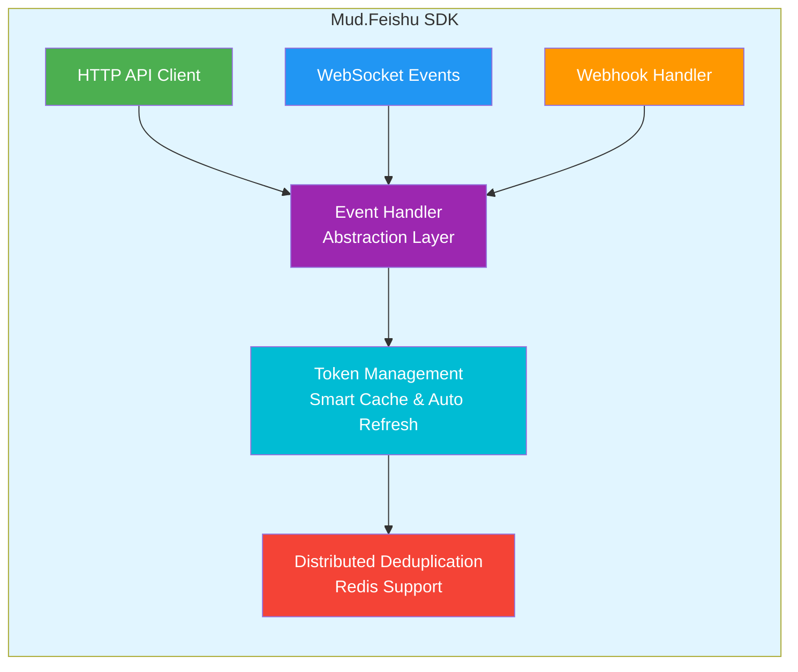

# MudFeishu

<div align="center">


**现代化 .NET 飞书 API 集成 SDK**

极简 API · 类型安全 · 企业级特性 · 事件驱动

[快速开始](#快速开始) · [文档](https://www.mudtools.cn/documents/guides/feishu/) · [示例代码](#示例项目) · [贡献指南](#贡献指南)

</div>

---

## 📖 简介

MudFeishu 是一套现代化的企业级 .NET 飞书 API 集成 SDK，提供完整的 HTTP API 调用、WebSocket 实时事件订阅和 Webhook 事件处理能力。SDK 采用策略模式和工厂模式设计，内置自动令牌管理、智能重试、高性能缓存等企业级特性。

### ✨ 核心特性

- **极简 API** - 一行代码完成服务注册
- **类型安全** - 完整的强类型数据模型，编译时检查
- **自动令牌管理** - 智能缓存和自动刷新机制
- **企业级稳定** - 统一异常处理、智能重试、高性能缓存
- **事件驱动架构** - WebSocket + Webhook 双模式支持
- **多框架支持** - .NET Standard 2.0 / .NET 6.0 / .NET 8.0 / .NET 10.0
- **分布式支持** - Redis 分布式去重，多实例部署
- **安全增强** - 签名验证、时间戳验证、IP 白名单

---

## 🏗️ 架构概览



---

## 📦 模块组成

| 模块 | NuGet 包 | 功能定位 |
|------|---------|---------|
| **Mud.Feishu.Abstractions** | `Mud.Feishu.Abstractions` | 事件处理抽象层，提供统一的处理器接口和数据模型 |
| **Mud.Feishu** | `Mud.Feishu` | HTTP API 客户端核心，支持组织架构、消息、审批、任务等 |
| **Mud.Feishu.WebSocket** | `Mud.Feishu.WebSocket` | 实时事件订阅，支持自动重连、心跳检测、消息队列 |
| **Mud.Feishu.Webhook** | `Mud.Feishu.Webhook` | HTTP 回调事件处理，支持签名验证、加密解密 |
| **Mud.Feishu.Redis** | `Mud.Feishu.Redis` | 分布式去重扩展，支持多实例部署 |

### 功能覆盖矩阵

```
功能模块          │ HTTP API │ WebSocket │ Webhook │ Redis 扩展
─────────────────┼──────────┼──────────┼─────────┼───────────
认证授权          │    ✅     │    ✅     │    ✅    │     ✅
组织架构          │    ✅     │    ✅     │    ✅    │     ✅
用户管理          │    ✅     │    ✅     │    ✅    │     ✅
部门管理          │    ✅     │    ✅     │    ✅    │     ✅
消息服务          │    ✅     │    ✅     │    ✅    │     ✅
群聊管理          │    ✅     │    ✅     │    ✅    │     ✅
审批流程          │    ✅     │    ✅     │    ✅    │     ✅
任务管理          │    ✅     │    ✅     │    ✅    │     ✅
卡片管理          │    ✅     │    ✅     │    ✅    │     ✅
```

---

## 🚀 快速开始

### 安装

```bash
# 核心包
dotnet add package Mud.Feishu --version 1.1.0

# 可选模块
dotnet add package Mud.Feishu.WebSocket --version 1.1.0
dotnet add package Mud.Feishu.Webhook --version 1.1.0
dotnet add package Mud.Feishu.Redis --version 1.1.0
```

### 配置依赖注入

#### 🎯 一键完整注册（推荐新手）

```csharp
using Mud.Feishu;

var builder = WebApplication.CreateBuilder(args);

// 一行代码注册所有飞书 API 服务（懒人模式）
builder.Services.AddFeishuServices(builder.Configuration);

var app = builder.Build();
```

#### 🔧 构造者模式（推荐高级用户）

```csharp
// 按需灵活注册服务（使用配置文件）
builder.Services.CreateFeishuServicesBuilder(builder.Configuration)
    .AddOrganizationApi()                  // 组织架构
    .AddMessageApi()                       // 消息服务
    .AddChatGroupApi()                    // 群组服务
    .AddApprovalApi()                     // 流程审批
    .AddTaskApi()                         // 任务管理
    .AddCardApi()                         // 卡片管理
    .Build();

// 按需灵活注册服务（使用代码配置）
builder.Services.CreateFeishuServicesBuilder(options =>
{
    options.AppId = "your_app_id";
    options.AppSecret = "your_app_secret";
    options.BaseUrl = "https://open.feishu.cn";
    options.TimeOut = 30;
    options.RetryCount = 3;
})
    .AddOrganizationApi()
    .AddMessageApi()
    .Build();
```

#### 📦 模块化注册

```csharp
// 仅注册需要的模块
builder.Services.AddFeishuServices(builder.Configuration, new[]
{
    FeishuModule.Organization,      // 组织架构
    FeishuModule.Message,          // 消息服务
    FeishuModule.ChatGroup         // 群组服务
});
```

### 配置文件

#### appsettings.json

```json
{
  "Feishu": {
    "AppId": "your_feishu_app_id",
    "AppSecret": "your_feishu_app_secret",
    "BaseUrl": "https://open.feishu.cn",
    "TimeOut": 30,
    "RetryCount": 3,
    "EnableLogging": true
  },
  "Feishu:Redis": {
    "ServerAddress": "localhost:6379",
    "Password": "",
    "DefaultDatabase": 0,
    "EventCacheExpiration": "08:00:00"
  }
}
```

### Controller 注入示例

```csharp
using Microsoft.AspNetCore.Mvc;
using Mud.Feishu;

[ApiController]
[Route("api/[controller]")]
public class FeishuController : ControllerBase
{
    private readonly IFeishuTenantV3User _userApi;
    private readonly IFeishuTenantV3Departments _departmentsApi;
    private readonly IFeishuTenantV1Message _messageApi;

    public FeishuController(
        IFeishuTenantV3User userApi,
        IFeishuTenantV3Departments departmentsApi,
        IFeishuTenantV1Message messageApi)
    {
        _userApi = userApi;
        _departmentsApi = departmentsApi;
        _messageApi = messageApi;
    }
}
```

---

## 💡 使用示例

### 📧 消息通知

#### 发送文本消息

```csharp
public class MessageService
{
    private readonly IFeishuTenantV1Message _messageApi;

    public MessageService(IFeishuTenantV1Message messageApi)
    {
        _messageApi = messageApi;
    }

    public async Task SendMessageAsync(string userId, string text)
    {
        var content = new MessageTextContent { Text = text };
        var result = await _messageApi.SendMessageAsync(new SendMessageRequest
        {
            ReceiveId = userId,
            MsgType = "text",
            Content = JsonSerializer.Serialize(content)
        }, receive_id_type: "user_id");

        if (result.Code != 0)
        {
            throw new Exception($"发送失败: {result.Msg}");
        }

        Console.WriteLine($"消息发送成功，消息ID: {result.Data?.MessageId}");
    }
}
```

#### 批量发送通知

```csharp
public class NotificationService
{
    private readonly IFeishuTenantV1BatchMessage _batchMessageApi;

    public async Task<string> SendSystemNotificationAsync(
        string[] departmentIds,
        string title,
        string content)
    {
        var request = new BatchSenderTextMessageRequest
        {
            DeptIds = departmentIds,
            Content = new TextContent
            {
                Text = $"📢 {title}-{content}"
            }
        };

        var result = await _batchMessageApi.BatchSendTextMessageAsync(request);

        if (result.Code == 0)
        {
            var messageId = result.Data!.MessageId;
            Console.WriteLine($"批量消息发送成功，任务ID: {messageId}");

            // 异步查询发送进度
            _ = Task.Run(async () => await MonitorProgressAsync(messageId));

            return messageId;
        }

        throw new Exception($"发送失败: {result.Msg}");
    }

    private async Task MonitorProgressAsync(string messageId)
    {
        for (int i = 0; i < 20; i++)
        {
            var progress = await _batchMessageApi.GetBatchMessageProgressAsync(messageId);

            if (progress.Code == 0)
            {
                var progressData = progress.Data!;
                Console.WriteLine($"发送进度: {progressData.SentCount}/{progressData.TotalCount}");

                if (progressData.IsFinished)
                {
                    Console.WriteLine($"发送完成！成功: {progressData.SentCount}, 失败: {progressData.FailedCount}");
                    break;
                }
            }

            await Task.Delay(TimeSpan.FromSeconds(5));
        }
    }
}
```

### 👤 用户管理

#### 创建用户

```csharp
public async Task<string> CreateUserAsync()
{
    var userResult = await _userApi.CreateUserAsync(new CreateUserRequest
    {
        Name = "张三",
        Mobile = "13800138000",
        DepartmentIds = new[] { "dept_1" },
        Emails = new[] { new EmailValue { Email = "zhangsan@company.com" } }
    });

    if (userResult.Code != 0)
    {
        throw new Exception($"创建用户失败: {userResult.Msg}");
    }

    return userResult.Data!.User!.UserId;
}
```

#### 批量获取用户信息

```csharp
public async Task<List<UserInfo>> GetUsersAsync(string[] userIds)
{
    var result = await _userApi.GetUserByIdsAsync(userIds);

    if (result.Code == 0)
    {
        return result.Data!.Users!;
    }

    throw new Exception($"获取用户失败: {result.Msg}");
}
```

### 🏢 组织架构

#### 获取部门树

```csharp
public async Task<List<DepartmentInfo>> GetDepartmentTreeAsync()
{
    var result = await _deptApi.GetDepartmentsByParentIdAsync("0", fetch_child: true);

    if (result.Code != 0)
    {
        throw new Exception($"获取部门树失败: {result.Msg}");
    }

    return result.Data!.Items!;
}
```

#### 获取部门下的用户

```csharp
public async Task<List<UserInfo>> GetDepartmentUsersAsync(string departmentId)
{
    var result = await _deptApi.GetUserByDepartmentIdAsync(departmentId);

    if (result.Code == 0)
    {
        return result.Data!.Items!;
    }

    throw new Exception($"获取部门用户失败: {result.Msg}");
}
```

---

## 🌐 事件处理

### WebSocket 实时事件订阅

#### 服务注册

```csharp
// 配置 WebSocket 服务（自动包含令牌管理）
builder.Services.CreateFeishuWebSocketServiceBuilder(builder.Configuration)
    .AddHandler<MessageEventHandler>()        // 消息事件
    .AddHandler<UserEventHandler>()           // 用户事件
    .AddHandler<DepartmentCreatedEventHandler>()  // 部门创建事件
    .AddHandler<DepartmentDeletedEventHandler>()  // 部门删除事件
    .Build();

// 配置 Redis 分布式去重（可选）
builder.Services.AddFeishuRedisDeduplicators(builder.Configuration);
```

#### 配置选项

```json
{
  "FeishuWebSocket": {
    "AutoReconnect": true,
    "MaxReconnectAttempts": 5,
    "ReconnectDelayMs": 5000,
    "HeartbeatIntervalMs": 30000,
    "InitialReceiveBufferSize": 4096,
    "EnableLogging": true,
    "EnableMessageQueue": true,
    "MessageQueueCapacity": 1000,
    "EmptyQueueCheckIntervalMs": 100,
    "HealthCheckIntervalMs": 60000,
    "MaxConcurrentMessageProcessing": 10,
    "MessageSizeLimits": {
      "MaxTextMessageSize": 1048576,
      "MaxBinaryMessageSize": 10485760
    },
    "EventDeduplication": {
      "Mode": "Distributed",
      "CacheExpirationMs": 86400000,
      "CleanupIntervalMs": 300000
    }
  }
}
```

#### 事件处理器示例

```csharp
using Mud.Feishu.Abstractions.EventHandlers;

public class MessageEventHandler : MessageReceiveEventBaseHandler
{
    private readonly ILogger<MessageEventHandler> _logger;

    public MessageEventHandler(ILogger<MessageEventHandler> logger)
    {
        _logger = logger;
    }

    protected override async Task ProcessBusinessLogicAsync(
        EventData eventData,
        MessageReceiveResult? messageData,
        CancellationToken cancellationToken = default)
    {
        _logger.LogInformation(
            "收到消息: {MessageId}, 发送者: {SenderId}, 内容: {Content}",
            messageData?.Message?.MessageId,
            messageData?.Sender?.SenderId,
            messageData?.Message?.Content);

        // 处理业务逻辑
        await ProcessMessageAsync(messageData, cancellationToken);
    }
}
```

### Webhook 事件处理

#### 服务注册

```csharp
builder.Services.CreateFeishuWebhookServiceBuilder(builder.Configuration)
    .AddHandler<MessageReceiveEventHandler>()
    .AddHandler<DepartmentCreatedEventHandler>()
    .AddHandler<DepartmentDeleteEventHandler>()
    .EnableHealthChecks()    // 启用健康检查
    .EnableMetrics()         // 启用性能监控
    .Build();

var app = builder.Build();
app.UseFeishuWebhook();
```

#### 配置选项

```json
{
  "FeishuWebhook": {
    "VerificationToken": "your_verification_token",
    "EncryptKey": "your_encrypt_key_32_bytes",
    "DefaultAppId": "your_app_id",
    "RoutePrefix": "feishu/Webhook",
    "EnforceHeaderSignatureValidation": true,
    "EnableBodySignatureValidation": true,
    "EventHandlingTimeoutMs": 30000,
    "MaxConcurrentEvents": 10
  }
}
```

#### 事件处理器示例

```csharp
using Mud.Feishu.Abstractions.EventHandlers;

public class DepartmentCreatedEventHandler :
    DefaultFeishuEventHandler<DepartmentCreatedResult>
{
    private readonly IDepartmentService _departmentService;

    public DepartmentCreatedEventHandler(IDepartmentService departmentService)
    {
        _departmentService = departmentService;
    }

    protected override async Task ProcessBusinessLogicAsync(
        EventData eventData,
        DepartmentCreatedResult? departmentData,
        CancellationToken cancellationToken = default)
    {
        if (departmentData == null)
        {
            return;
        }

        // 1. 记录事件到数据库
        await _departmentService.RecordDepartmentEventAsync(
            departmentData, cancellationToken);

        // 2. 处理业务逻辑
        await _departmentService.InitializeDepartmentPermissionsAsync(
            departmentData.Department!.DepartmentId!, cancellationToken);

        // 3. 通知部门主管
        await _departmentService.NotifyDepartmentLeaderAsync(
            departmentData.Department!, cancellationToken);
    }
}
```

---

## ⚙️ 配置选项

### FeishuOptions 配置项

| 选项 | 类型 | 默认值 | 说明 |
|------|------|--------|------|
| `AppId` | string | - | 飞书应用唯一标识（必填） |
| `AppSecret` | string | - | 飞书应用秘钥（必填） |
| `BaseUrl` | string | "https://open.feishu.cn" | 飞书 API 基础地址 |
| `TimeOut` | int | 30 | HTTP 请求超时时间（秒），范围：1-300 |
| `RetryCount` | int | 3 | 失败重试次数，范围：0-10 |
| `EnableLogging` | bool | true | 是否启用日志记录 |

### FeishuWebSocketOptions 配置项

| 配置项 | 类型 | 默认值 | 说明 |
|-------|------|--------|------|
| **连接管理** | | | |
| `AutoReconnect` | bool | true | 是否自动重连 |
| `MaxReconnectAttempts` | int | 5 | 最大重连次数 |
| `ReconnectDelayMs` | int | 5000 | 重连延迟（毫秒） |
| `ConnectionTimeoutMs` | int | 10000 | 连接超时（毫秒） |
| **心跳检测** | | | |
| `HeartbeatIntervalMs` | int | 30000 | 心跳间隔（毫秒） |
| `HealthCheckIntervalMs` | int | 60000 | 健康检查间隔（毫秒） |
| **消息处理** | | | |
| `MaxConcurrentMessageProcessing` | int | 10 | 最大并发消息处理数 |
| `EnableMessageQueue` | bool | true | 启用消息队列 |
| `MessageQueueCapacity` | int | 1000 | 队列容量 |
| **事件去重** | | | |
| `EventDeduplication.Mode` | `EventDeduplicationMode` | `InMemory` | 去重模式（None/InMemory/Distributed） |
| `EventDeduplication.CacheExpirationMs` | int | 86400000 | 缓存过期时间（毫秒） |
| `EventDeduplication.CleanupIntervalMs` | int | 300000 | 缓存清理间隔（毫秒） |

### FeishuWebhookOptions 配置项

| 配置项 | 类型 | 默认值 | 说明 |
|-------|------|--------|------|
| **安全配置** | | | |
| `VerificationToken` | string | - | 验证 Token |
| `EncryptKey` | string | - | 事件加密 Key（32字节） |
| `DefaultAppId` | string | - | 默认应用ID |
| `EnforceHeaderSignatureValidation` | bool | true | 强制签名验证 |
| `ValidateSourceIP` | bool | false | 验证来源IP |
| **路由配置** | | | |
| `RoutePrefix` | string | "feishu/Webhook" | 路由前缀 |
| `AutoRegisterEndpoint` | bool | true | 自动注册端点 |
| **事件处理** | | | |
| `EventHandlingTimeoutMs` | int | 30000 | 事件处理超时（毫秒） |
| `MaxConcurrentEvents` | int | 10 | 最大并发事件数 |

### 配置验证

`FeishuOptions` 提供了 `Validate()` 方法用于验证配置项的有效性：

- `TimeOut` 必须在 1-300 秒之间
- `RetryCount` 必须在 0-10 次之间
- `BaseUrl` 必须是有效的 HTTP/HTTPS URL 格式

### 安全建议

- `AppId` 和 `AppSecret` 是飞书应用的身份凭证，请妥善保管
- 建议使用环境变量或安全的配置管理系统来存储敏感信息
- 不要在代码中硬编码敏感信息
- 在生产环境中，建议使用 HTTPS 协议以确保通信安全
- 生产环境必须启用签名验证和时间戳验证

---

## 🎯 常见操作快速参考

### 令牌管理

```csharp
// 直接获取有效令牌（自动处理刷新）
var token = await tokenManager.GetTokenAsync();

// 监控令牌缓存状态
var (total, expired) = tokenManager.GetCacheStatistics();
logger.LogInformation("令牌缓存状态: 总数 {Total}, 过期 {Expired}", total, expired);

// 清理过期令牌
tokenManager.CleanExpiredTokens();
```

### 分页处理

```csharp
public async Task<List<T>> GetAllItemsAsync<T>(
    Func<string?, Task<FeishuApiPageListResult<T>>> pageFetcher)
{
    var allItems = new List<T>();
    string? pageToken = null;

    do
    {
        var result = await pageFetcher(pageToken);

        if (result.Code == 0 && result.Data?.Items != null)
        {
            allItems.AddRange(result.Data.Items);
            pageToken = result.Data.PageToken;
        }
        else
        {
            break;
        }

    } while (!string.IsNullOrEmpty(pageToken));

    return allItems;
}

// 使用示例
var allUsers = await GetAllItemsAsync(pageToken =>
    userApi.GetUserByDepartmentIdAsync("dept_123", page_size: 50, page_token: pageToken));
```

---

## 🔒 错误处理最佳实践

### 统一错误处理

```csharp
public class FeishuServiceBase
{
    protected async Task<T> ExecuteWithErrorHandling<T>(
        Func<Task<T>> operation,
        string operationName)
    {
        try
        {
            var result = await operation();

            if (result.Code != 0)
            {
                throw new FeishuServiceException(
                    $"飞书 API 调用失败: {operationName}",
                    result.Code,
                    result.Msg);
            }

            return result.Data!;
        }
        catch (FeishuException ex)
        {
            // 飞书 API 错误
            logger.LogError(ex,
                "飞书 API 错误 (代码: {ErrorCode}): {Message}",
                ex.ErrorCode, ex.Message);
            throw;
        }
        catch (HttpRequestException ex)
        {
            // 网络错误
            logger.LogError(ex, "网络请求失败: {Message}", ex.Message);
            throw new FeishuServiceException(
                $"网络连接失败: {operationName}", -1, ex.Message);
        }
    }
}

// 使用示例
public async Task<UserInfo> GetUserSafelyAsync(string userId)
{
    return await ExecuteWithErrorHandling(
        () => userApi.GetUserInfoByIdAsync(userId),
        "获取用户信息");
}
```

---

## 📊 与原生飞书 SDK 的对比

| 对比维度 | 原生 SDK 调用 | Mud.Feishu 组件 | 优势说明 |
|---------|--------------|----------------|----------|
| **开发效率** | 需要手动构造 HTTP 请求、处理响应、解析 JSON 等大量样板代码 | 只需调用简洁的接口方法，一行代码完成操作 | 大幅减少代码量，提高开发效率 |
| **类型安全** | 手动处理 JSON 序列化/反序列化，容易出现类型转换错误 | 提供完整的强类型支持，编译时就能发现类型错误 | 提高代码健壮性，减少运行时错误 |
| **令牌管理** | 需要手动获取、刷新和管理访问令牌 | 自动处理令牌获取和刷新机制 | 减少开发者负担，避免令牌管理错误 |
| **异常处理** | 需要手动处理各种网络异常和业务异常 | 提供统一的异常处理机制和明确的异常类型 | 简化异常处理逻辑，提高代码可读性 |
| **重试机制** | 需要手动实现重试逻辑 | 内置智能重试机制，自动处理网络抖动等问题 | 提高系统稳定性 |
| **可测试性** | 直接调用 HTTP 接口，难以进行单元测试 | 基于接口设计，易于进行 Mock 测试 | 提高代码质量和可维护性 |
| **文档完善度** | 需要在飞书官方文档中查找各个接口的详细说明 | 提供完整的中文 API 文档和示例代码 | 降低学习成本，快速上手 |
| **事件处理** | 需要自行实现 WebSocket 和 Webhook 处理逻辑 | 提供完整的 WebSocket 和 Webhook 事件处理框架 | 简化事件驱动架构的实现 |
| **分布式支持** | 需要自行实现分布式锁和去重机制 | 内置 Redis 分布式去重，支持多实例部署 | 快速构建高可用系统 |

---

## 📁 示例项目

### Mud.Feishu.Test

完整的 HTTP API 功能测试，包含所有模块的演示代码：

- **组织架构**：用户、部门、员工、用户组、职务、职级等
- **消息服务**：消息发送、批量消息
- **群聊管理**：群组、成员、菜单、会话标签
- **审批流程**：审批实例、审批任务、审批评论
- **任务管理**：任务、任务列表、任务评论
- **卡片服务**：卡片管理、卡片元素、消息流卡片

### Mud.Feishu.Webhook.Demo

Webhook 事件处理演示，展示如何：

- 注册和配置 Webhook 服务
- 实现自定义事件处理器
- 处理部门创建、更新、删除事件
- 实现事件去重和安全验证

### Mud.Feishu.WebSocket.Demo

WebSocket 实时事件订阅演示，展示如何：

- 注册和配置 WebSocket 服务
- 实现自定义事件处理器
- 处理实时用户和部门事件
- 使用 Redis 实现分布式去重

---

## 🛠️ 技术架构

### 设计模式

- **策略模式** - 事件处理器接口和实现
- **工厂模式** - 处理器工厂和表单组件工厂
- **建造者模式** - 服务注册构造者
- **中间件模式** - Webhook 中间件和限流中间件

### 企业级特性

- **自动令牌管理** - 智能缓存（提前 5 分钟刷新），解决缓存击穿和竞态条件
- **智能重试** - 基于 Polly 策略，指数退避算法
- **统一异常处理** - `FeishuException` 和详细日志记录
- **高性能缓存** - `ConcurrentDictionary` + `Lazy<Task>`，并发安全
- **分布式支持** - Redis 去重，支持集群和哨兵模式

---

## 📚 支持的 .NET 版本

| .NET 版本 | 支持状态 | 说明 |
|----------|---------|------|
| .NET Standard 2.0 | ✅ | 兼容性版本 |
| .NET 6.0 | ✅ LTS | 长期支持版本 |
| .NET 7.0 | ✅ | 稳定版本 |
| .NET 8.0 | ✅ LTS | 长期支持版本 |
| .NET 9.0 | ✅ | 稳定版本 |
| .NET 10.0 | ✅ LTS | 长期支持版本 |

---

## 🤝 贡献指南

我们欢迎社区贡献！请遵循以下指南：

1. **Fork 项目**并创建特性分支
2. **编写代码**并添加相应的单元测试
3. **确保代码质量**：遵循项目编码规范，代码覆盖率不低于 80%
4. **提交 Pull Request**：详细描述更改内容和测试结果

### 代码规范

- 使用 C# 13.0 语言特性
- 遵循 Microsoft 编码规范
- 所有公共 API 必须包含 XML 文档注释
- 异步方法命名以 `Async` 结尾
- 所有接口必须指定飞书 API 原始文档 URL

### 测试要求

- 新功能必须在 `Mud.Feishu.Test` 项目中添加演示代码
- 确保 Controller 示例能够正常工作
- 添加相应的 Swagger 文档注释

---

## 📄 许可证

MudFeishu 遵循 [MIT 许可证](LICENSE)。

---

## 🔗 相关链接

- [项目 Gitee 主页](https://gitee.com/mudtools/MudFeishu)
- [项目 Github 主页](https://github.com/mudtools/MudFeishu)
- [NuGet 包](https://www.nuget.org/packages/Mud.Feishu/)
- [文档网站](https://www.mudtools.cn/documents/guides/feishu/)
- [飞书开放平台](https://open.feishu.cn/document/)
- [问题反馈](https://gitee.com/mudtools/MudFeishu/issues)

---

<div align="center">

**Made with ❤️ by MudTools**

如果你觉得这个项目对你有帮助，请给我们一个 ⭐️ Star！

</div>
