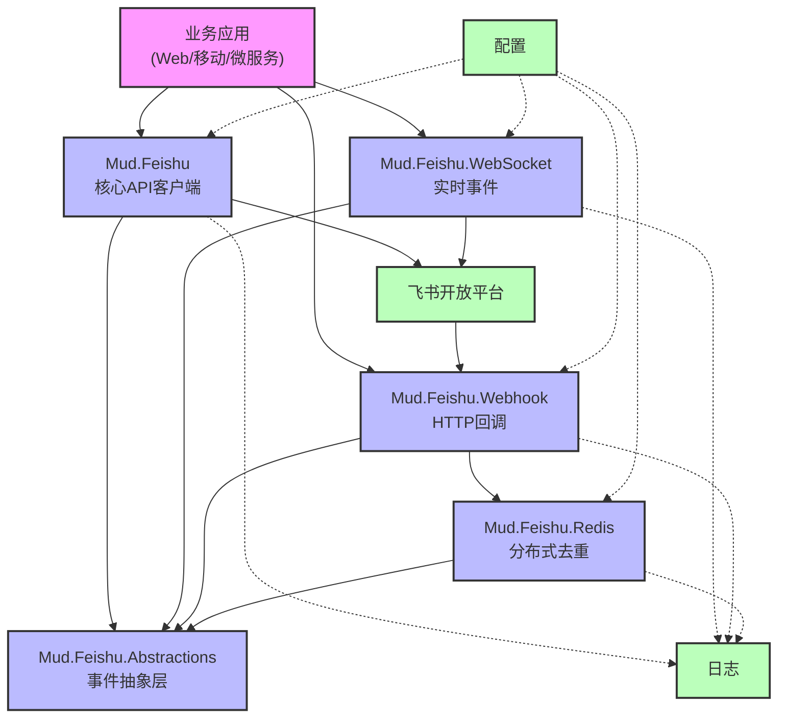
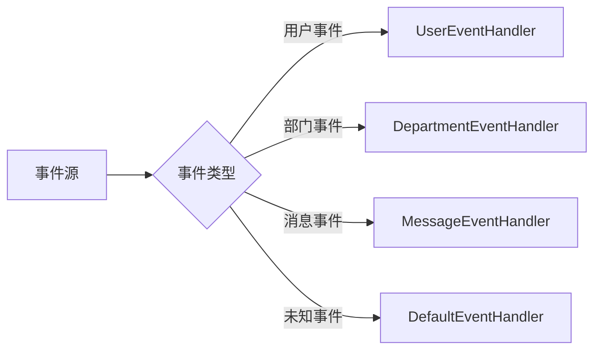
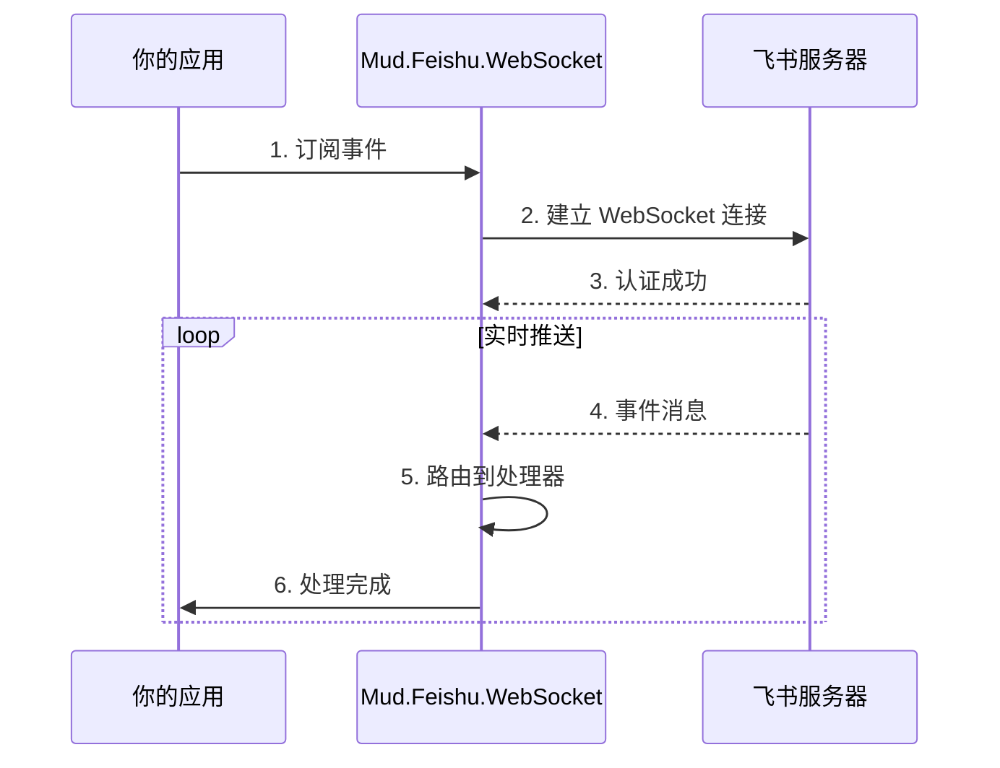
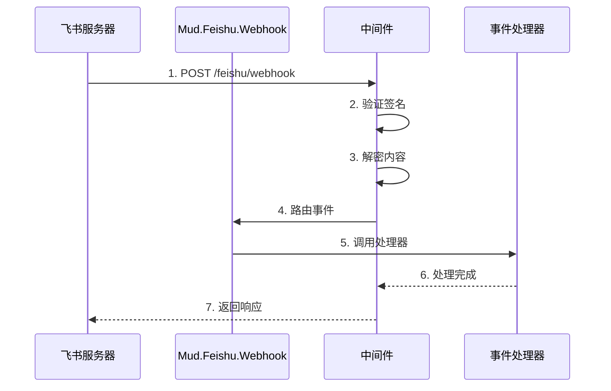

# MudFeishu

<div align="center">


企业级 .NET 飞书 API 集成 SDK

[](LICENSE)
[](https://www.nuget.org/packages/Mud.Feishu/)
[](https://www.nuget.org/packages/Mud.Feishu.WebSocket/)
[](https://www.nuget.org/packages/Mud.Feishu.Webhook/)
[](https://www.nuget.org/packages/Mud.Feishu.Abstractions/)
[](https://www.nuget.org/packages/Mud.Feishu.Redis/)

**完整的 HTTP API、WebSocket 实时事件订阅和 Webhook 事件处理解决方案**

[快速开始](#-快速开始) • [架构说明](#-项目架构) • [功能特性](#-核心功能) • [使用示例](#-使用示例) • [文档](#-详细文档)

</div>

---

## 📖 项目简介

MudFeishu 是一套现代化的企业级 .NET 飞书 API 集成 SDK，提供完整的 HTTP API 调用、WebSocket 实时事件订阅和 Webhook 事件处理能力。SDK 采用策略模式和工厂模式设计，内置自动令牌管理、智能重试、高性能缓存等企业级特性，大幅简化飞书应用的开发难度。

### ✨ 核心优势

- 🚀 **极简API** - 一行代码完成服务注册，开箱即用
- 🏗️ **类型安全** - 强类型数据模型，编译时类型检查
- 🔄 **自动令牌管理** - 智能缓存和刷新，无需手动维护
- 🛡️ **企业级稳定** - 统一异常处理、智能重试、详细日志
- 🎯 **事件驱动** - 策略模式事件处理，灵活扩展
- 📊 **多框架支持** - .NET Standard 2.0、.NET 6.0、.NET 8.0、.NET 10.0

---

## 🏗️ 项目架构

### 整体架构图



### 模块功能对比

| 模块                     | 核心功能      | 通信方式         | 实时性        | 适用场景           |
| ------------------------ | ------------- | ---------------- | ------------- | ------------------ |
| **Mud.Feishu**           | HTTP API 调用 | HTTP 请求        | 低 (主动查询) | 数据查询、操作管理 |
| **Mud.Feishu.WebSocket** | 实时事件订阅  | WebSocket 长连接 | 高 (实时推送) | 实时通知、即时响应 |
| **Mud.Feishu.Webhook**   | HTTP 回调处理 | HTTP 回调        | 中 (被动接收) | 事件触发、异步处理 |
| **Mud.Feishu.Redis**     | 分布式去重    | Redis            | -             | 多实例部署、防重复 |

---

## 📦 项目概览

| 组件                        | 描述                                                           | NuGet                                                                                                                           | 下载                                                                  |
| --------------------------- | -------------------------------------------------------------- | ------------------------------------------------------------------------------------------------------------------------------- | --------------------------------------------------------------------- |
| **Mud.Feishu.Abstractions** | 事件订阅抽象层，提供策略模式和工厂模式的事件处理架构           | [](https://www.nuget.org/packages/Mud.Feishu.Abstractions/) |  |
| **Mud.Feishu**              | 核心 HTTP API 客户端库，支持组织架构、消息、群聊等完整飞书功能 | [](https://www.nuget.org/packages/Mud.Feishu/)                           |               |
| **Mud.Feishu.WebSocket**    | 飞书 WebSocket 客户端，支持实时事件订阅和自动重连              | [](https://www.nuget.org/packages/Mud.Feishu.WebSocket/)       |     |
| **Mud.Feishu.Webhook**      | 飞书 Webhook 事件处理组件，支持 HTTP 回调事件接收和处理        | [](https://www.nuget.org/packages/Mud.Feishu.Webhook/)           |       |
| **Mud.Feishu.Redis**        | Redis 分布式去重扩展，支持多实例部署场景的事件去重             | [](https://www.nuget.org/packages/Mud.Feishu.Redis/)               |         |

---

## 🚀 快速开始

### 1️⃣ 安装 NuGet 包

```bash
# HTTP API 客户端 (核心模块)
dotnet add package Mud.Feishu

# 事件处理抽象层 (可选，WebSocket/Webhook 依赖)
dotnet add package Mud.Feishu.Abstractions

# WebSocket 实时事件订阅 (可选)
dotnet add package Mud.Feishu.WebSocket

# Webhook HTTP 回调事件处理 (可选)
dotnet add package Mud.Feishu.Webhook

# Redis 分布式去重扩展 (可选)
dotnet add package Mud.Feishu.Redis
```

> 💡 **提示**：根据实际需求安装对应包，`Mud.Feishu` 是核心包，`Mud.Feishu.Abstractions` 已作为 WebSocket 和 Webhook 的依赖自动安装。

### 2️⃣ 配置文件 (appsettings.json)

```json
{
  "Logging": {
    "LogLevel": {
      "Default": "Information",
      "Mud.Feishu": "Debug"
    }
  },
  "Feishu": {
    "AppId": "your_feishu_app_id",
    "AppSecret": "your_feishu_app_secret",
    "BaseUrl": "https://open.feishu.cn",
    "TimeOut": 30,
    "RetryCount": 3,
    "EnableLogging": true,
    "WebSocket": {
      "AutoReconnect": true,
      "MaxReconnectAttempts": 5,
      "ReconnectDelayMs": 5000,
      "HeartbeatIntervalMs": 30000,
      "EnableLogging": true
    },
    "Webhook": {
      "VerificationToken": "your_verification_token",
      "EncryptKey": "your_encrypt_key_32_bytes_long",
      "RoutePrefix": "feishu/webhook",
      "EnableRequestLogging": true,
      "MaxConcurrentEvents": 10
    }
  }
}
```

### 3️⃣ 服务注册 (Program.cs)

```csharp
using Mud.Feishu;
using Mud.Feishu.WebSocket;
using Mud.Feishu.Webhook;

var builder = WebApplication.CreateBuilder(args);

// 注册 HTTP API 服务（方式一：懒人模式 - 注册所有服务）
builder.Services.AddFeishuServices(builder.Configuration);

// 注册 HTTP API 服务（方式二：构造者模式 - 按需注册）
builder.Services.CreateFeishuServicesBuilder(builder.Configuration)
    .AddOrganizationApi()
    .AddMessageApi()
    .AddChatGroupApi()
    .AddApprovalApi()
    .AddTaskApi()
    .AddCardApi()
    .Build();

// 注册 HTTP API 服务（方式三：按模块注册）
builder.Services.AddFeishuServices(builder.Configuration, new[] {
    FeishuModule.Organization,
    FeishuModule.Message,
    FeishuModule.ChatGroup,
    FeishuModule.Approval
});

// 注册 HTTP API 服务（方式四：代码配置）
builder.Services.CreateFeishuServicesBuilder(options =>
{
    options.AppId = "your_app_id";
    options.AppSecret = "your_app_secret";
    options.BaseUrl = "https://open.feishu.cn";
})
.AddAllApis()
.Build();

// 注册 WebSocket 事件订阅服务
builder.Services.CreateFeishuWebSocketServiceBuilder(builder.Configuration)
    .AddHandler<MessageEventHandler>()
    .Build();

// 注册 Webhook HTTP 回调事件服务
builder.Services.CreateFeishuWebhookServiceBuilder(builder.Configuration)
    .AddHandler<MessageReceiveEventHandler>()
    .AddHandler<DepartmentCreatedEventHandler>()
    .Build();

var app = builder.Build();

// 添加 Webhook 中间件
app.UseFeishuWebhook();

app.Run();
```

### 4️⃣ 验证配置

```csharp
// 获取用户信息测试
public class TestController : ControllerBase
{
    private readonly IFeishuTenantV3User _userApi;

    public TestController(IFeishuTenantV3User userApi)
    {
        _userApi = userApi;
    }

    [HttpGet("test")]
    public async Task<IActionResult> TestConnection()
    {
        var result = await _userApi.GetUserInfoByIdAsync("test_user_id");
        return Ok(new { code = result.Code, message = result.Msg });
    }
}
```

---

## 🎯 核心功能

### 🏛️ Mud.Feishu.Abstractions - 事件处理抽象层

**统一的事件处理架构，WebSocket 和 Webhook 共享相同的处理器接口**



| 功能特性       | 说明                       |
| -------------- | -------------------------- |
| **策略模式**   | 可扩展的事件处理器架构     |
| **工厂模式**   | 动态注册和发现处理器       |
| **类型安全**   | 强类型数据模型，编译时检查 |
| **自动去重**   | 内置事件 ID 去重机制       |
| **基类处理器** | 简化开发的专用基类         |

**支持的基类处理器**：

- `DepartmentCreatedEventHandler` - 部门创建
- `DepartmentDeleteEventHandler` - 部门删除
- `DefaultFeishuEventHandler<T>` - 通用处理器

### 🌐 Mud.Feishu - HTTP API 客户端

**完整的飞书 API 覆盖，自动令牌管理**

| 模块分类        | API版本 | 主要功能                                   |
| --------------- | ------- | ------------------------------------------ |
| **🔐 认证授权** | V3      | 应用令牌、租户令牌、用户令牌、OAuth 2.0    |
| **👥 组织架构** | V1/V3   | 用户、部门、员工、用户组、职级、职务、角色 |
| **💬 消息服务** | V1      | 文本/图片/卡片消息、批量发送、群聊管理     |
| **📋 审批流程** | V4      | 审批定义、审批实例、审批操作               |
| **📝 任务管理** | V2      | 任务创建、更新、分组、附件、评论           |
| **📅 日程会议** | V4      | 日程事件、会议管理                         |

**企业级特性**：

- ✅ 自动令牌缓存和刷新
- ✅ 智能重试机制（可配置重试次数）
- ✅ 高性能缓存（解决缓存击穿）
- ✅ 统一异常处理
- ✅ 连接池管理
- ✅ 详细日志记录

> 💡 **提示**：[查看完整 API 文档](./Mud.Feishu/README.md)

### 🔄 Mud.Feishu.WebSocket - 实时事件订阅

**基于 WebSocket 长连接的实时事件推送，支持智能连接管理和错误分类处理**



| 功能分类     | 特性                                       |
| ------------ | ------------------------------------------ |
| **连接管理** | 自动重连、心跳检测、连接监控、错误分类处理 |
| **事件处理** | 策略模式、多处理器并行、事件重放           |
| **消息类型** | ping/pong、heartbeat、event、auth          |
| **监控运维** | 连接状态、处理统计、健康检查、审计日志     |

**错误分类处理**：

- ✅ **可恢复错误** - 网络波动、临时故障等
- ✅ **不可恢复错误** - 认证失败、权限不足等
- ✅ **详细的错误日志和错误类型标识** - 帮助快速定位问题

**认证失败处理**：

- ✅ **按错误码分类认证失败原因**
- ✅ **统计总失败次数和失败时间**
- ✅ **提供针对性修复建议**

### 🌐 Mud.Feishu.Webhook - HTTP 回调事件处理

**基于中间件模式的事件接收和分发，具备企业级安全防护和性能优化**



| 功能分类     | 特性                                                                 |
| ------------ | -------------------------------------------------------------------- |
| **安全验证** | 签名验证、时间戳验证、AES-256-CBC 解密、IP 白名单、Content-Type 验证 |
| **事件处理** | 中间件模式、自动路由、策略模式、异步处理、事件拦截器                 |
| **高级功能** | 多机器人支持、后台处理、并发控制、配置热更新、断路器模式             |
| **监控运维** | 性能监控、健康检查、请求日志、异常处理、失败事件重试                 |
| **安全加固** | 滑动窗口限流、威胁检测、安全审计、密钥验证、JSON深度限制             |
| **性能优化** | 流式请求体读取、源生成器序列化、内存管理优化                         |

**安全增强特性**：

- ✅ **Content-Type 验证** - 仅接受 `application/json` 请求
- ✅ **JSON 深度限制** - 防止深度嵌套 JSON 导致 DoS 攻击
- ✅ **流式请求体读取** - 防止伪造 Content-Length 的 DoS 攻击
- ✅ **Nonce 过期清理** - 防止内存泄漏
- ✅ **断路器模式** - 使用 Polly 实现熔断机制
- ✅ **失败事件重试** - 后台自动重试失败事件

**性能优化**：

- ✅ **源生成器序列化** - 提升序列化性能约 20-30%
- ✅ **限流内存管理** - LRU 淘汰机制，最大 10 万条目
- ✅ **日志脱敏** - 自动脱敏敏感字段防止信息泄露

---

## 💡 快速开始示例

### HTTP API 调用

```csharp
// 创建用户
[HttpPost("users")]
public async Task<IActionResult> CreateUser([FromBody] CreateUserRequest request)
{
    var result = await _userApi.CreateUserAsync(request);
    return result.Code == 0 ? Ok(result.Data) : BadRequest(result.Msg);
}

// 发送消息
var textContent = new MessageTextContent { Text = "Hello World!" };
var result = await _messageApi.SendMessageAsync(new SendMessageRequest
{
    ReceiveId = "user_123",
    MsgType = "text",
    Content = JsonSerializer.Serialize(textContent)
}, receive_id_type: "user_id");
```

### WebSocket 事件处理

```csharp
// 实现事件处理器
public class MessageHandler : IFeishuEventHandler
{
    public string SupportedEventType => "im.message.receive_v1";

    public async Task HandleAsync(EventData eventData, CancellationToken cancellationToken = default)
    {
        var messageEvent = JsonSerializer.Deserialize<MessageReceiveEvent>(
            eventData.Event?.ToString() ?? "{}");

        Console.WriteLine($"收到消息: {messageEvent.Message.Content}");
    }
}

// 注册处理器
builder.Services.CreateFeishuWebSocketServiceBuilder(builder.Configuration)
    .AddHandler<MessageHandler>()
    .Build();
```

### Webhook 事件处理

```csharp
// 部门创建事件处理器（继承基类）
public class DepartmentCreatedHandler : DepartmentCreatedEventHandler
{
    protected override async Task ProcessBusinessLogicAsync(
        EventData eventData,
        DepartmentCreatedResult? departmentData,
        CancellationToken cancellationToken = default)
    {
        // 同步到本地数据库
        await SyncToDatabaseAsync(departmentData);
    }
}

// 注册处理器
builder.Services.CreateFeishuWebhookServiceBuilder(builder.Configuration)
    .AddHandler<DepartmentCreatedHandler>()
    .Build();

// 添加中间件
app.UseFeishuWebhook();
```

---

## 📖 详细文档

- [Mud.Feishu.Abstractions 详细文档](./Mud.Feishu.Abstractions/README.md) - 事件处理抽象层使用指南
- [Mud.Feishu 详细文档](./Mud.Feishu/README.md) - HTTP API 完整使用指南
- [Mud.Feishu.WebSocket 详细文档](./Mud.Feishu.WebSocket/Readme.md) - WebSocket 实时事件订阅指南
- [Mud.Feishu.Webhook 详细文档](./Mud.Feishu.Webhook/README.md) - Webhook HTTP 回调事件处理指南
- [Mud.Feishu.Redis 详细文档](./Mud.Feishu.Redis/README.md) - Redis 分布式去重扩展指南

---

## 🛠️ 技术栈

### 框架支持

- **.NET Standard 2.0** - 兼容 .NET Framework 4.6.1+
- **.NET 6.0** - LTS 长期支持版本
- **.NET 8.0** - LTS 长期支持版本（推荐）
- **.NET 10.0** - LTS 长期支持版本

### 核心依赖

| 包                                            | 版本             | 说明                  |
| --------------------------------------------- | ---------------- | --------------------- |
| **Mud.ServiceCodeGenerator**                  | v1.4.6           | HTTP 客户端代码生成器 |
| **System.Text.Json**                          | v10.0.1          | 高性能 JSON 序列化    |
| **Microsoft.Extensions.Http**                 | v8.0.1 / v10.0.1 | HTTP 客户端工厂       |
| **Microsoft.Extensions.Http.Polly**           | v8.0.2 / v10.0.1 | 弹性和瞬态故障处理    |
| **Microsoft.Extensions.DependencyInjection**  | v8.0.2 / v10.0.1 | 依赖注入              |
| **Microsoft.Extensions.Logging**              | v8.0.3 / v10.0.1 | 日志记录              |
| **Microsoft.Extensions.Configuration.Binder** | v8.0.2 / v10.0.1 | 配置绑定              |

---

## 📄 许可证

本项目遵循 [MIT 许可证](./LICENSE)，允许商业和非商业用途。

---

## 🔗 相关链接

### 📖 官方文档

- [飞书开放平台文档](https://open.feishu.cn/document/) - 飞书 API 官方文档和最佳实践
- [NuGet 包管理器](https://www.nuget.org/) - .NET 包管理官方平台

### 📦 NuGet 包

- [Mud.Feishu.Abstractions](https://www.nuget.org/packages/Mud.Feishu.Abstractions/) - 事件处理抽象层
- [Mud.Feishu](https://www.nuget.org/packages/Mud.Feishu/) - 核心 HTTP API 客户端库
- [Mud.Feishu.WebSocket](https://www.nuget.org/packages/Mud.Feishu.WebSocket/) - WebSocket 实时事件订阅库
- [Mud.Feishu.Webhook](https://www.nuget.org/packages/Mud.Feishu.Webhook/) - Webhook HTTP 回调事件处理库
- [Mud.Feishu.Redis](https://www.nuget.org/packages/Mud.Feishu.Redis/) - Redis 分布式去重扩展库

### 🛠️ 开发资源

- [项目仓库](https://gitee.com/mudtools/MudFeishu) - 源代码和开发文档
- [Mud.ServiceCodeGenerator](https://gitee.com/mudtools/mud-code-generator) - HTTP 客户端代码生成器
- [示例项目](./Mud.Feishu.Test) - 完整的使用示例和演示代码

### 🤝 社区支持

- [问题反馈](https://gitee.com/mudtools/MudFeishu/issues) - Bug 报告和功能请求
- [贡献指南](./CONTRIBUTING.md) - 如何参与项目贡献
- [更新日志](./CHANGELOG.md) - 版本更新记录和变更说明

---

<div align="center">

**如果觉得 MudFeishu 对你有帮助，请给个 ⭐Star 支持一下！**

Made with ❤️ by MudTools

</div>
