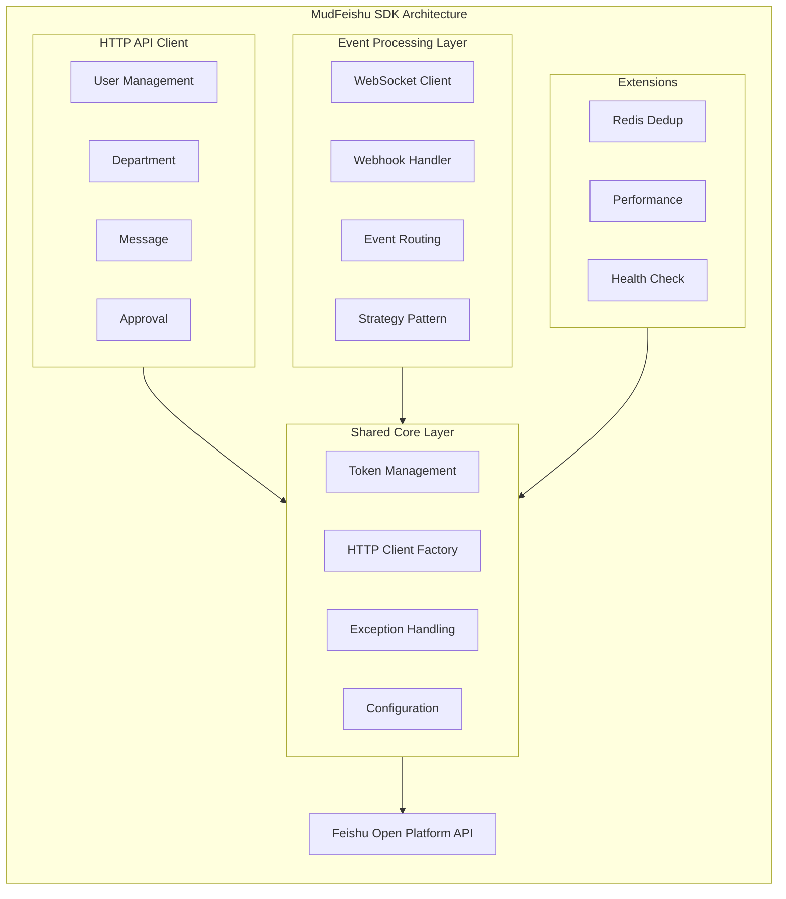
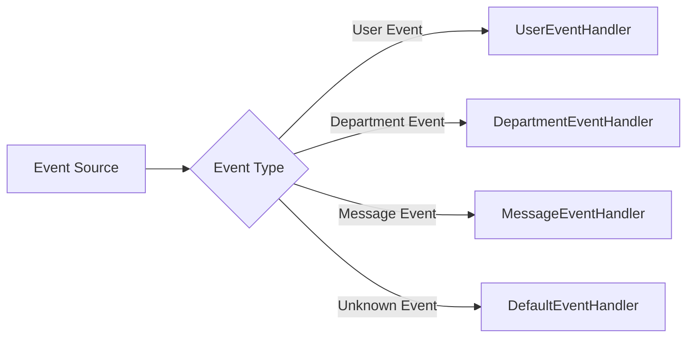
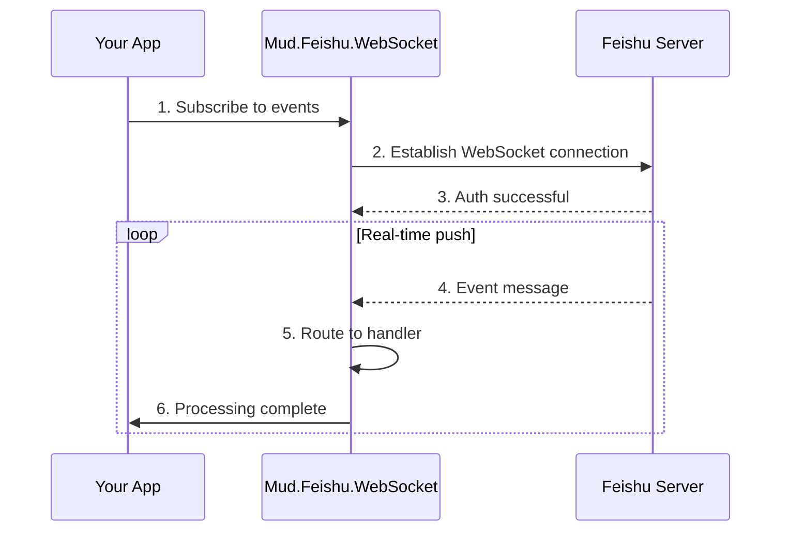
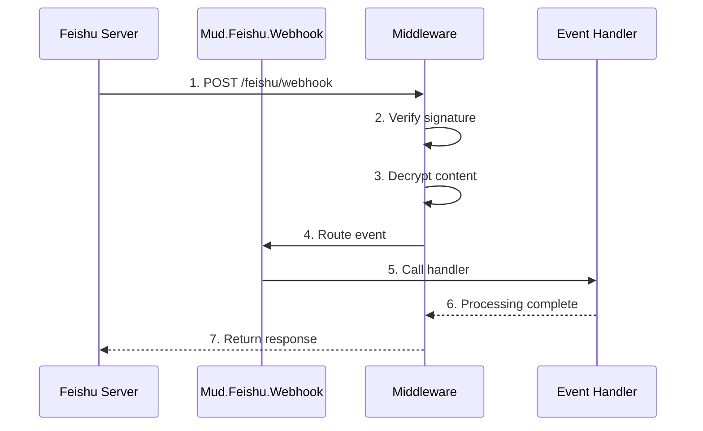

# MudFeishu

<div align="center">


Enterprise-Grade .NET SDK for Feishu (Lark) API Integration

[](LICENSE)
[](https://www.nuget.org/packages/Mud.Feishu/)
[](https://www.nuget.org/packages/Mud.Feishu.WebSocket/)
[](https://www.nuget.org/packages/Mud.Feishu.Webhook/)
[](https://www.nuget.org/packages/Mud.Feishu.Abstractions/)
[](https://www.nuget.org/packages/Mud.Feishu.Redis/)

**Complete HTTP API, WebSocket Real-time Event Subscription, and Webhook Event Processing Solution**

[Quick Start](#-quick-start) • [Architecture](#-project-architecture) • [Features](#-core-features) • [Examples](#-quick-start-examples) • [Docs](#-detailed-documentation)

</div>

---

## 📖 Project Introduction

MudFeishu is a modern enterprise-grade .NET SDK for Feishu (Lark) API integration, providing comprehensive HTTP API calls, WebSocket real-time event subscription, and Webhook event processing capabilities. The SDK is designed using Strategy and Factory patterns with built-in automatic token management, intelligent retry mechanisms, and high-performance caching, significantly simplifying Feishu application development.

### ✨ Core Advantages

- 🚀 **Minimal API** - One-line service registration, ready to use out of the box
- 🏗️ **Type Safety** - Strongly-typed data models with compile-time type checking
- 🔄 **Automatic Token Management** - Smart caching and refresh, no manual maintenance required
- 🛡️ **Enterprise Stability** - Unified exception handling, intelligent retry, detailed logging
- 🎯 **Event-Driven** - Strategy pattern event processing, flexible extension
- 📊 **Multi-Framework Support** - .NET Standard 2.0, .NET 6.0, .NET 8.0, .NET 10.0

---

## 🏗️ Project Architecture

### Overall Architecture Diagram



### Module Comparison

| Module                   | Core Features                | Communication             | Real-time                | Use Cases                                       |
| ------------------------ | ---------------------------- | ------------------------- | ------------------------ | ----------------------------------------------- |
| **Mud.Feishu**           | HTTP API calls               | HTTP Request              | Low (active query)       | Data query, management operations               |
| **Mud.Feishu.WebSocket** | Real-time event subscription | WebSocket Long Connection | High (real-time push)    | Real-time notifications, instant response       |
| **Mud.Feishu.Webhook**   | HTTP callback processing     | HTTP Callback             | Medium (passive receive) | Event trigger, async processing                 |
| **Mud.Feishu.Redis**     | Distributed deduplication    | Redis                     | -                        | Multi-instance deployment, duplicate prevention |

---

## 📦 Project Overview

| Component                   | Description                                                                                                           | NuGet                                                                                                                           | Downloads                                                               |
| --------------------------- | --------------------------------------------------------------------------------------------------------------------- | ------------------------------------------------------------------------------------------------------------------------------- | ----------------------------------------------------------------------- |
| **Mud.Feishu.Abstractions** | Event subscription abstraction layer with Strategy and Factory pattern event handling architecture                    | [](https://www.nuget.org/packages/Mud.Feishu.Abstractions/) | [] |
| **Mud.Feishu**              | Core HTTP API client library with full Feishu capabilities including organization, messaging, and group chat features | [](https://www.nuget.org/packages/Mud.Feishu/)                           | []              |
| **Mud.Feishu.WebSocket**    | Feishu WebSocket client supporting real-time event subscription and automatic reconnection                            | [](https://www.nuget.org/packages/Mud.Feishu.WebSocket/)       | []    |
| **Mud.Feishu.Webhook**      | Feishu Webhook event handling component for HTTP callback event reception and processing                              | [](https://www.nuget.org/packages/Mud.Feishu.Webhook/)           | []      |
| **Mud.Feishu.Redis**        | Redis distributed deduplication extension supporting event deduplication in multi-instance deployment scenarios       | [](https://www.nuget.org/packages/Mud.Feishu.Redis/)               | []        |

---

## 🚀 Quick Start

### 1️⃣ Install NuGet Packages

```bash
# HTTP API Client (Core Module)
dotnet add package Mud.Feishu

# Event Processing Abstraction Layer (Optional, WebSocket/Webhook dependency)
dotnet add package Mud.Feishu.Abstractions

# WebSocket Real-time Event Subscription (Optional)
dotnet add package Mud.Feishu.WebSocket

# Webhook HTTP Callback Event Processing (Optional)
dotnet add package Mud.Feishu.Webhook

# Redis Distributed Deduplication Extension (Optional)
dotnet add package Mud.Feishu.Redis
```

> 💡 **Tip**: Install packages based on your needs. `Mud.Feishu` is the core package, and `Mud.Feishu.Abstractions` is automatically installed as a dependency of WebSocket and Webhook.

### 2️⃣ Configuration File (appsettings.json)

```json
{
  "Logging": {
    "LogLevel": {
      "Default": "Information",
      "Mud.Feishu": "Debug"
    }
  },
  "Feishu": {
    "AppId": "your_feishu_app_id",
    "AppSecret": "your_feishu_app_secret",
    "BaseUrl": "https://open.feishu.cn",
    "TimeOut": 30,
    "RetryCount": 3,
    "EnableLogging": true,
    "WebSocket": {
      "AutoReconnect": true,
      "MaxReconnectAttempts": 5,
      "ReconnectDelayMs": 5000,
      "HeartbeatIntervalMs": 30000,
      "EnableLogging": true
    },
    "Webhook": {
      "VerificationToken": "your_verification_token",
      "EncryptKey": "your_encrypt_key_32_bytes_long",
      "RoutePrefix": "feishu/webhook",
      "EnableRequestLogging": true,
      "MaxConcurrentEvents": 10
    }
  }
}
```

### 3️⃣ Service Registration (Program.cs)

```csharp
using Mud.Feishu;
using Mud.Feishu.WebSocket;
using Mud.Feishu.Webhook;

var builder = WebApplication.CreateBuilder(args);

// Register HTTP API Services (One line for all services)
builder.Services.AddFeishuServices(builder.Configuration);

// Or use builder pattern for selective registration
builder.Services.CreateFeishuServicesBuilder(builder.Configuration)
    .AddOrganizationApi()
    .AddMessageApi()
    .AddChatGroupApi()
    .Build();

// Register WebSocket Event Subscription
builder.Services.CreateFeishuWebSocketServiceBuilder(builder.Configuration)
    .AddHandler<MessageEventHandler>()
    .Build();

// Register Webhook HTTP Callback Event Service
builder.Services.CreateFeishuWebhookServiceBuilder(builder.Configuration)
    .AddHandler<MessageReceiveEventHandler>()
    .AddHandler<DepartmentCreatedEventHandler>()
    .Build();

var app = builder.Build();

// Add Webhook Middleware
app.UseFeishuWebhook();

app.Run();
```

### 4️⃣ Verify Configuration

```csharp
// Test user information retrieval
public class TestController : ControllerBase
{
    private readonly IFeishuTenantV3User _userApi;

    public TestController(IFeishuTenantV3User userApi)
    {
        _userApi = userApi;
    }

    [HttpGet("test")]
    public async Task<IActionResult> TestConnection()
    {
        var result = await _userApi.GetUserInfoByIdAsync("test_user_id");
        return Ok(new { code = result.Code, message = result.Msg });
    }
}
```

---

## 🎯 Core Features

### 🏛️ Mud.Feishu.Abstractions - Event Processing Abstraction Layer

**Unified event processing architecture, WebSocket and Webhook share the same handler interface**



| Feature                | Description                                           |
| ---------------------- | ----------------------------------------------------- |
| **Strategy Pattern**   | Extensible event handler architecture                 |
| **Factory Pattern**    | Dynamic registration and discovery of handlers        |
| **Type Safety**        | Strongly-typed data models with compile-time checking |
| **Auto Deduplication** | Built-in event ID deduplication mechanism             |
| **Base Handlers**      | Specialized base classes to simplify development      |

**Supported Base Handlers**:

- `DepartmentCreatedEventHandler` - Department creation
- `DepartmentDeleteEventHandler` - Department deletion
- `DefaultFeishuEventHandler<T>` - Generic handler

### 🌐 Mud.Feishu - HTTP API Client

**Complete Feishu API coverage with automatic token management**

| Module Category       | API Version | Main Features                                                            |
| --------------------- | ----------- | ------------------------------------------------------------------------ |
| **🔐 Authentication** | V3          | App token, tenant token, user token, OAuth 2.0                           |
| **👥 Organization**   | V1/V3       | Users, departments, employees, user groups, job levels, positions, roles |
| **💬 Messaging**      | V1          | Text/image/card messages, batch sending, group chat management           |
| **📋 Approvals**      | V4          | Approval definitions, instances, operations                              |
| **📝 Tasks**          | V2          | Task creation, updates, groups, attachments, comments                    |
| **📅 Calendar**       | V4          | Calendar events, meeting management                                      |

**Enterprise Features**:

- ✅ Automatic token caching and refresh
- ✅ Intelligent retry mechanism (configurable retry count)
- ✅ High-performance caching (resolves cache stampede)
- ✅ Unified exception handling
- ✅ Connection pool management
- ✅ Detailed logging

> 💡 **Tip**: [View complete API documentation](./Mud.Feishu/README.md)

### 🔄 Mud.Feishu.WebSocket - Real-time Event Subscription

**Real-time event push based on WebSocket long connection**



| Category                  | Features                                                            |
| ------------------------- | ------------------------------------------------------------------- |
| **Connection Management** | Auto reconnect, heartbeat detection, connection monitoring          |
| **Event Processing**      | Strategy pattern, multi-handler parallel, event replay              |
| **Message Types**         | ping/pong, heartbeat, event, auth                                   |
| **Monitoring**            | Connection status, processing statistics, health checks, audit logs |

**Supported Event Types**:

- Message events: `im.message.receive_v1`
- User events: `contact.user.*_v3`
- Department events: `contact.department.*_v3`
- Approval events: `approval.approval.*_v1`

### 🌐 Mud.Feishu.Webhook - HTTP Callback Event Processing

**Event reception and distribution based on middleware mode**



| Category               | Features                                                                             |
| ---------------------- | ------------------------------------------------------------------------------------ |
| **Security**           | Signature verification, timestamp verification, AES-256-CBC decryption, IP whitelist |
| **Event Processing**   | Middleware mode, auto routing, strategy pattern, async processing                    |
| **Advanced**           | Multi-bot support, background processing, concurrency control, hot reload config     |
| **Monitoring**         | Performance monitoring, health checks, request logs, exception handling              |
| **Security Hardening** | Sliding window rate limiting, threat detection, security audit, key validation       |

### 💾 Mud.Feishu.Redis - Distributed Deduplication Extension

**Distributed event deduplication based on Redis, suitable for multi-instance deployment**

| Category                    | Features                                             |
| --------------------------- | ---------------------------------------------------- |
| **Deduplication Mechanism** | EventId, Nonce, SeqID three deduplication dimensions |
| **Atomic Operations**       | SETNX + EXPIRE ensures atomicity                     |
| **Auto Expiration**         | Auto cleanup of expired data                         |
| **Distributed Support**     | Cluster mode, sentinel mode, TLS/SSL                 |
| **Flexible Config**         | Configurable expiration time, key prefix, timeout    |
| **Monitoring**              | Logging, cache statistics, health checks             |

---

## 📚 Usage Scenarios

| Scenario                  | Recommended Solution | Latency | Code Example |
| ------------------------- | -------------------- | ------- | ------------ |
| User Info Query           | Mud.Feishu           | Low     | HTTP API     |
| System Notification       | Mud.Feishu           | Low     | HTTP API     |
| Real-time Chatbot         | Mud.Feishu.WebSocket | High    | WebSocket    |
| Organization Sync         | Mud.Feishu.Webhook   | Medium  | Webhook      |
| Multi-instance Deployment | Mud.Feishu.Redis     | -       | Redis        |

---

## 💡 Quick Start Examples

### HTTP API Calls

```csharp
// Create user
[HttpPost("users")]
public async Task<IActionResult> CreateUser([FromBody] CreateUserRequest request)
{
    var result = await _userApi.CreateUserAsync(request);
    return result.Code == 0 ? Ok(result.Data) : BadRequest(result.Msg);
}

// Send message
var textContent = new MessageTextContent { Text = "Hello World!" };
var result = await _messageApi.SendMessageAsync(new SendMessageRequest
{
    ReceiveId = "user_123",
    MsgType = "text",
    Content = JsonSerializer.Serialize(textContent)
}, receive_id_type: "user_id");
```

### WebSocket Event Processing

```csharp
// Implement event handler
public class MessageHandler : IFeishuEventHandler
{
    public string SupportedEventType => "im.message.receive_v1";

    public async Task HandleAsync(EventData eventData, CancellationToken cancellationToken = default)
    {
        var messageEvent = JsonSerializer.Deserialize<MessageReceiveEvent>(
            eventData.Event?.ToString() ?? "{}");

        Console.WriteLine($"Message received: {messageEvent.Message.Content}");
    }
}

// Register handler
builder.Services.CreateFeishuWebSocketServiceBuilder(builder.Configuration)
    .AddHandler<MessageHandler>()
    .Build();
```

### Webhook Event Processing

```csharp
// Department creation event handler (inherit base class)
public class DepartmentCreatedHandler : DepartmentCreatedEventHandler
{
    protected override async Task ProcessBusinessLogicAsync(
        EventData eventData,
        DepartmentCreatedResult? departmentData,
        CancellationToken cancellationToken = default)
    {
        // Sync to local database
        await SyncToDatabaseAsync(departmentData);
    }
}

// Register handler
builder.Services.CreateFeishuWebhookServiceBuilder(builder.Configuration)
    .AddHandler<DepartmentCreatedHandler>()
    .Build();

// Add middleware
app.UseFeishuWebhook();
```

---

## 📖 Detailed Documentation

- [Mud.Feishu.Abstractions Documentation](./Mud.Feishu.Abstractions/README_EN.md) - Event processing abstraction layer guide
- [Mud.Feishu Documentation](./Mud.Feishu/README_EN.md) - HTTP API complete usage guide
- [Mud.Feishu.WebSocket Documentation](./Mud.Feishu.WebSocket/Readme_EN.md) - WebSocket real-time event subscription guide
- [Mud.Feishu.Webhook Documentation](./Mud.Feishu.Webhook/README_EN.md) - Webhook HTTP callback event processing guide
- [Mud.Feishu.Redis Documentation](./Mud.Feishu.Redis/README.md) - Redis distributed deduplication extension guide

## 🛠️ Technology Stack

### Framework Support

- **.NET Standard 2.0** - Compatible with .NET Framework 4.6.1+
- **.NET 6.0** - LTS long-term support version
- **.NET 8.0** - LTS long-term support version (recommended)
- **.NET 10.0** - LTS long-term support version

### Core Dependencies

| Package                                       | Version          | Description                             |
| --------------------------------------------- | ---------------- | --------------------------------------- |
| **Mud.ServiceCodeGenerator**                  | v1.4.6           | HTTP client code generator              |
| **System.Text.Json**                          | v10.0.1          | High-performance JSON serialization     |
| **Microsoft.Extensions.Http**                 | v8.0.1 / v10.0.1 | HTTP client factory                     |
| **Microsoft.Extensions.Http.Polly**           | v8.0.2 / v10.0.1 | Resilience and transient fault handling |
| **Microsoft.Extensions.DependencyInjection**  | v8.0.2 / v10.0.1 | Dependency injection                    |
| **Microsoft.Extensions.Logging**              | v8.0.3 / v10.0.1 | Logging                                 |
| **Microsoft.Extensions.Configuration.Binder** | v8.0.2 / v10.0.1 | Configuration binding                   |

---

## 📄 License

This project is licensed under the [MIT License](./LICENSE), allowing both commercial and non-commercial use.

---

## 🔗 Related Links

### 📖 Official Documentation

- [Feishu Open Platform Documentation](https://open.feishu.cn/document/) - Official Feishu API documentation and best practices
- [NuGet Package Manager](https://www.nuget.org/) - Official .NET package management platform

### 📦 NuGet Packages

- [Mud.Feishu.Abstractions](https://www.nuget.org/packages/Mud.Feishu.Abstractions/) - Event processing abstraction layer
- [Mud.Feishu](https://www.nuget.org/packages/Mud.Feishu/) - Core HTTP API client library
- [Mud.Feishu.WebSocket](https://www.nuget.org/packages/Mud.Feishu.WebSocket/) - WebSocket real-time event subscription library
- [Mud.Feishu.Webhook](https://www.nuget.org/packages/Mud.Feishu.Webhook/) - Webhook HTTP callback event processing library
- [Mud.Feishu.Redis](https://www.nuget.org/packages/Mud.Feishu.Redis/) - Redis distributed deduplication extension library

### 🛠️ Development Resources

- [Project Repository](https://gitee.com/mudtools/MudFeishu) - Source code and development documentation
- [Mud.ServiceCodeGenerator](https://gitee.com/mudtools/mud-code-generator) - HTTP client code generator
- [Example Projects](./Mud.Feishu.Test) - Complete usage examples and demo code

### 🤝 Community Support

- [Issue Tracker](https://gitee.com/mudtools/MudFeishu/issues) - Bug reports and feature requests
- [Contributing Guide](./CONTRIBUTING.md) - How to contribute to the project
- [Changelog](./CHANGELOG.md) - Version updates and change notes

---

<div align="center">

**If MudFeishu helps you, please give us a ⭐Star to support us!**

Made with ❤️ by MudTools

</div>
